# AWS VPC 및 서브넷 설정하기

<BR>
<BR>

### VPC를 외부 접근가능하게 해보자

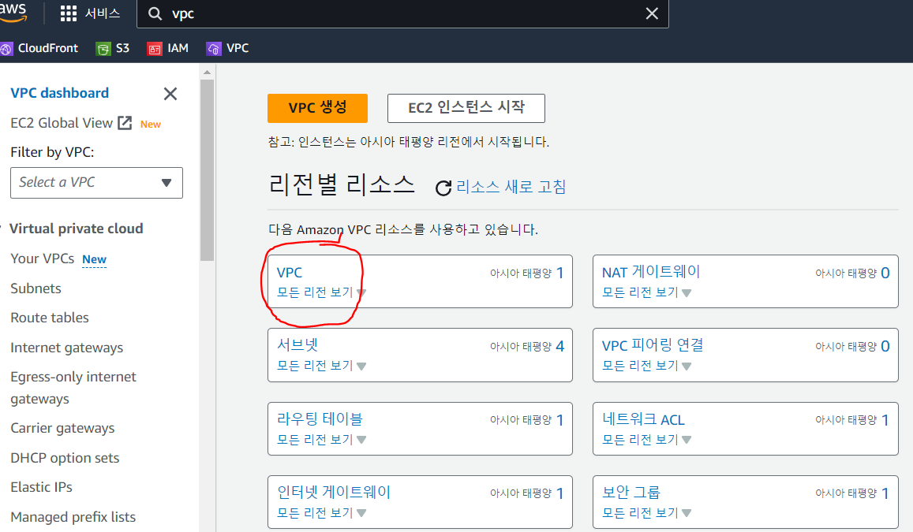

- 먼저 AWS 계정 생성하면 자동으로 모든 Region에 기본 VPC를 하나씩 만들어준다.
  <BR>
  <BR>

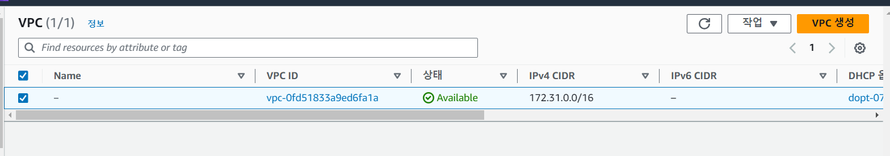

- 기본 VPC (이름은 없고 CIDR은 16 range)
  <BR>
  <br>

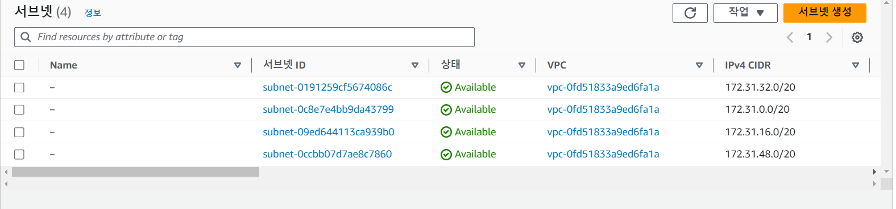

- 가용영역(available zone)에 걸쳐 subnet이 형성 되어있다.

  <BR>
   <BR>

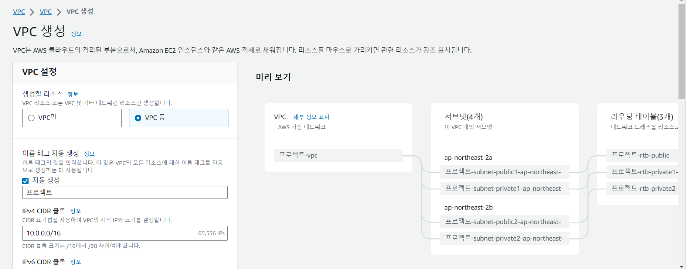

- VPC 생성을 클릭하면 다음과 같은 창으로 이동한다.
- VPC 등을 선택하면 서브넷 라우팅 테이블 등 다양한 설정을 만들 수 있다.
- VPC만 을 선택하면 말 그대로 VPC만 생성되지만 나중에 Subnet, IGW 등 생성이 가능하다
- 아직 배우는 단계니까 일단 VPC 만을 선택한 뒤 차차 다른 요소들을 생성해보도록 하자

  <BR>
   <BR>

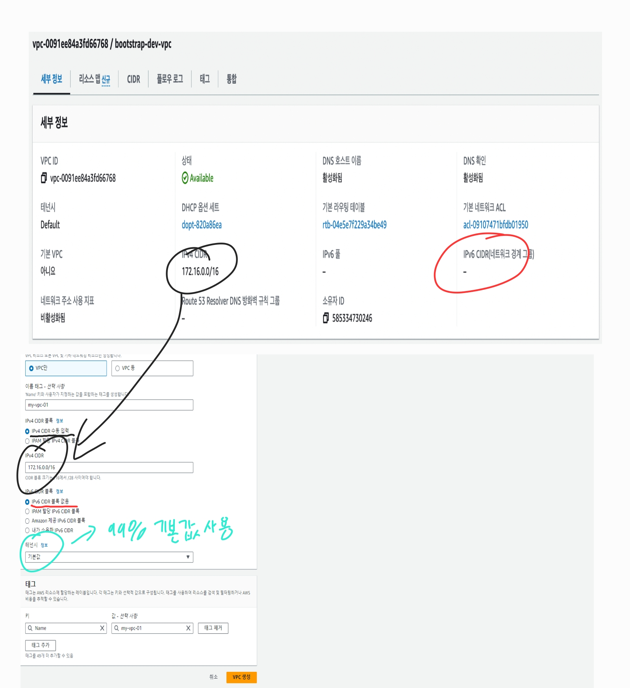
과제 예시에 맞게 설정 후 생성해준다
<BR>

VPC를 생성하면 기본으로 몇 가지 리소스를 같이 생성해준다

1. 라우팅 테이블

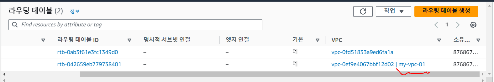
그림과 같이 my-vpc-01(내가 만든 vpc 이름)의 라우팅 테이블이 자동생성됐다.

  <BR>
<BR>   
  
2. NACL(방화벽)

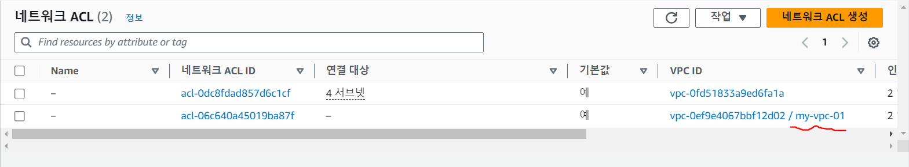
마찬가지로 NACL도 생성된 걸 확인할 수 있다.

  <BR>
  <BR>

3. 보안그룹

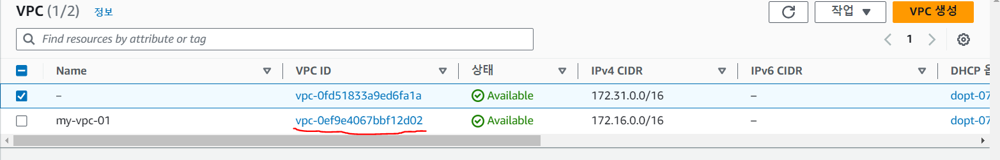
방금 생성한 VPC ID 값과 일치하는

  <BR>
  <BR>

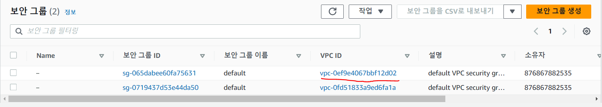
보안그룹이 생성되었음을 확인할 수 있다. 참고로 밑에 보안그룹은 기본적으로 있는 (원래있던) 보안그룹이다.

  <BR>
  <BR>

다음으로 서브넷을 생성해보자

**Private** Subnet 2개, **Public** Subnet 2개 를 생성해보자

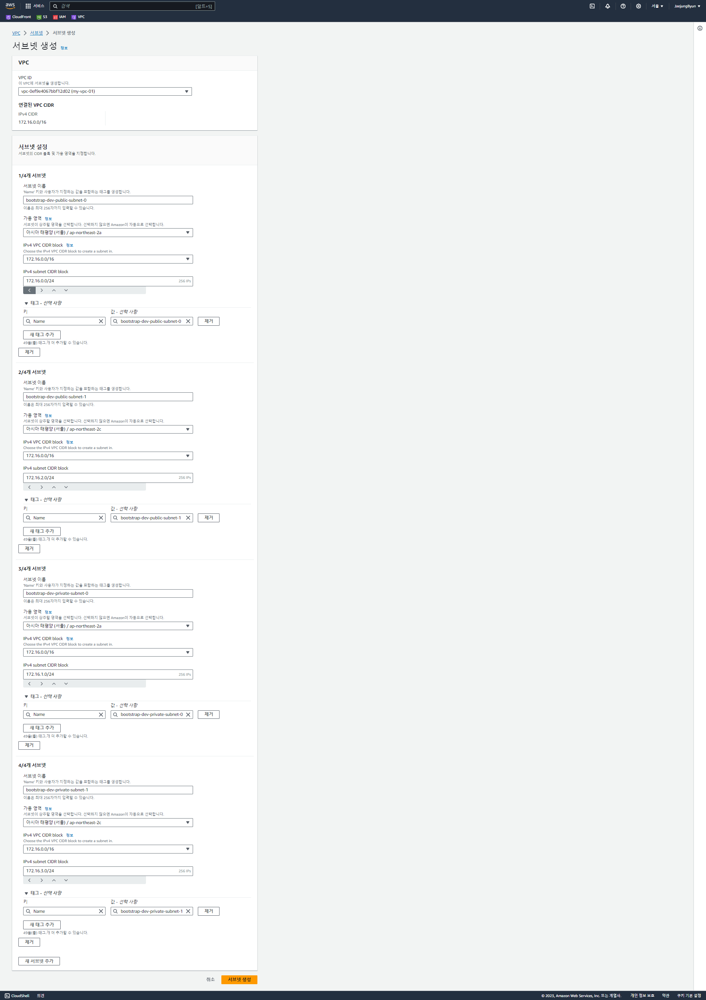

과제 조건에 맞게 생성했다.

  <BR>
 <BR> 
      
      
서브넷을 2개씩 만든 이유

- Multi AZ 설정을 위해

> Multi AZ 를 하는 이유? **가용성
> →** 한쪽의 AZ 에서 화재라던가 네트워크 이슈등이 발생했을시, 다른 한쪽의 AZ 로 커버하기 위함

달걀을 한 곳에 모아 두지 말라는 의미

  <BR>
<BR>

서브넷을 생성하면 AWS는 서브넷에게 2가지 리소스를 제공한다.

1. NACL

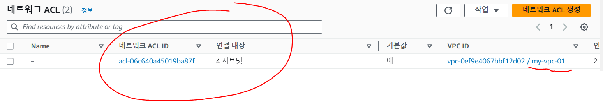

  <BR>
  <BR>

2. 라우팅 테이블

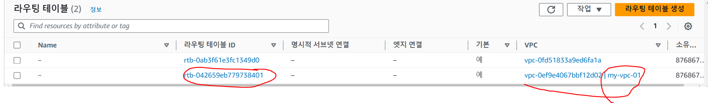

  <BR>

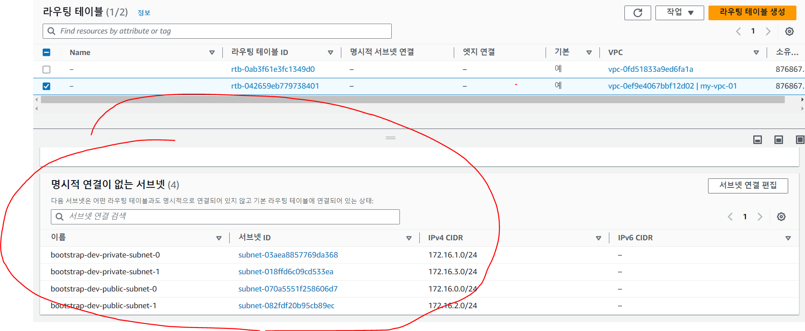

명시적으로 연결하지 않은 Subnet은 모두 default 서브넷에 연결된다.

다음으로 EC2 Instance를 만들고 SSH (22) 접근 시도 후 실패하는 과정을 진행해보자.

  <BR>
  <BR>

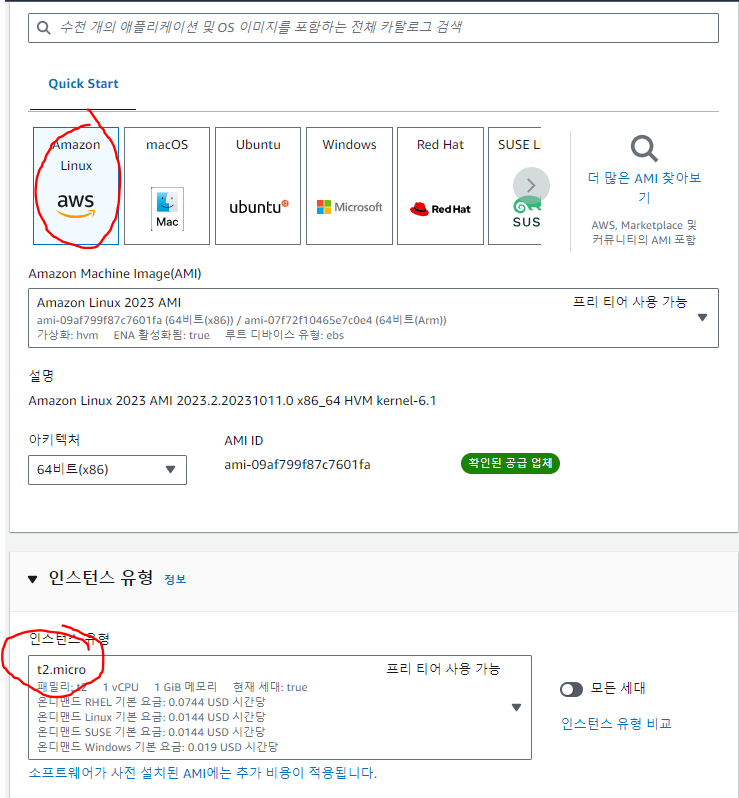

EC2로 들어가 Instance 생성을 누른뒤 과제 예시와 같이 인스턴스 t2.micro 타입으로, Amazon Linux 선택하여 생성해준다.

  <BR>
  <BR>

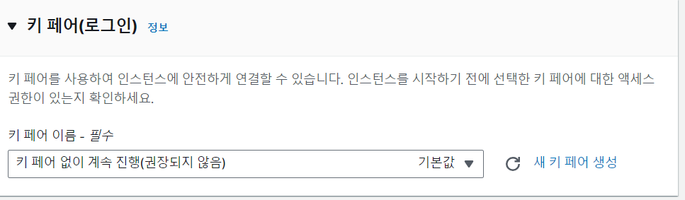
키페어는 일단 없이 진행하고

  <BR>
  <BR>

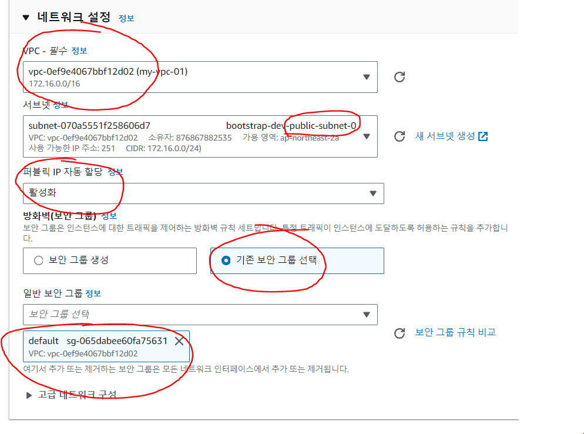

- vpc는 방금 생성한 vpc로 선택
- 서브넷은 public 서브넷
- 퍼블릭 ip 자동 할당 활성화
  퍼블릭 ip 자동 할당이란. 선택한 subnet에 ec2 instance가 만들어질때 public ip 할당 유무를 선택할 수 있다.
- 보안그룹은 기존보안그룹 선택 후 인스턴스를 생성해준다.

 <BR>
<BR>

그리고 보안그룹(SG)를 만들어 **SSH (22 포트)** 만 열어 인스턴스에 할당해주도록 한다. (SSH 접근 테스트만 할것이기에)

보안그룹 - 인바운드 규칙 편집을 들어간다.

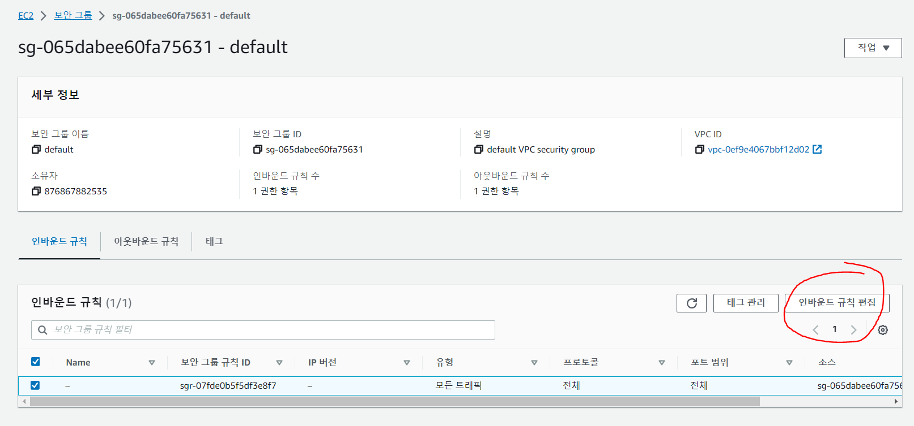

SSH만 열고 저장한다.

  <BR>
  <BR>

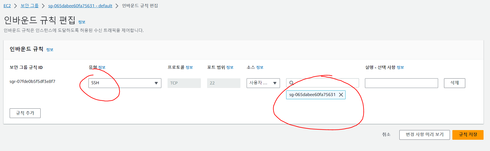

SSH (22 포트) 만 열어 인스턴스에 할당해줬다.

  <BR>
  <BR>

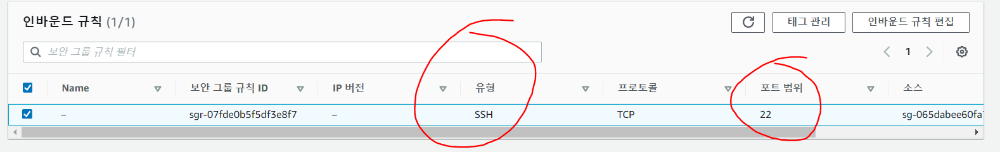

이제 방금만든 인스턴스에 SSH (22) 접근을 시도해본다.

  <BR>
  <BR>

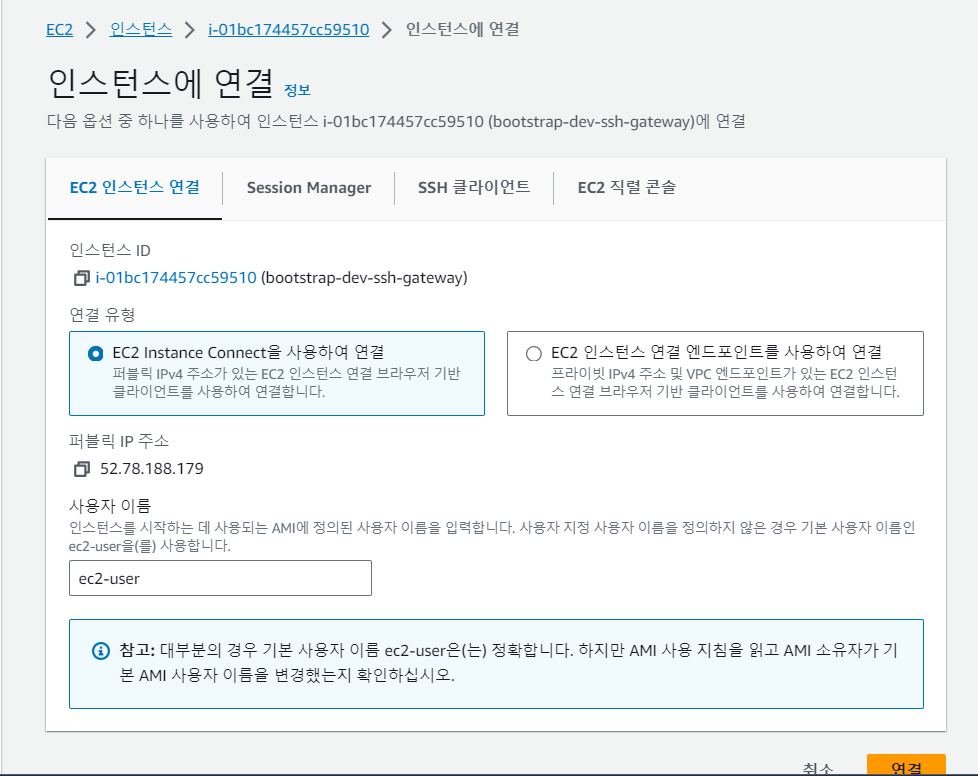

  <BR>
  <BR>
  
계획대로 에러가 떴다.

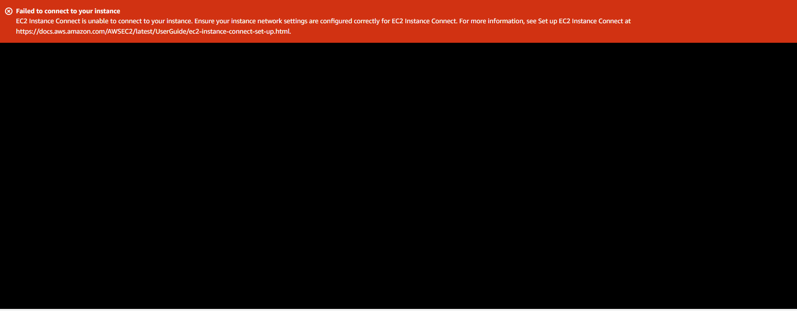

```
Failed to connect to your instance
EC2 Instance Connect is unable to connect to your instance. Ensure your instance network settings are configured correctly for EC2 Instance Connect.
```

  <BR>

→

인스턴스에 연결하지 못했습니다.
EC2 Instance Connect를 인스턴스에 연결할 수 없습니다. EC2 Instance Connect에 대한 인스턴스 네트워크 설정이 올바르게 구성되어 있는지 확인하십시오.

  <BR>
  <BR>
<br>

인스턴스에 연결할 수 있도록 IGW, 라우트 테이블을 설정해보자.

먼저 **IGW** 생성하여 EC2 의 외부 노출을 시도하자

- 앞서 EC2 가 **Public Subnet** 에 할당되어있음에도 외부 접근이 되지 않은 이유
  > SSH 접근 시도 시 _인스턴스 네트워크 설정이 올바로 구성되지 않았다._ 에러 발생
  - **VPC** 가 Private Network 라고 말했듯이 아무것도 하지않으면 **Intranet** 일뿐
  - 이때 제가 설명드렸던 **Internet GW (IGW)** 가 필요한 시점
    - **VPC** ⇒ **Intranet**
    - **VPC** + **Internet GW (IGW)** ⇒ **Internet**
      <BR>
      <BR>

인터넷 게이트웨이를 생성해준다.

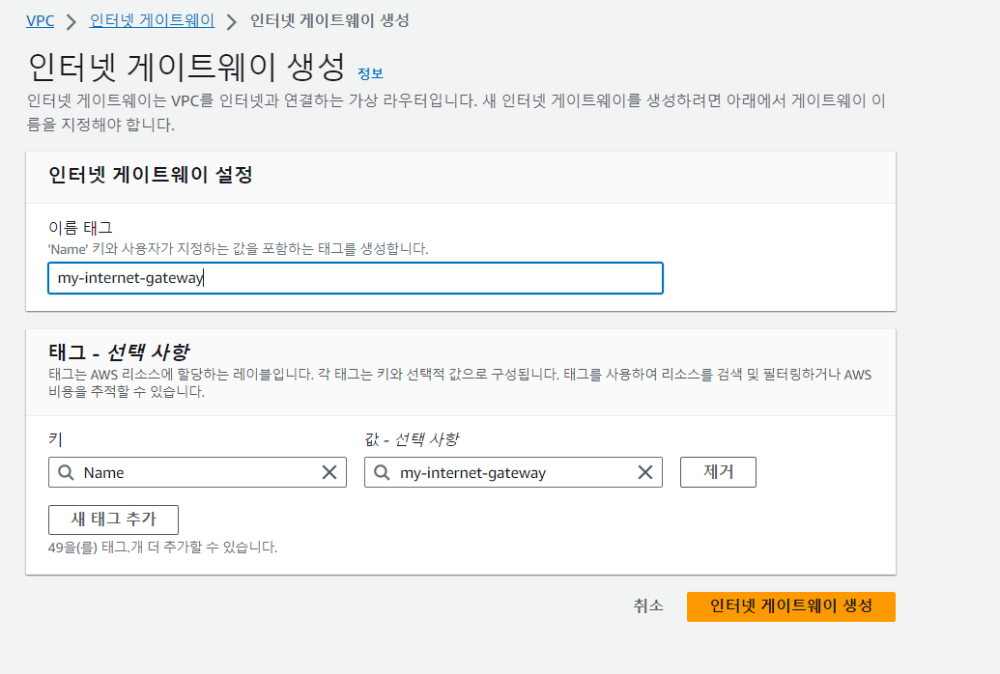

  <BR>
  <BR>

vpc에 붙여준다.
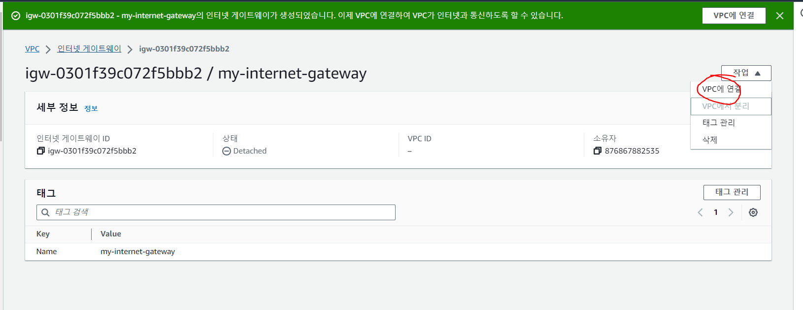

  <BR>

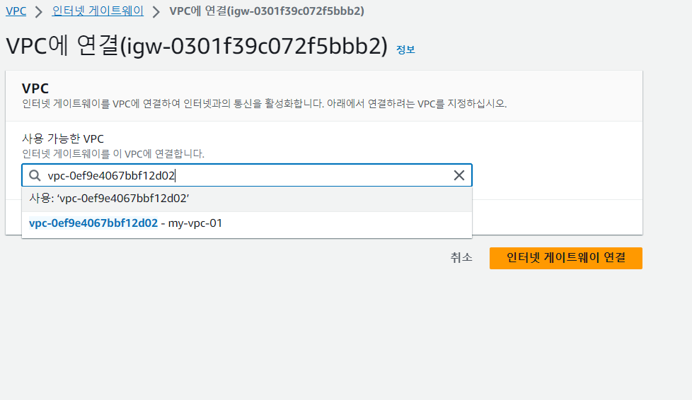

이때 default vpc가 안뜨는 이유는 default vpc는 이미 인터넷을 가지고 있기 때문이다.

아까 인스턴스에 다시 SSH (22) 접근을 시도해본다.

  <BR>
  <BR>

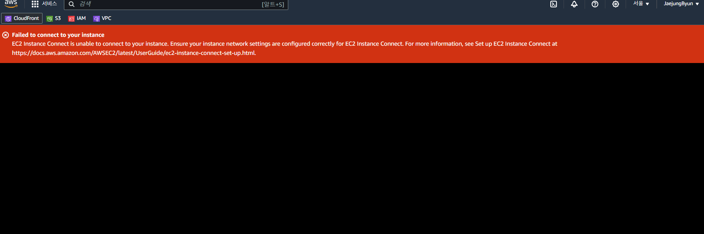

어김없이 안된다.

  <BR>

> 동일하게 SSH 접근 시도 시 _인스턴스 네트워크 설정이 올바로 구성되지 않았다._ 에러 발생

<BR>
  <BR>

이제 **Route Table** 2개를 생성하는 작업을 할 것이다.

자동으로 생성된 라우트 테이블은 private subnet과 연결해준다.

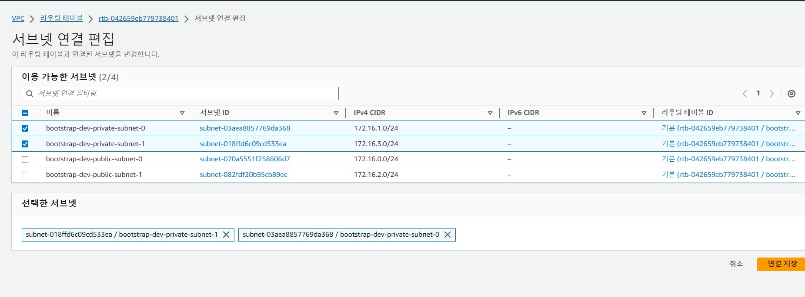

  <BR>
  <BR>

public 서브넷에 연결할 라우트 테이블을 생성해주고

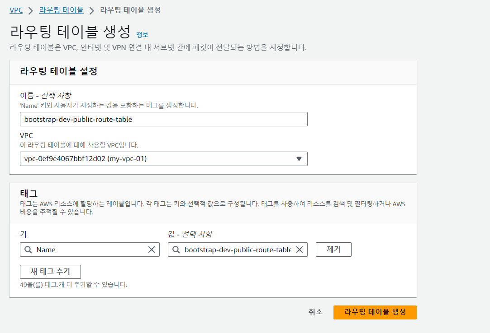

  <BR>
  <BR>

public 서브넷을 연결해준다.

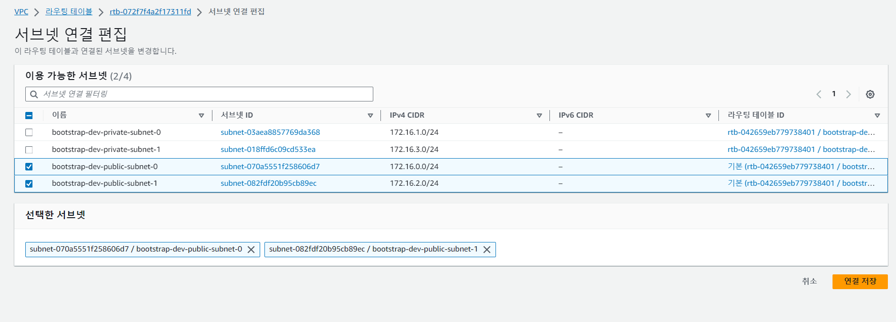

  <BR>
  <BR>

사진과 같이 서브넷연결을 완료했다.
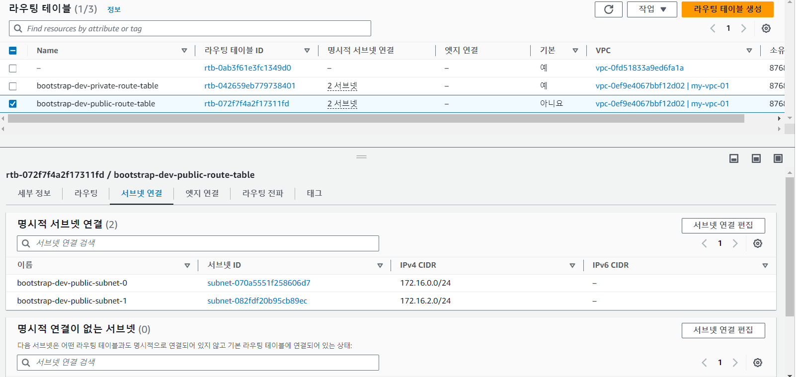

<BR>
  <BR>
    
    
 이제  Public Route Table에 route경로를 설정해 IGW 를 추가해준다. (모든 트래픽에 적용)

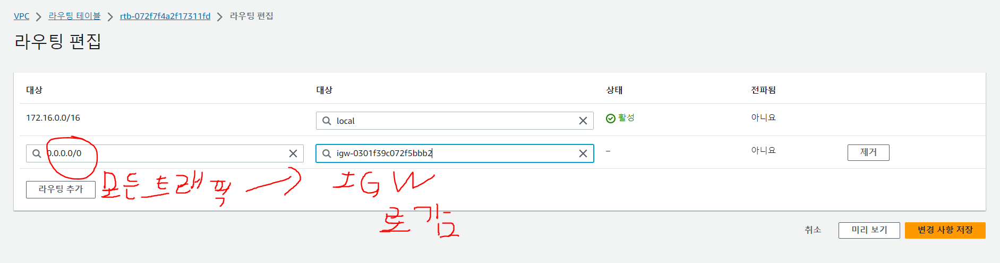

<BR>
  <BR>
    
  
  
연결 완료 및 인스턴스 연결 시도

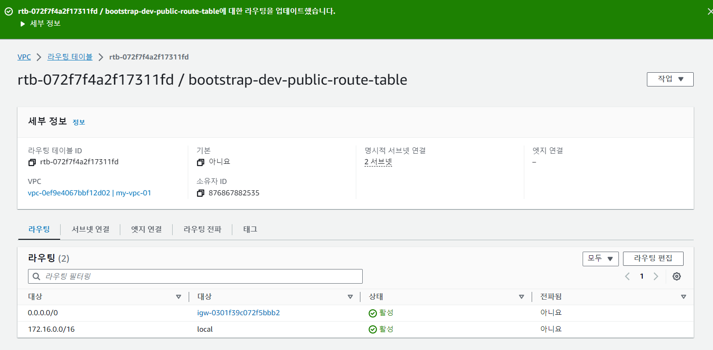

  <BR>

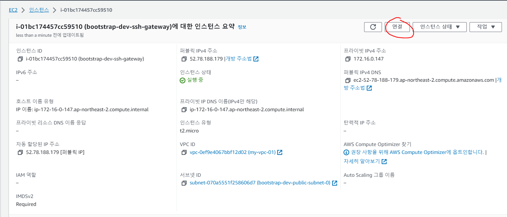

실패했다ㅎㅎ

  <BR>
  <BR>

이유는 보안그룹때문.

보안그룹 들어가서 내 vpc와 연결된 보안그룹 인바운드 규칙을 다음과 같이 편집했다.

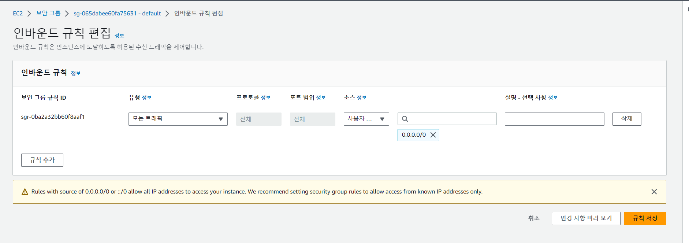

  <BR>
  <BR>

인스턴스 연결 재시도 결과 성공적으로 연결됐다.

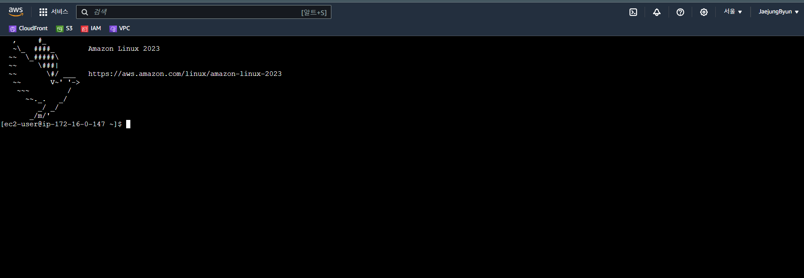

  <BR>
  <BR>

ping google.com 검색하니 잘 작동한다.

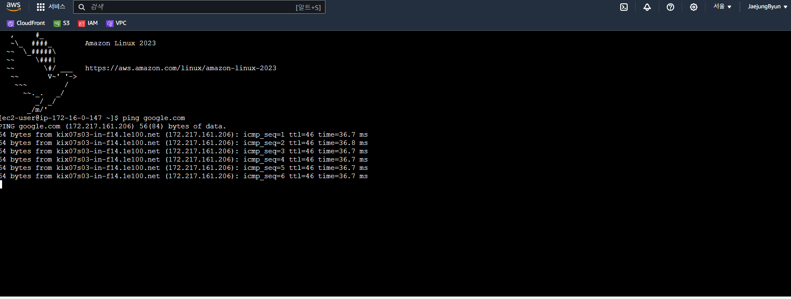


<br>
<br>
<br>

<details>

<summary>참고문헌</summary>

<div markdown="1">

https://velog.io/@juhyeon1114/AWS-S3%EC%99%80-Cloudfront%EB%A1%9C-%EC%9B%B9%EC%82%AC%EC%9D%B4%ED%8A%B8-%EB%B0%B0%ED%8F%AC

</div>

</details>
