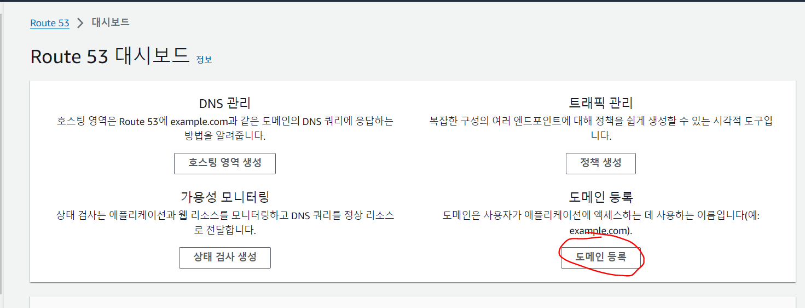
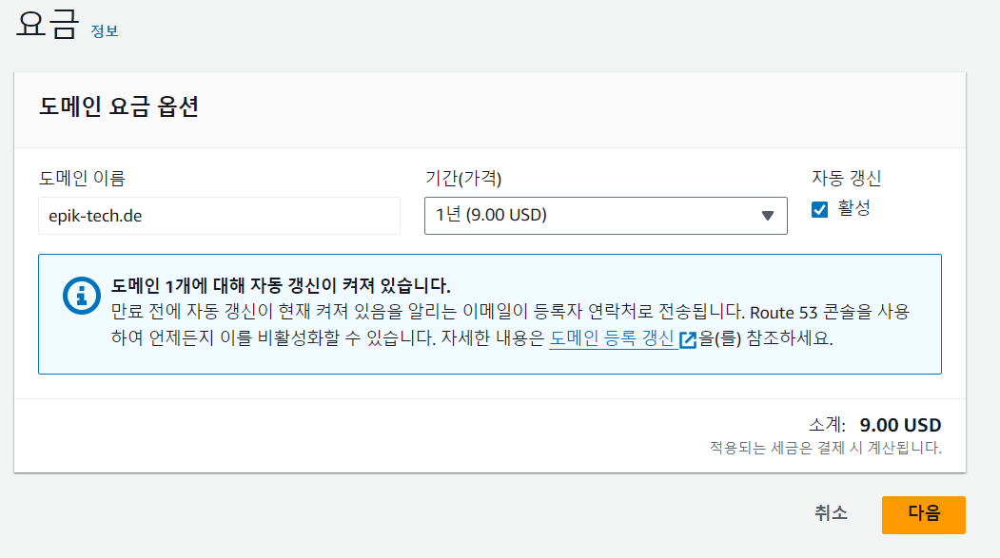
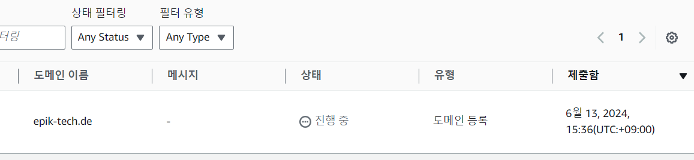

https://d7zyusgbyb73k.cloudfront.net/

현재 이 기술 블로그 도메인 주소입니다. 매우 못생겼습니다. 아무 의미없는 글자들이 나열된 도메인주소입니다.

저 혼자 사용하는거면 문제없지만 본 블로그 운영 목적은 정보 공유, 개발 과정 기록이기 때문에 보기 좋은 도메인을 적용시킬 필요성이 있습니다.

 
 

# 커스텀 도메인 적용

## 1. Route53 도메인 구매

먼저 도메인 구매를 위해 Route53 서비스에 접속해줍니다.

도메인 등록을 클릭해줍니다.

 

원하는 도메인을 입력하고 구매가능한지 조회해줍니다. 참고로 TLD는 de도메인이 가장 싸다고 합니다. 이번 도메인 구매과정은 본 블로그 도메인을 구매하는 것이므로 굳이 비싼 TLD를 사용할 이유가 없어서 저는 .de를 선택해줬습니다.

 

결제를 완료하면 도메인 등록이 진행중이라는 창이 뜹니다. 최대 3일까지 걸릴 수 있다니 커피 40잔정도 하면서 마음의 여유를 가져보도록 합시다.

 

 
 
 

참고문헌

https://velog.io/@juhyeon1114/AWS-S3%EC%99%80-Cloudfront%EB%A1%9C-%EC%9B%B9%EC%82%AC%EC%9D%B4%ED%8A%B8-%EB%B0%B0%ED%8F%AC

