https://d7zyusgbyb73k.cloudfront.net/

현재 이 기술 블로그 도메인 주소입니다. 매우 못생겼습니다. 아무 의미없는 글자들이 나열된 도메인주소입니다.

저 혼자 사용하는거면 문제없지만 본 블로그 운영 목적은 정보 공유, 개발 과정 기록이기 때문에 보기 좋은 도메인을 적용시킬 필요성이 있습니다.

 
 

# 커스텀 도메인 적용

AWS Route53 서비스에서 도메인을 구매해도 되지만 전 별도로 가비아에서 도메인을 구매하고 해당 도메인을 route53으로 옮겨보도록 하겠습니다. 본 과정은 웹페이지가 S3, CloundFront로 배포된 상태인 전제하에 진행하겠습니다.

> 참고로 aws Route53 에서 도메인을 구매하는 것이 레코드 관련, 인증서관련이 편하다고 합니다. 

 

## 1. 도메인 구매

먼저 가비아에 접속해 도메인을 구매해줍니다. 

[도메인 구매 과정](https://www.epik-blog.com/[%ED%82%A4%EC%9B%8C%EB%93%9C%20%ED%94%84%EB%A1%9C%EC%A0%9D%ED%8A%B8]%20%EB%8F%84%EB%A9%94%EC%9D%B8%20%EA%B5%AC%EB%A7%A4%20%EB%B0%8F%20%EC%A0%81%EC%9A%A9/)은 제 블로그 내용을 참고하시면 될 것 같습니다. 

 
 

## 2. Route53 호스팅 영역 생성

이제 aws Route 53으로 접속해 호스팅 영역을 생성해줍니다.

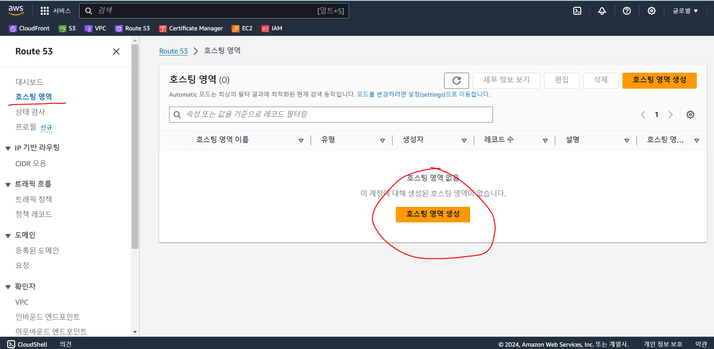

도메인 이름에는 가비아에서 구매한 도메인(저는 `epik-blog.com`입니다.)을 입력하고 유형은 퍼블릭 호스팅 영역으로 선택해줍니다. 

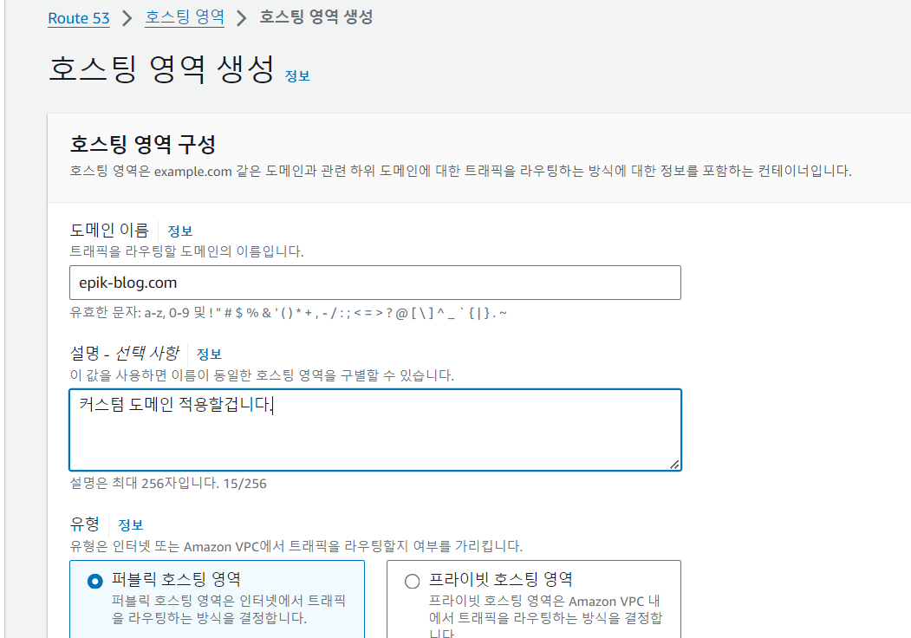

 

호스팅 영역을 생성하면 레코드가 생성되는데 `값/트래픽 라우팅 대상` 내용을 복사해줍니다. 총 4개입니다. 

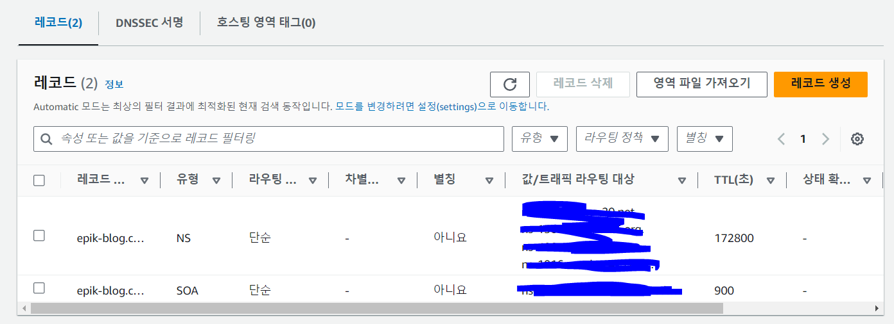

 
 

## 3. 가비아 네임서버 설정

이제 가비아 접속 후 my가비아 - 도메인 관리에 접속해 네임서버를 설정해줍니다.

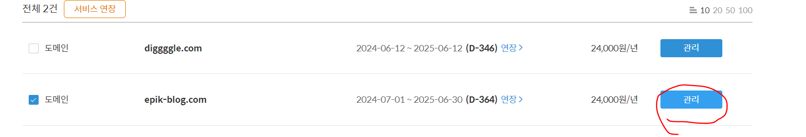

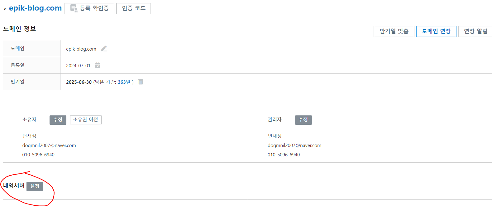

아까 복사했던 `값/트래픽 라우팅 대상` 내용을 순차적으로 넣어주면 됩니다. 

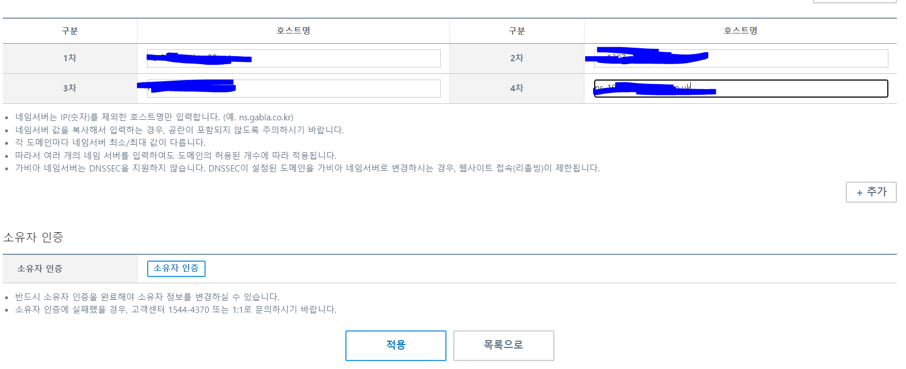

> 이 과정에서 안전잠금해지를 하라고 할 텐데 그냥 해주면 됩니다. 

 
 

# 4. ACM 인증서 발급

AWS ACM 서비스에 접속 후 인증서 요청을 해줍니다. 이때 위치를 `버지니아 북부`로 해줘야합니다.

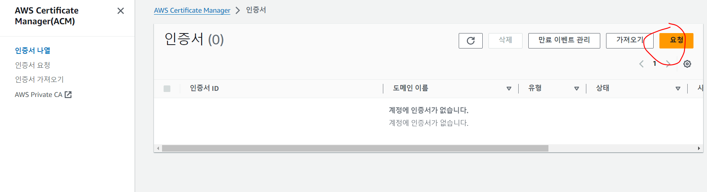

퍼블릭 인증서 요청을 선택하고 완전히 `정규화된 도메인 이름`에 가비아에서 `구매한 도메인(epik-blog.com)`과 `www.구매한 도메인(www.epik-blog.com)`을 입력해줍니다. 검증방법은 DNS 검증, 키 알고리즘은 RSA 2048을 선택하시면 됩니다. 

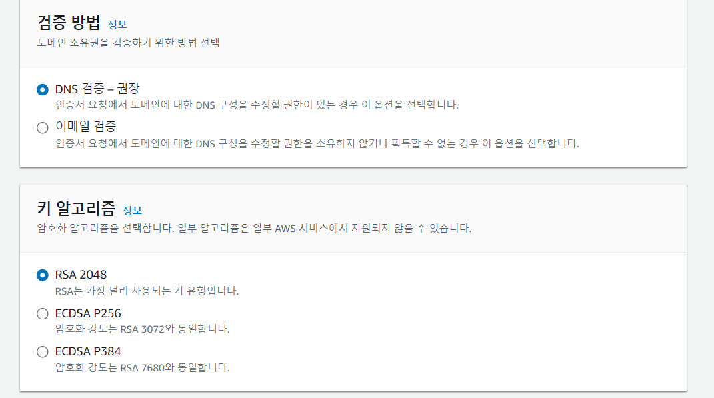

 

인증서 요청을 완료했다면 인증서 상태가 `검증 대기중` 이라 뜰 텐데 `Route 53에서 레코드 생성`을 눌러줍니다. 

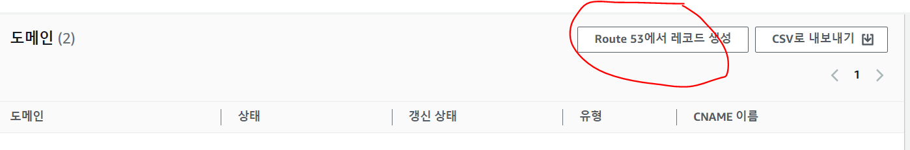

레코드를 생성해주면 상태가 성공으로 바로 변경됩니다. (안된다면 조금만 기다려봅시다.)

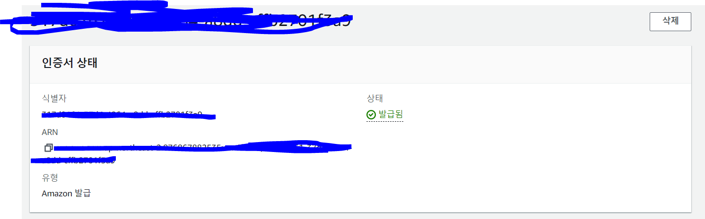

 
 

## 5. CloudFront에 발급한 인증서 적용

CloudFront 배포 목록에 들어가 도메인 적용시킬 웹페이지 클릭 후 편집을 눌러줍니다.

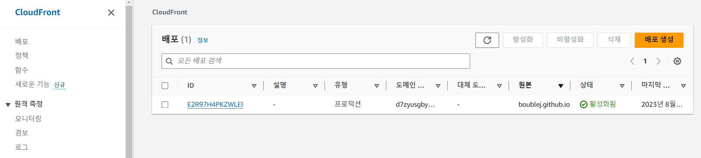

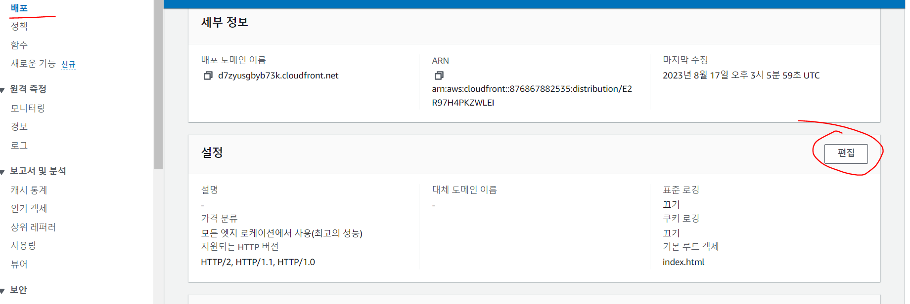

`대체 도메인 이름(alternative domain name)`에 가비아에서 구입한 도메인(epik-blog.com)과 `www.구입한 도메인(www.epik-blog.com)`을 입력하고 사용자 정의 SSL 인증서에서 발급받은 인증서를 선택해줍니다. 방금 acm에서 발급한 인증서입니다. 

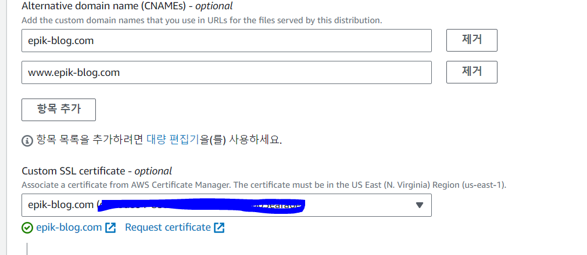

 
 

## 6. Route 53 레코드 생성 및 엔드포인트 선택

다시 Route 53으로 돌아가서 호스팅 영역에서 레코드 생성을 해줍니다.

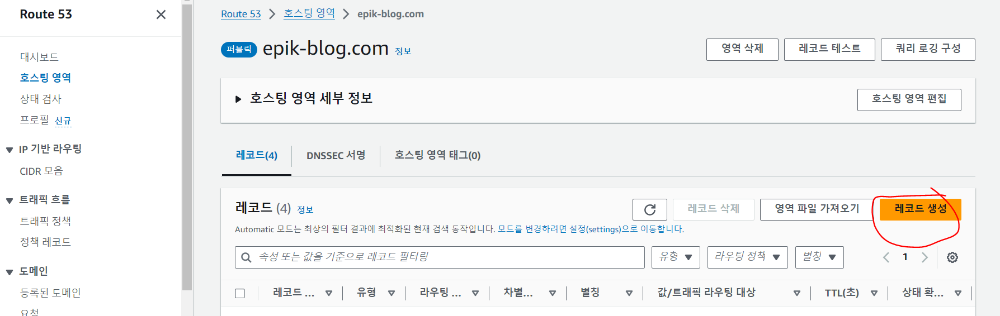

subdomain에 www를 입력하고 레코드 유형을 A로 선택하고 별칭으로 전환하여 엔드포인트를 CloudFront 배포로 선택해줍니다. 

region은 자동으로 미국 동부(버지니아 북부)가 될 겁니다. 아까 acm 인증서 발급 시  미국 동부(버지니아 북부) region을 선택한 이유 입니다. 

마지막으로 CloudFront에서 생성한 배포를 선택 후 레코드를 생성해주면 됩니다. 
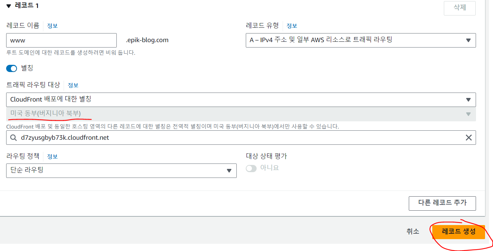

 
 

## 7. 도메인 적용 성공

성공적으로 도메인이 적용된 것을 확인할 수 있습니다.!!~~~

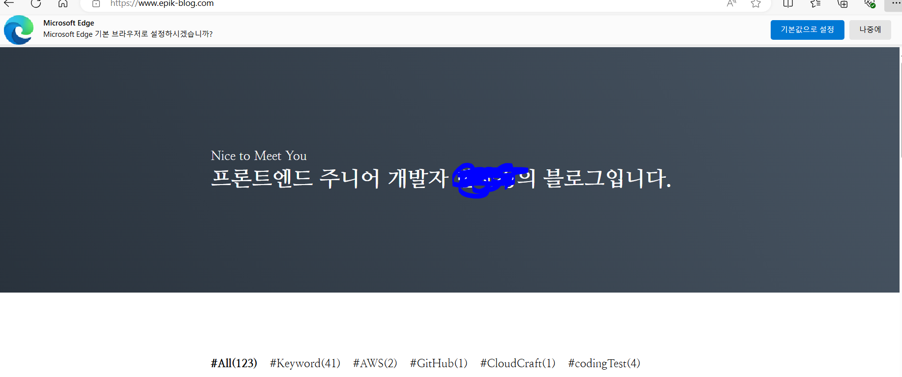

 
 
 

참고문헌

https://velog.io/@tjdwn9753/AWS-S3-CloudFront-HTTPS-%EC%84%A4%EC%A0%95-%EB%8F%84%EB%A9%94%EC%9D%B8-%EC%84%A4%EC%A0%95%EA%B9%8C%EC%A7%80-%ED%95%98%EB%8A%94-%EB%B0%A9%EB%B2%95

https://velog.io/@ckdgus5189/AWS-S3%EC%99%80-CloudFront%EB%A1%9C-%EB%A6%AC%EC%95%A1%ED%8A%B8-%EC%9B%B9%ED%8E%98%EC%9D%B4%EC%A7%80-%EB%B0%B0%ED%8F%AC#route53%EC%9C%BC%EB%A1%9C-%EC%BB%A4%EC%8A%A4%ED%85%80-%EB%8F%84%EB%A9%94%EC%9D%B8-%EC%9E%85%ED%9E%88%EA%B8%B0

