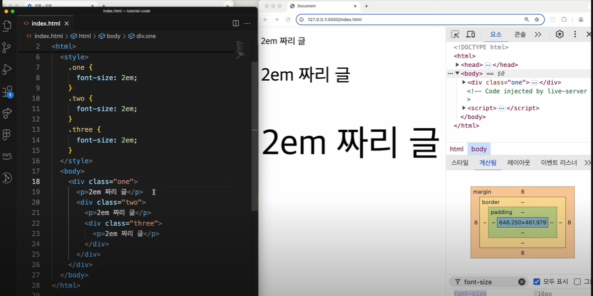

웹개발을 하다보면 폰트 사이즈를 설정할 일이 빈번합니다.

초기 개발 입문하신 분들은 대부분 `px` 단위를 사용할텐데요.

앞으로는 `px` 보단 `rem` 사용을 매우매우 권장드립니다.

그 이유를 한 번 알아봅시다.

# px 단위

px이란, 디지털 화상을 구성하는 기본적인 단위입니다.

즉 모니터 (디스플레이)를 쪼갤 수 있을만큼 최대한 쪼개서 나타낼 수 있는 가장 작은 단위입니다.

보통 0.26mm 인데요. px 사용을 권장하지 않는 이유는 px 단위는 절대단위이기 때문입니다.

즉 고정된 사이즈를 가진다는 뜻이죠. 16px은 어떻게 적용해도 16px 사이즈이고, 24px도 어디에 적용해도 24px입니다.

아래 예시를 봅시다.

## px의 단점

우리가 자주 사용하는 크롬 브라우저에는 웹접근성을 위해 폰트 사이즈를 조절할 수 있는 기능이 별도로 내장되어 있습니다.

설정 - 모양 탭에 들어가시면 폰트 사이즈를 조절할 수 있는대요.

만약 개발자가 웹사이트 폰트 사이즈를 16px로 고정해놓았다면 크롬 브라우저 글꼴 크기 설정이 적용되지 않습니다.

글꼴 크기 설정을 `아주크게` 든 `아주작게` 로 설정해놓아도 이미 해당 글씨는 16px로 설정되어 있기 때문에 무조건 16px로 적용되어 화면에 띄워집니다.

이러한 부분은 눈이 안좋은 어르신분들이 사이트를 이용하는데 불편함을 줄 수 있겠죠.

# rem, em

이러한 문제점을 해결하기 위해서 `rem` 혹은 `em` 사용을 매우 지향합니다.

`rem`과 `em` 모두 상대단위입니다.

차이점은 rem은 root 요소의 폰트사이즈에 비례해서 사이즈가 변경되고, em은 부모 요소의 폰트 사이즈에 맞춰 변경됩니다.

## em 예시

위 사진을 보면 em 단위의 경우 부모요소 폰트 사이즈에 맞춰 사이즈가 변경되는 것을 알 수 있습니다.

상황에 따라 em 단위도 유용하게 사용될 수 있지만 웹 사이트 규모가 커지면 중첩되는 요소들이 많아짐에 따라 폰트 사이즈를 계산하기 어려울 수 있다는 단점이 있습니다.

## rem 예시

`rem` 단위의 경우 root 요소 폰트 사이즈에 맞춰 폰트 사이즈가 변경됩니다.

여기서 말하는 root 요소는 html을 의미하고 html의 기본 폰트 사이즈는 16px 입니다.

때문여 별도의 설정을 하지 않았을 경우 1rem은 16px을 의미합니다.

만약 상술했던 크롬 브라우저 설정에서 글꼴 크기를 변경한다면 이에 맞춰 폰트 사이즈가 변경되겠죠. 즉 웹접근성을 향상시킬 수 있다는 장점이 있습니다.

또한 root 요소 기준으로 폰트 사이즈가 변경되기 때문에 em 처럼 머리아플일도 없죠.

### rem 사용시 주의할 점

다만 주의할 점으로 html (root 요소)에 `font-size` 속성을 px(절대단위)로 부여한다면 rem 사용 후 브라우저에서 글꼴 크기를 변경해도 적용되지 않는다는 점입니다.

위 사진처럼 html에 절대단위 20px을 부여하면 브라우저 글꼴 크기 설정이 적용되지 않습니다. 브라우저 폰트 사이즈가 절대단위 20px로 고정되어버렸거든요

## 결론

사실 대부분 rem을 씁니다. em은 부모요소 폰트 사이즈를 계산해야하다보니 여간 불편한게 아니거든요. **rem** 쓰세요!

 
 
 

참고문헌

https://www.youtube.com/watch?v=YS8sWZ-XoyY

