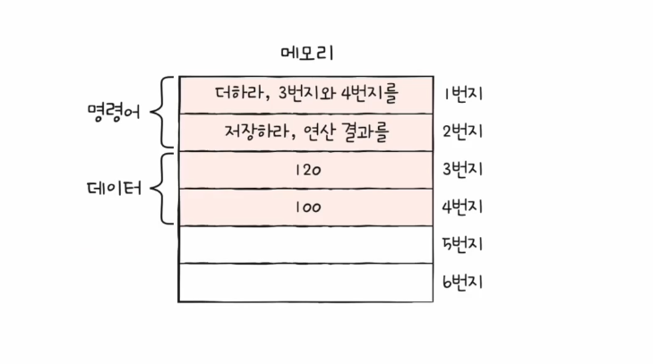
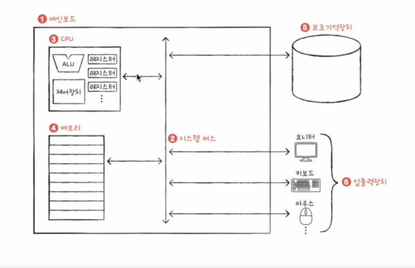
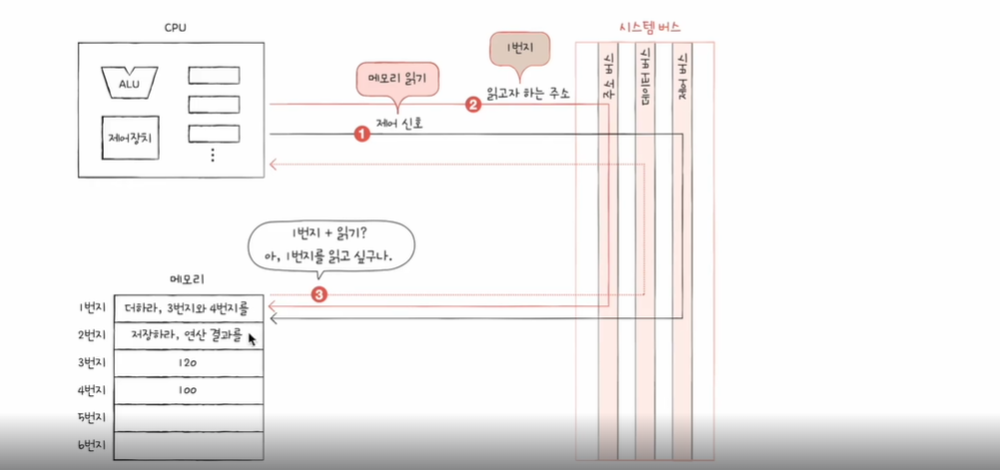
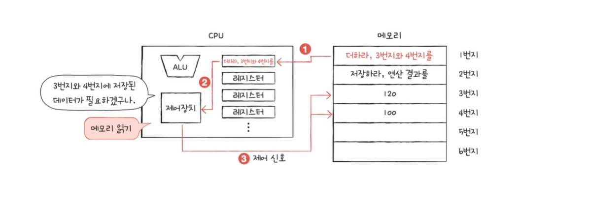
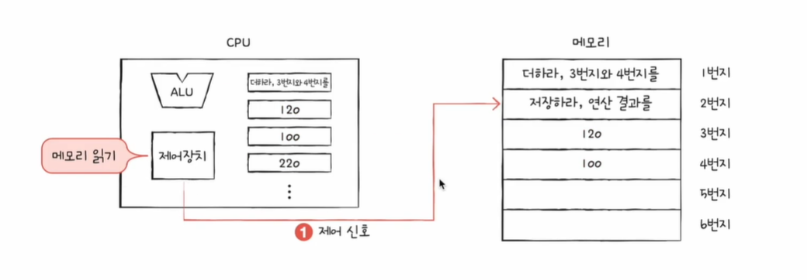
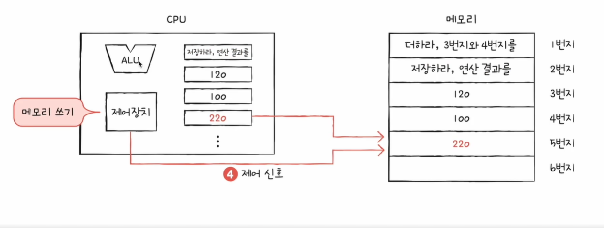
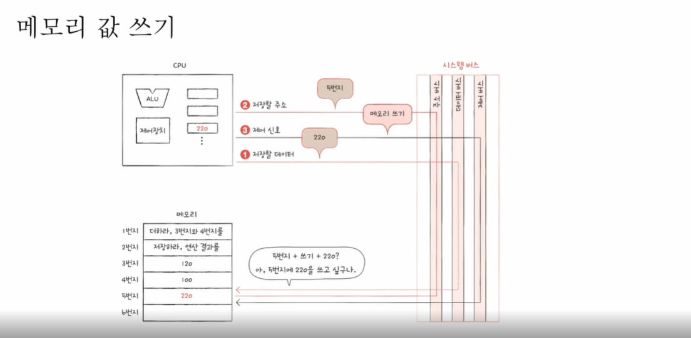

어찌저찌 운좋게 프론트엔드 개발자로 취업했지만 컴퓨터 공학에 대한 지식이 전무한 것 같아 CS 공부를 시작했고 이를 기록하려합니다.

본 아티클은 [개발자를 위한 컴퓨터공학 1: 혼자 공부하는 컴퓨터구조 + 운영체제](https://www.inflearn.com/course/%ED%98%BC%EC%9E%90-%EA%B3%B5%EB%B6%80%ED%95%98%EB%8A%94-%EC%BB%B4%ED%93%A8%ED%84%B0%EA%B5%AC%EC%A1%B0-%EC%9A%B4%EC%98%81%EC%B2%B4%EC%A0%9C/dashboard) 강의를 기반으로 작성했습니다.

# 컴퓨터가 이해하는 정보

## 1. 데이터

- 숫자, 문자, 이미지, 동영상과 같은 정적인 정보
- 컴퓨터와 주고받는/내부에 저장된 정보를 데이터라 통칭
- 0,1로 숫자, 문자를 표현하는 방법

## 2. 명령어

- 컴퓨터는 명령어를 처리하는 기계
- 명령어란 컴퓨터가 실질적으로 움직이는 정보, 데이터는 명령어를 위한 재료
- ex. 1과 2를 더해라. -> 1,2는 `데이터`, 더해라는 `명령어` 

# 컴퓨터의 네 가지 핵심 부품

## 1. CPU

메모리에 저장된 명령어를 읽어 들이고, 해석하고, 실행하는 부품입니다.

CPU 내부에는 ALU, 제어장치, 레지스터가 있습니다.

### ALU (산술논리연산장치)

일종의 계산기입니다.

### 제어장치

`제어 신호`를 보내고, 명령어를 해석하는 장치

여기서 제어 신호란 컴퓨터 부품들을 관리하고 작동시키기 위한 전기 신호를 말합니다. 

제어 신호는 2개로 분류할 수 있는데
- CPU가 메모리에 저장된 값을 읽고 싶을 땐 메모리를 향해 `메모리 읽기`라는 제어 신호를 보냅니다.
- CPU가 메모리에 어떤 값을 저장하고 싶을 땐 메모리를 향해 `메모리 쓰기`라는 제어 신호를 보냅니다.

### 레지스터

CPU 내부의 작은 저장장치 (임시 저장 장치)

 

## 2. 메모리(RAM)

- **현재 실행되는 프로그램**의 명령어와 데이터를 저장하는 부품입니다.

- 모든 프로그램은 명령어와 데이터로 이루어져 있는데, 어떤 프로그램이 실행되기 위해선 반드시 메모리에 저징되어있어야 합니다.

- 일반적으로 메모리는 RAM을 칭하는 경우가 많습니다. (ROM도 메모리이긴한데 잘 안씁니다.)

- 메모리에는 **주소**라는 개념이 사용되는데, 실행하려는 프로그램이 메모리내 저장되어 있을 때 그 위치를 칭하는 개념입니다. 즉 메모리에 저장된 값의 위치는 주소를 통해 알 수 있습니다. 

위 그림에서 1번지, 2번지라고 예시로 작성한 것들이 바로 메모리 주소입니다. 1번지 주소엔 `더하라, 3번지와 4번지를` 라는 명령어가 저장되있고, 3번지 주소엔 `120` 이라는 데이터가 저장되어있습니다. 

물론 실제 주소는 1번지 2번지라 표현하지 않습니다ㅎㅎ

- 보조기억 장치에 비해 가격이 비싸고, 전원이 꺼지면 저장된 내용을 잃습니다. (휘발성)

예를 들어 작업중 pc전원이 꺼지면 작업 중이던 내용은 모두 사라집니다. 

## 3. 보조기억장치

USB, 하드디스크, SSD 등 백업용 저장장치를 말합니다.

설치되어있지만 실행되지 않는 프로그램들이 저장되는 공간입니다. 

## 4. 입출력장치

컴퓨터와 정보를 주고받을 수 있는 장치를 말합니다. 

마우스, 키보드, 마이크 등등이 있습니다.

## 메인보드

위 네 가지 장치들이 정보를 주고받기 위한 공간. 

메인보드에 RAM, SSD, CPU 등을 꽂아놓고 각각 장치들이 정보를 주고 받습니다.

정보를 주고받는 통로를 `버스`라고 합니다. (여러 버스가 존재하는데 `시스템 버스`가 가장 중요합니다.)

### 시스템 버스

3가지 버스로 분류됩니다.

1. 주소 버스 : 주소를 주고받는 통로 
2. 데이터 버스 : 명령어와 데이터를 주고받는 통로
3. 제어 버스 : 제어 신호를 주고받는 버스
 

# 그렇다면 CPU는 메모리에 저장된 값들을 어떻게 처리할까요?

매우 러프하게 알아봅시다. 

 

1. cpu가 메모리에 있는 명령어 (더하라, 3번지와 4번지를) 를 읽어들이기 위해선 제어장치에서 제어신호(메모리읽기)를 메모리로 내보냅니다.

이때 메모리 읽기 신호 제어 신호는 `제어 버스`를 통해 전달되고, 읽고자 하는 주소 신호는 `주소 버스` 를 통해 전달됩니다. 

즉 메모리는 메모리 읽기 신호 제어 신호, 읽고자 하는 주소 신호 2 가지 정보를 받습니다. 

2. 메모리는 1번지에 해당하는 명령어 (더하라, 3번지와 4번지를) 를 CPU로 전달하는데 CPU의 레지스터에 저장됩니다. 

그리고 제어장치는 레지스터로 들어온 명령어를 해석합니다. 제어장치는 해당 명령어 (더하라, 3번지와 4번지를)를 실행하기 위해선 3번지, 4번지 데이터가 필요하다는 것을 인지합니다. 

3. 3번지 데이터 (120), 4번지 데이터 (100)가 레지스터로 가져와지고, ALU는 해당 명령어를 실행합니다. (3번지 4번지 값을 더해 220이라는 값을 만듭니다.)

그리고 220값을 레지스터에 저장합니다. 

4. CPU는 다음 메모리 주소인 2번지 명령어 (저장하라, 연산 결과를) 명령어를 가져와 레지스터에 저장하고, 제어장치는 해당 명령어를 해석합니다. (위 과정과 동일합니다.)

5. 제어장치는 메모리쓰기 신호를 메모리로 보내 220 이라는 값을 메모리에 저장합니다. 

메모리 값을 저장하기 위해선 3가지 정보가 필요한데 값을 저장할 메모리 주소는 `주소 버스`를 통해 전달되고, 메모리 쓰기 제어 신호는 `제어 버스`를 통해 전달되고, 저장할 데이터는 `데이터 버스`를 통해 전달됩니다.

 
 
 

참고문헌

https://www.inflearn.com/course/lecture?courseSlug=%ED%98%BC%EC%9E%90-%EA%B3%B5%EB%B6%80%ED%95%98%EB%8A%94-%EC%BB%B4%ED%93%A8%ED%84%B0%EA%B5%AC%EC%A1%B0-%EC%9A%B4%EC%98%81%EC%B2%B4%EC%A0%9C&unitId=149145&tab=curriculum

