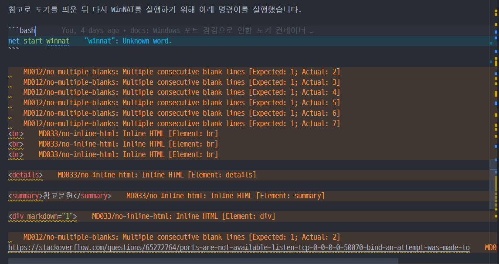
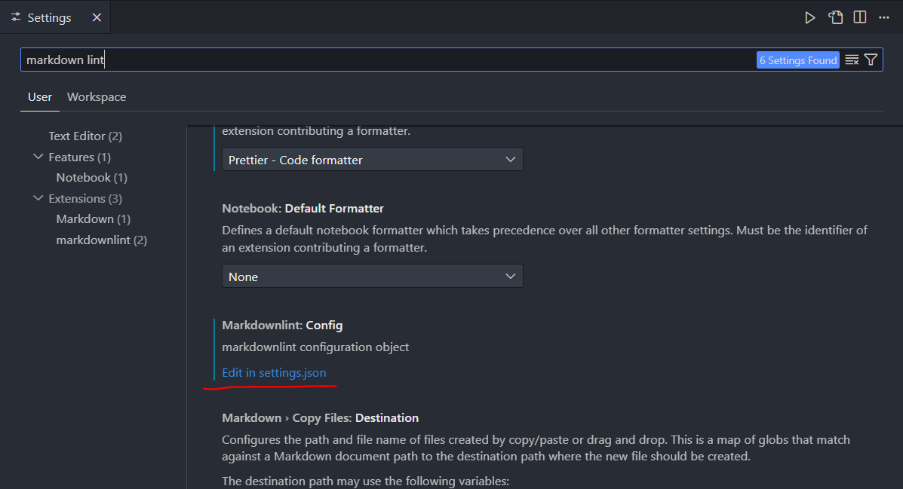
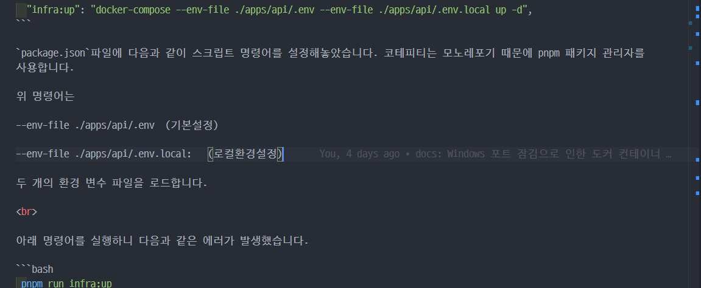

# 문제 발생

Cursor IDE로 마크다운 문서를 작성하는데 다음과 같은 lint 문법에러가 속출했습니다.



사실 마크다운은 단순 문서작성용이기 때문에 lint 에러를 굳이 신경쓸 이유가 없습니다.

쓸데없이 친절한 커서 에디터 덕분에 가독성이 극한의 쓰레기로 전락해버렸으니 불필요한 문법에러를 제거해봅시다.

# 해결

해결방법은 간단합니다.

1. Ctrl+, (mac환경은 Cmd+,)를 눌러 설정창을 열어줍니다.

2. 검색창에 'markdown lint'를 입력합니다.

3. setting.json 파일을 열어줍니다.



4. 아래 규칙을 추가해줍니다.

```json
  "markdownlint.config": {

    "default": false,
    "MD009": false,
    "MD013": false,
    "MD033": false
  }

```

<br>

5. 깨끗해진 마크다운 파일을 보며 속이 뻥~



# 원인 분석

제가 적용한 마크다운 규칙을 간단하게 알아보면

1. "default": false

모든 기본 Markdown 린트 규칙을 일괄적으로 비활성화합니다.

필요한 규칙만 명시적으로 활성화시킬 때 사용합니다.

<br>

2. "MD009": false

줄 끝 공백(trailing spaces) 검사 규칙을 비활성화합니다.

문장 끝이나 빈 줄에 공백이 있어도 오류/경고가 표시되지 않습니다.

<br>

3. "MD013": false

줄 길이 제한(line length) 규칙을 비활성화합니다.

기본값으로 한 줄이 80자를 초과해도 오류/경고가 표시되지 않습니다.

<br>

4. "MD033": false

HTML 태그 사용 제한 규칙을 비활성화합니다.

Markdown 문서 내에서 <div>, <span> 등의 HTML 태그를 자유롭게 사용할 수 있습니다.

<br>
<br>

[vscode 마켓플레이스 홈페이지](https://marketplace.visualstudio.com/items?itemName=DavidAnson.vscode-markdownlint)에서 다양한 마크다운 규칙을 확인할 수 있습니다. 참고하시면 좋을 것 같습니다.

<br>
<br>
<br>

<details>

<summary>참고문헌</summary>

<div markdown="1">

https://marketplace.visualstudio.com/items?itemName=DavidAnson.vscode-markdownlint

</div>

</details>
