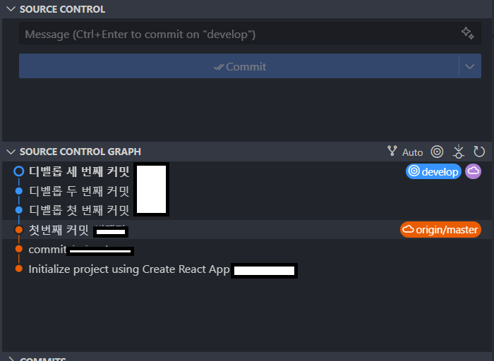
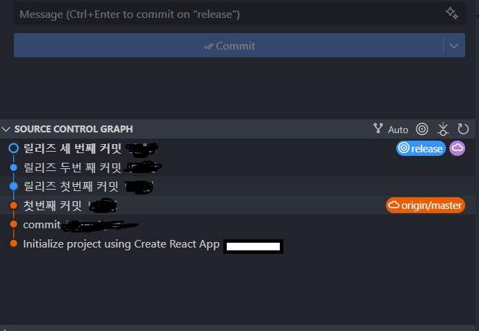
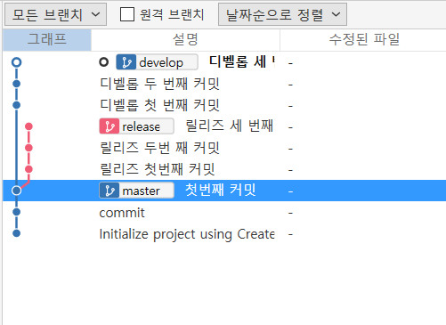

현재 재직중인 회사는 깃히스토리 관리를 위해 rebase를 사용중입니다. 

지금껏 rebase 명령어를 사용해본 적이 없어 적응하는데 많이 애먹었는데요...

예전 커밋로그까지 끌고와버리는 참사를 낸 적도 있습니다... 결국 똥을 치우기 위해 10시까지 야근을 했답니다. 물론 제가 한 건 없고 파트장님이 다 해결해주셨다는...

아무튼 이 놈의 rebase가 뭐길래 사람을 스트레스받게 하나 한 번 알아보도록 합시다.

 
 

여기 master, develop, release 총 3개의 브랜치가 있습니다. 

이미지를 보면 아시겠지만  master 브랜치의 첫 번째 커밋에서부터 develop, release 브랜치가 파생됐고 각 브랜치내에서 총 3번의 커밋을 진행했습니다.

소스트리는 위 구조로 되어있습니다.

자 이 상태에서 디벨롭 브랜치를 master 브랜치로 merge 해보겠습니다.

이 과정엔 문제가 없습니다. fast-forward가 가능하거든요

fast-forward란
위 브랜치 커밋 상태를 보면 master 브랜치에선 첫 번째 커밋 이후 아무 기록이 없습니다. 그리고 develop 브랜치는  `master 브랜치에선 첫 번째 커밋` 에서부터 파생된 브랜치입니다. 때문에 현재 develop 브랜치의 세번째 커밋과 master 브랜치의 첫 번째 커밋 사이에는 충돌날 일이 없습니다. 이러한 상태에서 merge 하는 것을  fast-forward라 합니다. 
 
 
 

참고문헌

안녕

