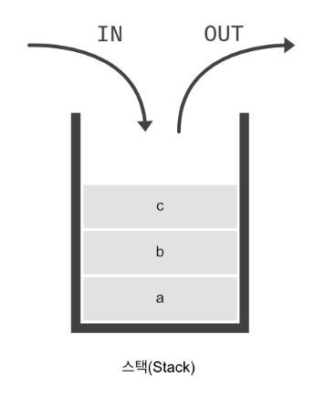
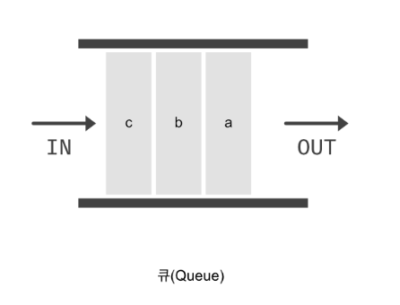
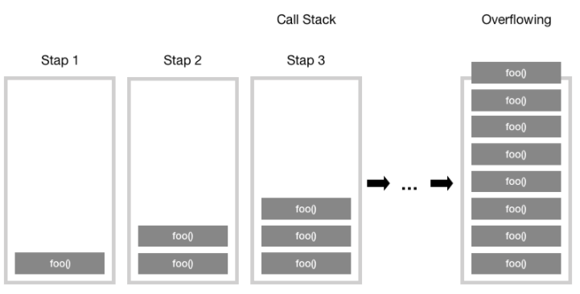
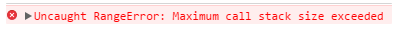
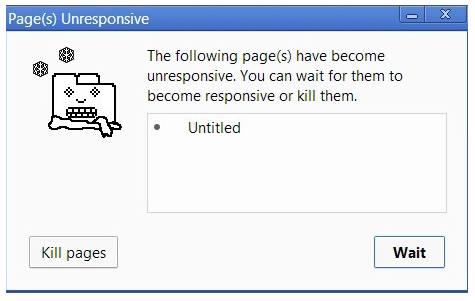
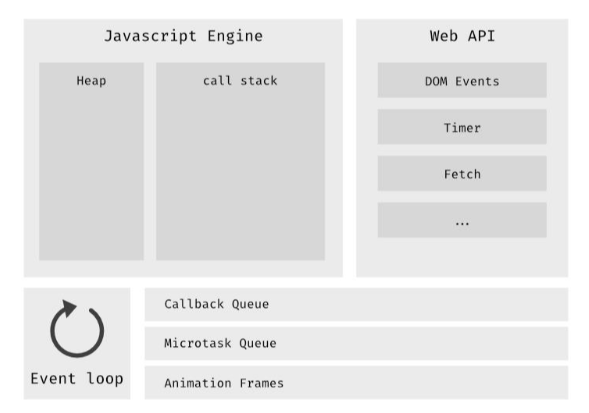

호출 스택을 알아보기 전 Stack과 Queue를 먼저 알아보자

# Stack(스택)



- 출입구가 하나인 데이터 구조
- a → b → c 순으로 데이터를 넣었다면 c → b → a 순으로 데이터가 나온다. (FILO, First In Last Out)

# Queue(큐)



- 출입구가 두개인 데이터 구조
- 일반적으로 a → b → c 순으로 데이터를 넣었다면 a → b → c 순으로 데이터가 나온다. (FIFO, First In First Out)
- 양쪽 모두 입출력 가능한 큐도 존재

# Call Stack(호출 스택)

여러 함수들을 호출하는 스크립트에서 해당 위치를 추적하는 인터프리터를 위한 메커니즘

자바스크립트 코드가 실행되며 생성되는 실행 컨텍스트를 저장하는 자료 구조

현재 어떤 함수가 실행중인지, 그 함수 내에서 어떤 함수가 호출되어야 하는지, 등 함수의 실행 순서를 제어한다 보면 된다.

## 메커니즘

1. 스크립트가 함수를 호출하면, 해당 함수에 대한 실행 컨텍스트가 생성
2. 인터프리터는 실행 컨텍스트를 호출 스택에 추가한 다음 함수를 실행하기 시작
3. 함수가 호출 될 때마다 새로운 실행 컨텍스트가 생성되고 생성된 실행 컨텍스트는 인터프리터에 의해 호출 스택 맨 위로 적재(push) 후 해당 위치에서 실행
4. 함수가 실행을 완료하면, 인터프리터는 실행 컨텍스트를 제거(pop)하고 호출 스택 마지막 코드 목록에서 중단된 실행을 다시 시작.
5. 스택이 할당된 공간보다 많은 공간을 차지하면, "stack overflow" 에러가 발생합니다.

<details>

<summary>스택 오버플로우(stack overflow)란?</summary>

<div markdown="1">

스택의 사이즈를 초과 했을 때 발생하는 오류

    EX

```jsx
function foo() {
  foo();
}
foo();
```



foo() 함수는 종료 조건 없이 자신을 계속해서 호출하는 함수이다. 따라서 함수의 스택 프레임이 계속해서 호출 스택에 쌓이게 된다.

어떠한 시점에서 호출 스택의 함수 호출 수가 호출 스택의 실제 크기를 초과하게 되고, 브라우저는 오류를 발생시키고 함수를 종료시킨다.



</div>

</details>

예시

```jsx
function greeting() {
  // [1] 일부 코드가 들어갑니다.
  sayHi();
  // [2] 일부 코드가 들어갑니다.
}
function sayHi() {
  return "Hi!";
}

// `greeting` 함수를 호출합니다.
greeting();

// [3] 일부 코드가 들어갑니다.
```

1. `greeting()` 함수에 도달할 때까지, 모든 함수를 무시합니다.
2. `greeting()` 함수를 호출 스택 리스트에 추가합니다.

   > **참고:** 호출 스택 리스트: - greeting

3. `greeting` 함수 내부의 모든 코드를 실행합니다.
4. `sayHi()` 함수를 호출합니다.
5. `sayHi()` 함수를 호출 스택 리스트에 추가합니다.

   > **참고:** 호출 스택 리스트: - sayHi - greeting

6. `sayHi()` 함수의 끝에 도달할 때까지, 함수 내부의 모든 코드를 실행합니다.
7. `sayHi()` 가 호출된 라인으로 돌아와 `greeting()` 함수의 나머지를 계속 실행합니다.
8. 호출 스택 리스트에서 `sayHi()` 함수를 제거합니다.

   > **참고:** 호출 스택 리스트: - greeting

9. `greeting()` 함수 내부의 모든 코드가 실행되었을 때, 이를 호출한 라인으로 돌아와 JS 코드의 나머지를 계속 실행합니다.
10. 호출 스택 리스트에서 `greeting()` 함수를 제거합니다.

    > **참고:** 호출 스택 리스트: EMPTY

- 실행 컨텍스트(Execution Context)란?
  실행할 코드에 제공할 환경 정보들을 모아놓은 객체
  자바스크립트는 동일한 환경에 있는 환경 정보들을 모은 실행 컨텍스트를 콜스택에 쌓아올린 후 실행하여 코드의 환경과 순서를 보장
  ex. 스택의 경우 FILO (First In, Last Out) 의 구조이기에 순서를 보장, 콜스택 내부에 쌓인 실행 컨텍스트의 정보를 통해 환경을 보장

# 브라우저 환경에서의 자바스크립트

위처럼 자바스크립트는 하나의 호출 스택만 존재한다. 즉, 한순간 하나의 작업만 처리하는 **싱글스레드** 환경에서 동작한다.

만약 자바스크립트에서 하나의 함수 처리가 엄청 느려서 다른 함수 실행에 지장을 줄 때는 어떻게 해야할까?

예를 들어, 브라우저에서 복잡한 이미지 처리할 경우 이미지 처리 작업 스택을 차지하고 있으면 자바스크립트는 후속 작업들을 처리할 수 없다. 단일 스레드, 단일 호출 스택이기 때문이다.

또한, 브라우저가 호출 스택에서 많은 작업을 처리하기 시작하면 꽤 오랜 시간 동안 응답을 멈출 수 있다. 대부분의 브라우저는 이 상황에서 웹 페이지를 종료할지 여부를 묻는 오류 메시지를 표시한다.



하지만 실제 브라우저는 동시에 수 많은 일이 일어나도 문제없이 동작한다. 싱글스레드로 어떻게 동시에 많은 일을 처리하는걸까?

## 비동기 콜백(**Asynchronous callbacks**)

싱글 스레드의 한계를 보완하기 위해 **비동기 콜백(asynchronous callback)**을 이용한다.

자바스크립트 코드 실행 중에 이벤트를 만나면 이벤트가 콜백 큐에 차례대로 쌓인다. 콜백 큐는 FIFO 선입선출 룰을 따른다.

이벤트 루프는 콜 스택이 비었는지 확인하고, 비었으면 콜백 큐에 있는 이벤트를 가져다 콜 스택에 밀어넣는다. 이 한 번의 작업을 **틱(tick)** 이라고 한다. 이벤트 루프는 이 작업을 반복(loop)한다.


