자바스크립트를 주 언어로 다루는 프론트엔드 개발자로서 자바스크립트 동작 원리는 알고 있어야하지 않나 싶어 실행 컨텍스트와 관련 용어들을 정리해보았습니다.

## 그럼 가시죠!

<br>
<br>
<br>

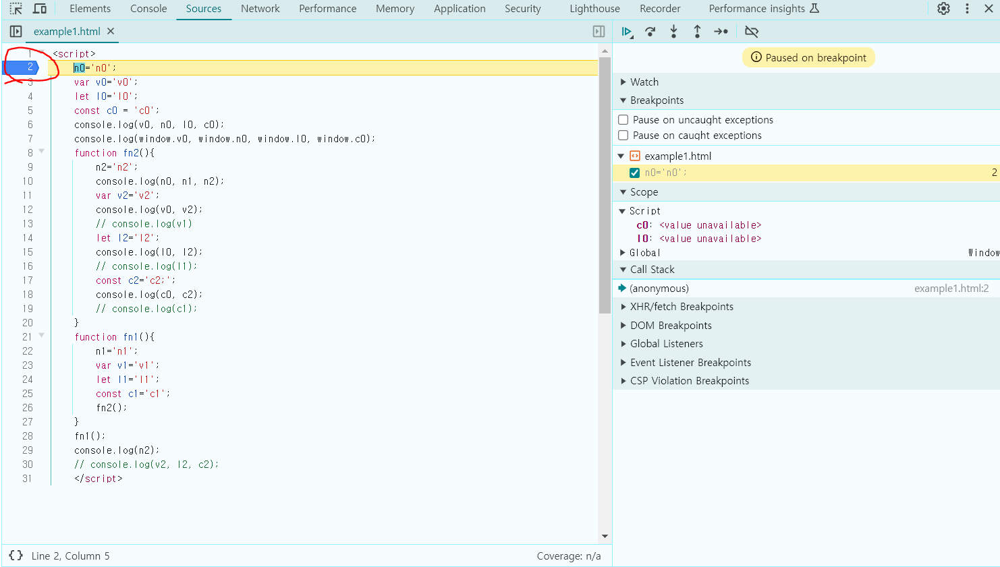

html파일을 만들고 스크립트 파일을 넣어줬습니다.

그림과 같이 두 번째 코드 줄에 브레이크 포인트를 걸어 준 뒤 새로고침을 누르면

브라우저가 코드 2번째 줄 이전까지만 읽고 멈춥니다.

<br>
<br>


이제 빨간색으로 동그라미 친

`step over next function call 버튼`을 클릭하면서 코드를 차례차례 읽고 스코프와 실행 컨텍스트에 어떤 변화가 생기는지 확인해보도록 하겠습니다.

<br>
<br>


2번째 줄 읽었네요.

변수 선언 키워드 없이 선언한 `n0` 값이 글로벌 스코프에 들어간 것을 확인 할 수 있습니다.

> 스코프란? <br> 변수에 접근할 수 있는 범위을 의미합니다.

즉 선언 키워드 없이 변수를 할당하면 그 값은 글로벌 스코프에 저장됩니다.

자바스크립트는 어떠한 변수를 읽으려할 때 스코프에서 변수를 찾습니다.

스코프를 찾는 순서는 스크립트 -> 글로벌 순 입니다. 변수를 찾았다면 더 이상 찾지 않고 해당 변수값을 가져옵니다.

<br><br>

다시 코드를 한 줄 실행해봅시다.

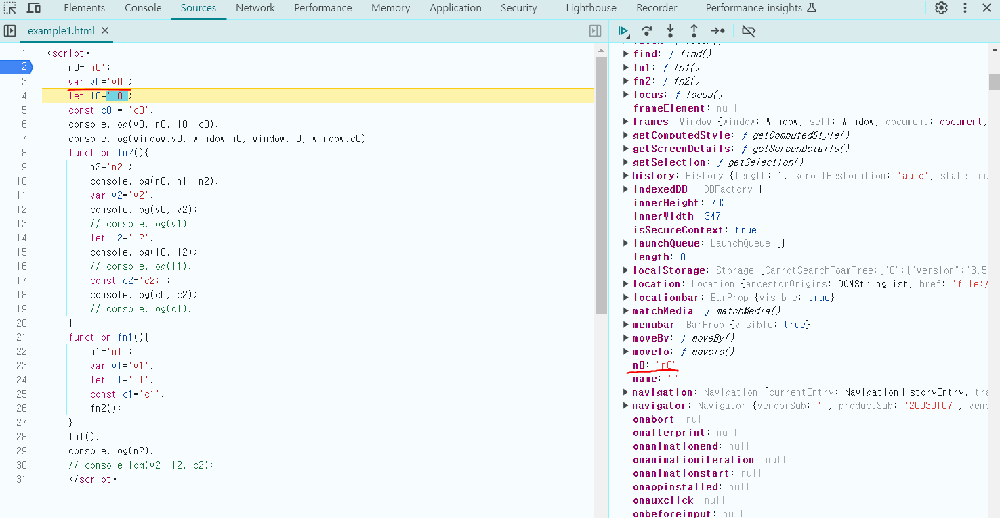

아까와 마찬가지로 글로벌 스코프에 생성됩니다.

즉 키워드 없이 선언, var 로 선언한 변수는 글로벌 스코프에 저장됩니다.

<br>
<br>

그럼 let과 const도 똑같을까요??

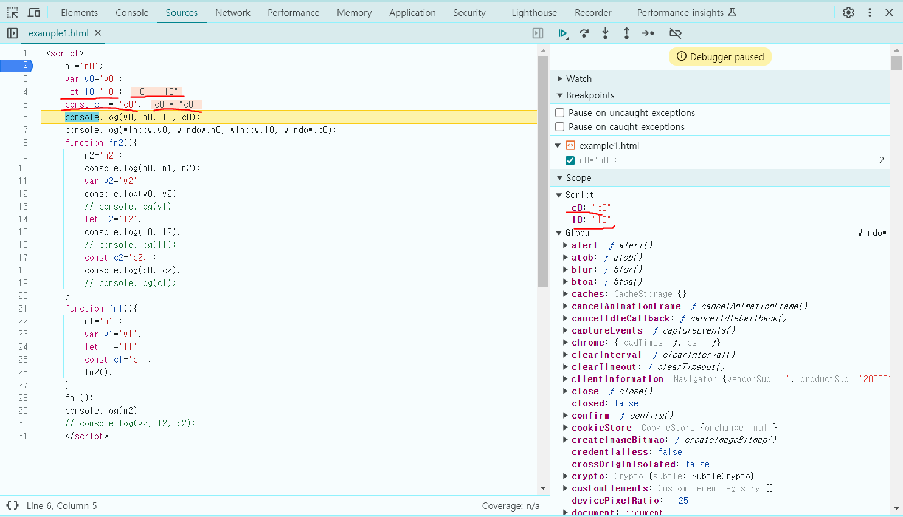

const 와 let으로 선언한 변수는 스크립트 스코프에 저장되는군요.

<br>
<br>

그럼 6번 째 줄 콘솔을 실행하면 어떻게 되는지 보겠습니다.

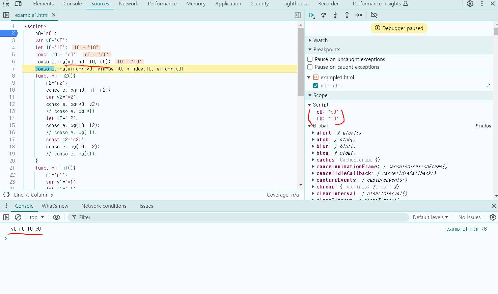

4개 변수 모두 정상적으로 콘솔에 찍힙니다.

위에 말한대로 `스크립트 스코프`에서 `c0`, `l0`를 찾고
`글로벌 스코프`에서 `v0`, `n0`를 찾아 출력합니다.

<br>
<br>
<br>

### window 객체

글로벌 스코프는 window 객체에 저장됩니다. 즉 window.어쩌구 한다는 것은 window 객체 내 프로퍼티나 메서드를 찾아 출력한다는 뜻이죠. 글로벌 스코프도 window 내 저장되어있으니 접근이 가능하다는 의미입니다.

우리가 어디서 코드를 실행하든 항상 글로벌 스코프가 맨 마지막 스코프로 자리합니다. 이 말은 어디서 실행하든 글로벌 스코프에는 접근이 가능하다는 뜻이죠. 글로벌 스코프 내 존재하는 `alert()` 메서드는 코드를 아무리 복잡하고 난해하게 작성했어도 무조건 접근가능하다는 의미입니다.

<br>
<br>

다음 콘솔은 window라는 표현이 있네요. 과연 결과값이 어떻게 달라질까요??


해당 콘솔 `window.변수`는 window 객체 즉 글로벌 스코프해서 해당 변수를 찾으라는 의미입니다.

하지만 보시다시피 `c0`, `l0`는 스크립트 스코프에 저장되어있습니다. 글로벌 스코프 내 존재하지 않죠. 때문에 undefined가 뜬겁니다. 접근에 실패한거죠.

<br>
<br>
<br>

### fn1()로 실행

다음은 fn1() 함수를 실행했을 때 어떤 결과가 나오는지 차례 차례 알아보도록 하겠습니다.

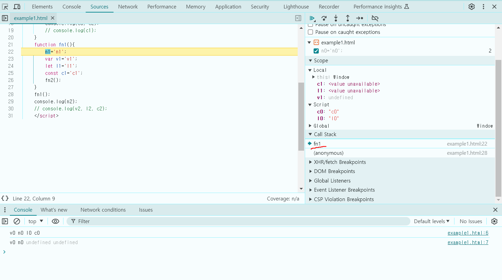

아까와 사뭇 다르죠?

call stack 영역에 방금 실행한 fn1 함수가 생성되었습니다.

> 콜스택이란? <br> Execute Context(실행 컨텍스트)가 쌓이는 공간을 의미합니다.

<br>
<br>

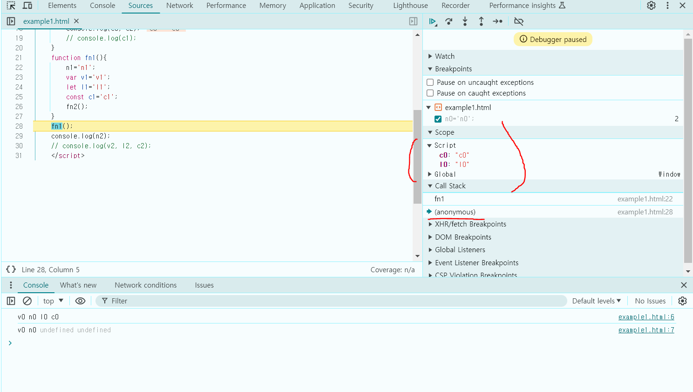

anonymous 클릭하면 아까 봤던 스코프와 콜스택을 볼 수 있습니다.

> 여기서 anonymous란 뭐냐 <br> 우리가 작성한 자바스크립트 코드에서 함수가 아닌 함수 외부 영역에서 선언된 코드들이 접근할 수 있는 스코프를 보여줍니다. <br> 전역에서 접근가능한 스코프를 보여준다해서 전역(글로벌) 실행 컨텍스트라 부릅니다.

<br>
<br>

fn1 함수를 클릭하면?

fn1 함수 내에 존재하는 코드들이 접근할 수 있는 스코프를 보여줍니다.

```js
n1 = "n1";
var v1 = "v1";
let l1 = "l1";
const c1 = "c1";
fn2();
```

이 친구들에 대한 스코프를 알려주는 것이죠.

이 콜스택에 생긴 fn1 을 함수 실행 컨텍스트라고 합니다.

<br>
<br>

자 이제 22번째 줄 fn1 함수 내부 코드를 실행해봅시다.

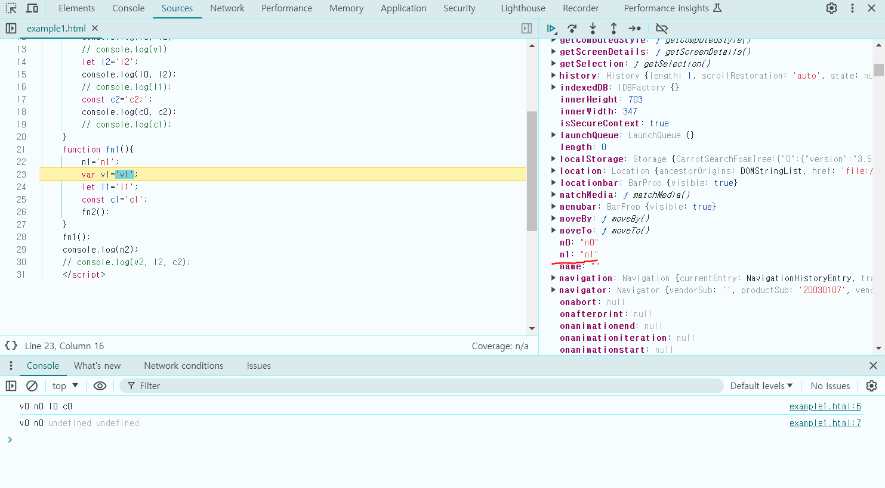

글로벌 스코프에 n1이 저장됐군요.

이것으로 알 수 있는 것은 키워드 없이 선언한 변수는 어디서 선언하든 글로벌 스코프에 저장된다는 것입니다.

이러한 선언 방식은 dx 적으로 좋지 않습니다. 전역 스코프에 존재하기 때문에 외부요인에 오염되기 쉽고 전역 스코프 자체가 온갖 메서드와 프로퍼티, 라이브러리로 가득한 곳인데 굳이 복잡한 곳에 저장할 이유가 없습니다.

<br>
<br>

자 다음 코드를 실행해봅시다.

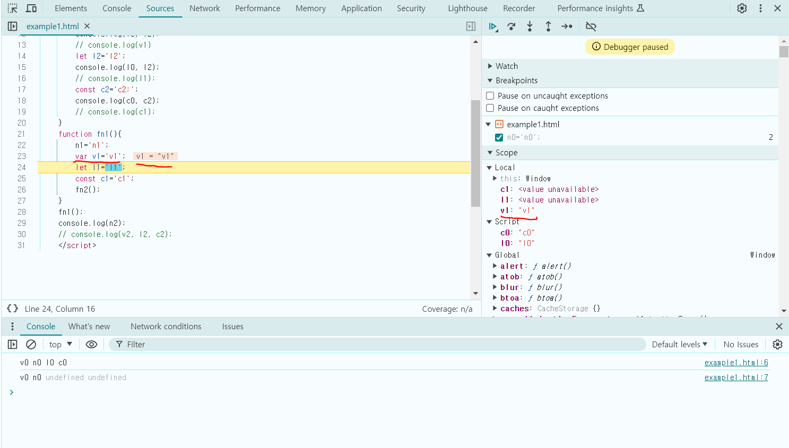

아까 전역에서 선언하면 전역 스코프에 저장되는 것과 다른 결과입니다. 즉 함수안에서 var 키워드로 변수를 선언하면 로컬 스코프에 저장됩니다.

<br>
<br>

이 상태에서 전역에 선언되어있는

```js
var v0 = "v0";
```

를 실행하면 어떻게 될까요??

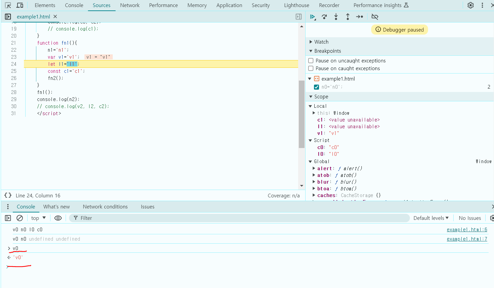

잘찾아오네요.

`v0` 변수를 찾는 과정은 로컬 스코프 -> 함수 스코프 -> 전역 스코프 순으로 찾습니다.

이렇게 스코프끼리 연결 되어있는 구조를 `스코프 체이닝(scope chaining)`이라고 합니다.

<br>
<br>

남은 let, const 로 선언한 변수도 마저 실행시켜봅시다.

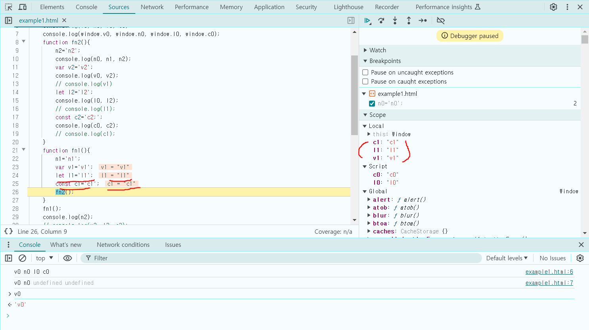

let과 const는 로컬 스코프에 저장되는군요

<br>
<br>

마지막으로 fn1 내부에 있는 fn2 함수를 실행해봅시다.

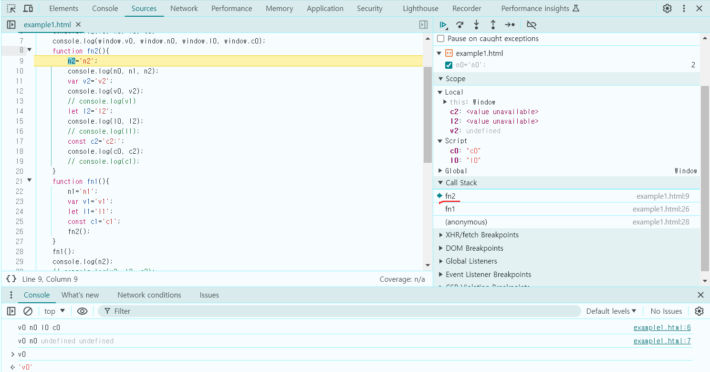

새로운 콜스택 fn2가 생겼네요.

콜스택은 우리가 함수를 실행한 순서대로 쌓인다는 것을 알 수 있습니다.

<br>
<br>

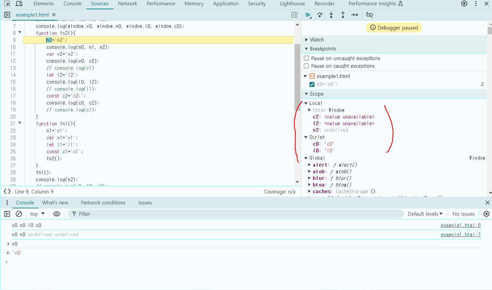

스코프가 많이 달라졌습니다.

fn2 함수가 실행된 공간인 fn1 함수 내부 스코프가 사라지고

fn2 로컬 스코프가 생성되었네요. 즉 스코프체이닝이 발생하지 않았습니다.

<br>
<br>

fn2 함수 내부에 있는 콘솔을 실행하면 어떻게 될까요?


잘 접근합니다. 접근 가능한 이유는

`n0` `n1` `n2` 변수들이 모두 키워드없이 선언된 친구들이라 글로벌 스코프 내부에 저장되어있기 때문입니다. 아까 설명했던 내용과 일치하죠.

<br>
<br>

계속해서 실행해봅시다.


fn2 함수 내부에서 선언한 `var v2='v2';` 도 잘 접근하고

전역에서 선언한 `var v0='v0'` 도 잘 접근하네요.

아까 설명했던 것처럼 var 키워드로 전역에서 선언하면 글로벌 스코프에 저장되기 때문에 접근가능한 겁니다.

<br>
<br>

이 상태에서 만약 v1 접근 시도하면 어떻게 될까요?


접근할 수 없다고 에러가 발생합니다.

왜냐면 v1은 fn1 내부에 선언되었기때문에 fn1 로컬 스코프에 저장되어있거든요. fn2 콜스택에선 접근이 안됩니다.

<br>
<br>

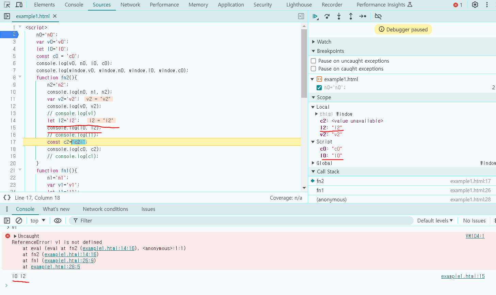

console.log(l0, l2)를 하니 정상적을 접근합니다.

이제 스코프 구조를 보시면 금방 이해가능하실겁니다.

l2는 fn2 함수의 로컬 스코프에 저장되고, 전역에서 선언한 `let l0 = 'l0'`는 스크립트 스코프에 저장되어있기 때문이죠.

<br>
<br>

그럼 l1에 접근도 안되겠네요??


맞습니다.

l1는 fn1 로컬 스코프에 저장되어 있으니까요. c1에 접근할 때도 똑같은 결과를 보입니다.

<br>
<br>

거의 다 끝나갑니다. 마저 실행해봅시다.

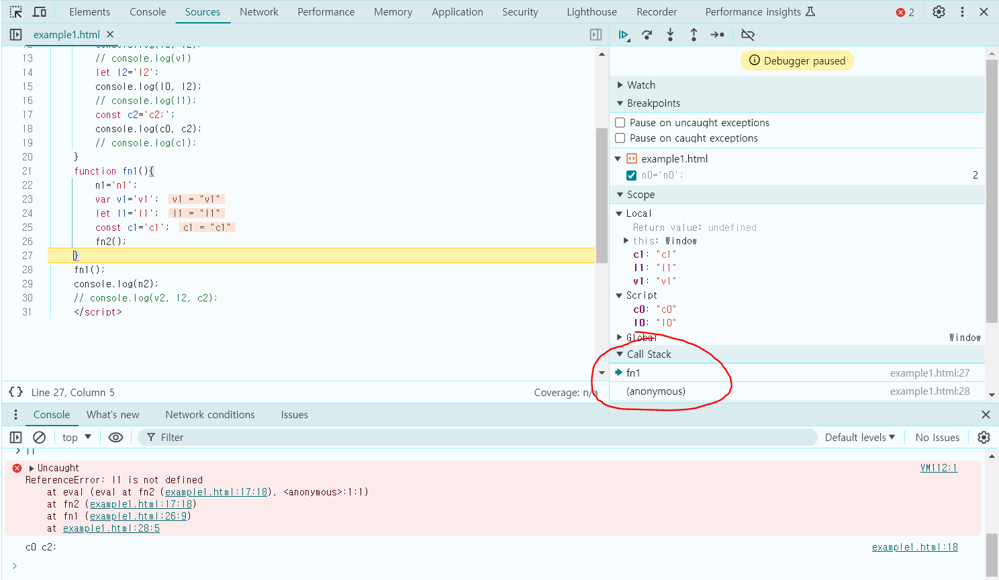

fn2 함수 실행이 끝났습니다. 콜스택에 fn2 함수가 사라진 것을 확인할 수 있습니다.

<br>
<br>


fn1 함수 실행이 끝나면 마찬가지로 콜스택에서 사라지네요.

이것으로 알 수 있는 점은 콜스택은 선입후출 구조입니다. 새로운 콜스택이 들어오면 기존 콜스택이 뒤로 밀리고 새로운 콜스택이 생성됩니다. 함수 실행이 종료되면 기존 콜스택에서 해당 함수는 사라지게 됩니다.

<br>
<br>
<br>

## 정리

밑 사진은 실행컨텍스트 위치에 따른 스코프를 정리해놓은 것입니다. 참고하시면 됩니다.

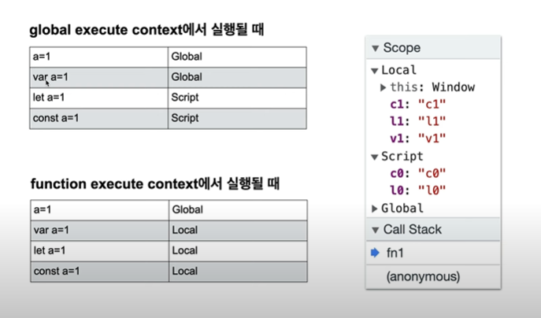

<br>
<br>
<br>

<details>

<summary>참고자료</summary>

<div markdown="1">

https://www.youtube.com/watch?v=QtOF0uMBy7k&t=31s

</div>

</details>
