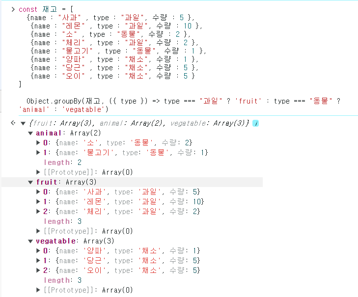

`Object.groupBy`라는 자바스크립트 신문법을 알아봅시다.

`Object.groupBy`는 특정한 배열을 조건에 따라 그룹화 하는 메서드입니다.

```js
cosnt 재고 = [
  {name : "사과" , type : "과일", 수량 : 5 },
   {name : "레몬" , type : "과일", 수량 : 10 },
   {name : "소" , type : "동물", 수량 : 2 },
   {name : "체리" , type : "과일", 수량 : 2 },
   {name : "물고기" , type : "동물", 수량 : 1 },
   {name : "양파" , type : "채소", 수량 : 1 },
   {name : "당근" , type : "채소", 수량 : 5 },
   {name : "오이" , type : "채소", 수량 : 5 }
]

```

다음과 같은 배열이 있다고 가정해봅니다. 
만약 위 배열 요소들을 과일과 고기로 분류하고싶다면 예전에는 `filter` 함수를 사용해야했습니다.

```js

cosnt 재고 = [
  {name : "사과" , type : "과일", 수량 : 5 },
   {name : "레몬" , type : "과일", 수량 : 10 },
   {name : "소" , type : "동물", 수량 : 2 },
   {name : "체리" , type : "과일", 수량 : 2 },
   {name : "물고기" , type : "동물", 수량 : 1 },
   {name : "양파" , type : "채소", 수량 : 1 },
   {name : "당근" , type : "채소", 수량 : 5 },
   {name : "오이" , type : "채소", 수량 : 5 }
]


  const obj = {
    fruit : 재고.filter((v) => v.type === "과일"),
    animal : 재고.filter((v) => v.type === "동물")
  }

```

하지만 이번에 새로나온 신문법인 `Object.groupBy` 문법을 사용하면 보다 편리하고 가독성좋고 코드양도 줄일 수 있습니다.

```JS

cosnt 재고 = [
  {name : "사과" , type : "과일", 수량 : 5 },
   {name : "레몬" , type : "과일", 수량 : 10 },
   {name : "소" , type : "동물", 수량 : 2 },
   {name : "체리" , type : "과일", 수량 : 2 },
   {name : "물고기" , type : "동물", 수량 : 1 },
   {name : "양파" , type : "채소", 수량 : 1 },
   {name : "당근" , type : "채소", 수량 : 5 },
   {name : "오이" , type : "채소", 수량 : 5 }
]

  Object.groupBy(재고, ({ type }) => type === "과일" ? 'fruit' : type === "동물" ? 'animal' : 'vegatable')


```



> 참고로 위 코드는 삼항연산자 중첩을 활용했습니다. 삼항연산자를 중첩으로 사용하는 건 읽는 사람의 심기를 불편하게 하니 자제하는게 좋습니다. 

위와 같은 방법으로 배열요소를 편리하게 분리할 수 있습니다. 


이미지 업로드


