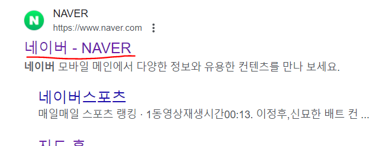

객체의 프로퍼티에 접근하는 방법에는 2가지가 있습니다. 점표기법(Dot notation)과 괄호표기법(Bracket Notation)입니다.

# 점표기법(Dot notation)

```js
let myself = {
  name: 'Code Kim',
  country: 'South Korea',
  age: 30,
  cats: ['냥순', '냥돌']
};

myself.name  // 'Code Kim'
myself.age   // 30

```

객체의 이름 뒤에 점을 찍어주고 그 뒤에 key를 넣어주면 그 key에 해당하는 value값이 출력됩니다.

# 괄호표기법(Bracket Notation)

```js
let myself = {
  name: 'Code Kim',
  country: 'South Korea',
  age: 30,
  cats: ['냥순', '냥돌']
};

myself['name']  // 'Code Kim'
myself['age']   // 30
```

객체의 이름 뒤에 대괄호 [ ]를 써주고 안에 key를 넣어주면 그 key에 해당하는 value값이 출력됩니다.

# 차이점


이미지 업로드



<br>
<br>
<br>

<details>

<summary>참고문헌</summary>

<div markdown="1">

안녕

</div>

</details>
