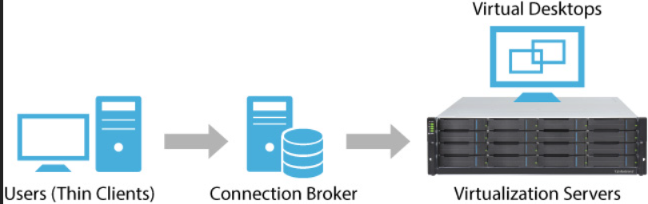

# 1. VDI 란 무엇일까?

VDI는 가상 머신을 이용하여 가상 데스크톱을 제공하고 관리하는 것을 의미합니다. 중앙집중식 서버에서 데스크톱 환경을 호스트하며 요청시 이를 최종 사용자에게 배포합니다.

  

VDI에서는 하이퍼바이저가 서버를 가상 머신으로 세분화하고, 가상 머신은 가상 데스크톱을 호스팅하며, 사용자는 각자의 기기를 통해 가상 데스크톱에 원격으로 액세스합니다. 사용자는 장소와 기기에 구애받지 않고 가상 데스크톱에 액세스 할 수 있고, 모든 처리는 호스트 서버에서 이루어집니다. 사용자는 연결 브로커를 통해 데스크톱 인스턴스에 접속합니다. 연결 브로커는 소프트웨어 기반 게이트웨어로서 사용자와 서버 사이에서 중개자 역할을 합니다.

  

조금 더 쉽게 설명하자면, 기업의 네트워크로 원격 접속하기 위해 구성하는 방식입니다. 서버에 가상 머신을 생성하는 하이퍼바이저를 설치하고 그 위에 사내망에 접속 할 수있는 여러 가상머신을 띄우고 사용자들은 인증을 받고 접속을 하면 가상머신 데스크탑으로 연결시켜주는 기술입니다.

  
  

# 2. VDI는 왜 사용해야 할까?

VDI를 사용하는 가장 큰 이유중 하나는 보안입니다.

공공기관이나 기업에서는 인터넷과 완전히 격리된 환경에서 업무를 볼 수 있도록 망분리를 해야합니다.

VDI를 사용하여 업무용 PC와 인터넷 PC로 구분하여 보안 문제를 해결할 수 있습니다.

  

# 3. VDI의 2가지 유형

VDI는 영구적이거나 비영구적일 수 있으며, 유형에 따라 서로 다른 이점을 제공합니다.

### 1. 고정VDI (영구적)

사용자는 매번 동일한 데스크톱에 접속하게 되며, 연결이 끊어진 후에도 변경사항이 유지되므로 사용자의 필요에 맞게 데스크톱을 맞춤화할 수 있습니다. 즉, 고정VDI 환경에서 데스크톱은 개인의 물리적 데스크톱과 동일하게 작동합니다.

(1인 1데스크톱을 제공합니다.)

   

### 2. 초기화VDI (비영구적)

사용자가 일반 데스크톱에 접속하고 변경사항도 저장되지 않으며, 세션간에 데스크톱을 사용자에 맞게 유지할 필요가 없기 때문에 보통 더 저렴하고 단순합니다. 초기화VDI는 제한된 형태의 반복 작업을 수행하고 맞춤형 데스크톱이 필요하지 않은 직원이나 작업자가 많은 조직에서 주로 사용합니다.

(PC방처럼 사용자가 계속 바뀔때마다 초기화 되는것을 생각합시다.)

   
  
   

# 4. VDI의 이점

VDI는 그 복잡성 때문에 모든 조직에 적합하지는 않지만, VDI를 사용하는 조직은 많은 이점을 누릴 수 있습니다. 예를 들면 다음과 같습니다.

### 1. 원격 액세스

VDI 사용자는 장소나 기기에 구애받지 않고 가상 데스크톱에 접속할 수 있습니다. 따라서 직원이 각자의 파일과 애플리케이션에 손쉽게 액세스하고 어디에서나 원격으로 업무를 수행할 수 있습니다.

   

### 2. 비용 절감

서버에서 작업을 처리하므로 최종 기기의 하드웨어 요구 사양이 훨씬 낮아집니다. 사용자가 구형 기기나 심지어 태블릿에서도 가상 데스크톱에 액세스할 수 있으므로 IT 부서에서 값비싼 신형 하드웨어를 구매할 필요가 줄어듭니다.

   

### 3. 보안

VDI 환경에서 데이터는 최종 클라이언트 기기가 아니라 서버에 저장됩니다. 따라서 Endpoint 기기가 도난당하거나 손상되는 경우에도 데이터가 보호됩니다.

   

### 4. 중앙 집중식 관리

VDI는 중앙 집중 방식으로 IT부서에서 시스템 내 모든 가상 데스크톱을 손쉽게 패치하고 업데이트하고 구성할 수 있게 해줍니다.

   
  
   

# 5. VDI와 가상머신의 차이점

가상머신은 VDI의 기반이 되는 기술입니다. 가상머신은 하이퍼바이저를 사용하여 하나의 물리적 서버를 여러 개의 가상 서버로 분할하여 생성된 소프트웨어 "머신"입니다.

가상머신은 다양한 용도로 사용가능하며, 그중 하나는 VDI환경에서 가상 데스크톱을 실행하는 것입니다.

 
 
 

참고문헌

https://potato-yong.tistory.com/3

