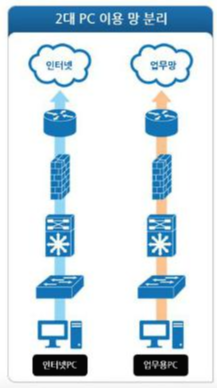
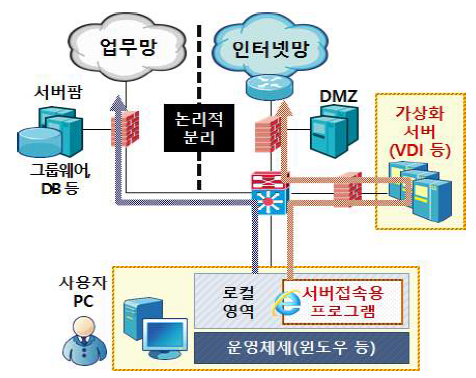
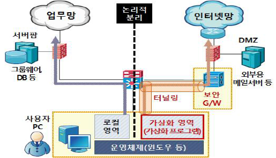

# 1. 망분리의 개념

망분리란 말 그대로 회사 업무를 볼 수 있는 업무망과 인터넷에 접속할 수 있는 인터넷망을 분리하는 것을 의미합니다.

업무망에서는 인터넷에 접속할 수 없고 회사 업무만 보게하고, 반대로 인터넷망에서는 회사 업무는 볼 수 없지만 인터넷에 접속이 가능하도록 합니다.

'정통망법(정보통신망 이용촉진 및 정보보호 등에 관한 법률) 시행렬 제 15조'에 망분리를 **의무화** 하도록 법률적으로 명시해두었습니다.

즉 단순히 회사 대외비 유출 방지를 넘어선 법률적인 조치라는 것이죠.

  
  
  

# 2. 망분리의 종류

망분리를 하는 방법은 **물리적 망분리**, **논리적 망분리**(서버기반 망분리, 클라이언트기반 망분리) 총 3가지가 있습니다.

  

## 1. 물리적 망분리

말 그대로 물리적으로 망을 분리시키는 방법입니다. 2대의 PC를 이용해 업무용 PC, 인터넷용 PC를 각각 사용하는 방식입니다.

물리적 망분리는 각각의 PC를 따로 사용하여 확연히 구분이 되고 나누기 쉬운 장점이 있습니다.

하지만 물리적인 장비가 늘어나기 때문에 관리해야 하는 보안이슈들이 증가하고, 업무 PC에서 인터넷 구간에 있는 업무 서버에는 접근을 못하는 단점도 존재합니다.

 

### 물리적 망분리 시 보안 위협

- 업무pc와 인터넷pc간의 자료이동

- 사용자의 악의적인 정보유출 가능성

- 보조 기억매체를 통한 정보유출

  
  

## 2. 논리적 망분리

논리적 망분리는 기존의 PC 1대에서 가상화로 구현된 서버를 이용하는 방법입니다.

모든 작업을 중앙 서버를 이용하기 때문에 보안과 관리, 스마트워크까지 효율적으로 운용할 수 있는 장점이 있죠.

논리적 망분리는 SBC, CBC 방식으로 구분할 수 있는데 **서버**를 가상화하느냐 **클라이언트**를 가상화하느냐에 따라 구분합니다.

  

### 1. SBC (Server Based Computing) 서버 기반 망분리

모든 어플리케이션 및 정보를 서버에 두고 100% 서버에서 실행되도록 하며, 클라이언트는 단지 서버의 실행결과만을 보여주는 컴퓨팅 환경을 의미합니다.

중앙서버에 가상화서버를 구축하여 ‘가상 데스크탑 환경’을 클라이언트가 제공받습니다.

이러한 망분리 방식은 다시 ‘인터넷망 가상화 방식’과 ‘업무망 가상화 방식’으로 구분됩니다.

서버의 리소스를 활용하는 가상화 방식으로, VDI나 Application 가상화까지 포함합니다.

리소스 및 데이터 중앙관리로 보안이 강화되고 패치가 수월하고, 효율적인 관리, 사용자의 접속 단말 기기의 사양이 낮아도 된다는 장점이 있습니다.

하지만 서버의 리소스를 이용하기 때문에 서버팜을 구성할 때 비용이 많이 든다는 단점이 있습니다.

  

### 2. CBC (Client based compution) 클라이언트 기반 망분리

기존의 1대 PC에서 가상화를 통해 **업무용PC**와 **인터넷용 PC**를 만들어 망분리를 방법입니다. 즉 pc가상화 프로그램을 설치하여 분리된 **가상 데스크탑 환경**을 사용하는 클라이언트 기반 가상화 방식입니다. (VMware와 유사)

각각의 단말 PC환경이 다양해서 이것들에 대한 호환성과 중앙의 관리가 힘들다는 단점이 있습니다. 또한, 사용자 통제가 쉽지않아 악의적인 사용자에 의한 정보유출의 가능성이 높다는 단점이 있습니다. 때문에 사용자 컴퓨터에 설치된 운영체제, 응용프로그램과의 호환성 등에 대해 충분한 검토가 필요합니다.

서버가상화 기반 망분리 방식에 비해 별도의 가상화 서버 구축이 불필요함에 따라 비용이 상대적으로 절감되는 장점이 있습니다.

 
 
 

참고문헌

https://potato-yong.tistory.com/4

