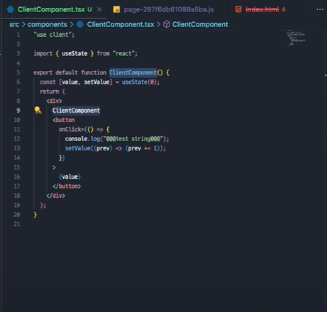
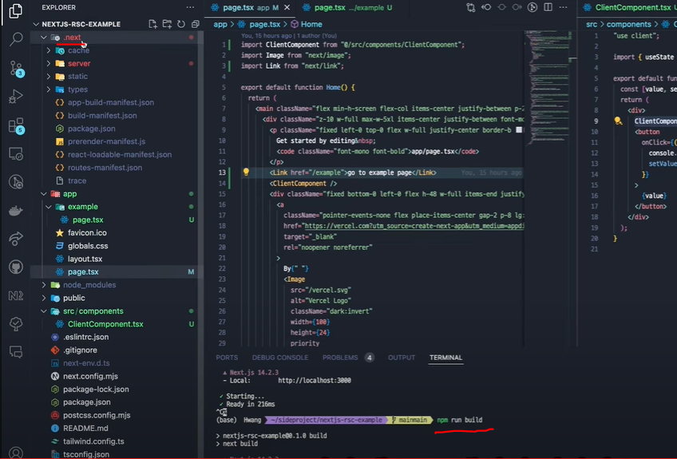
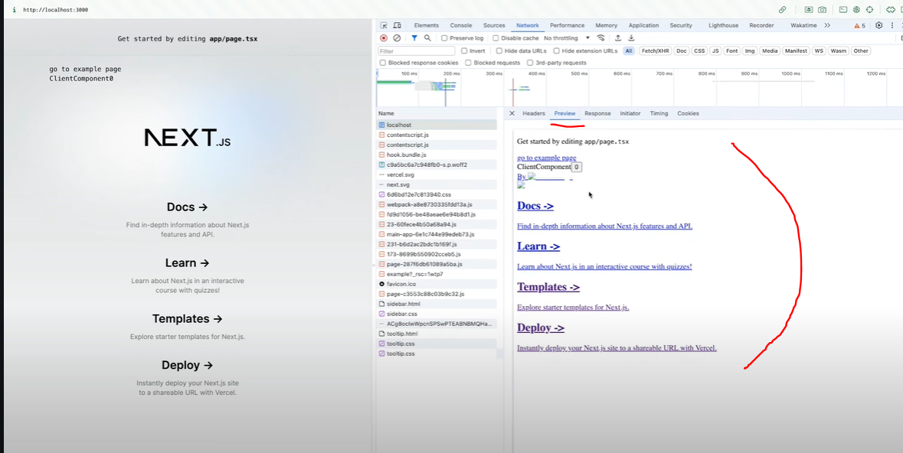
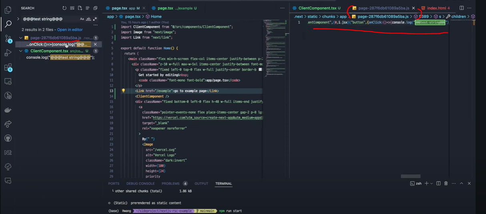
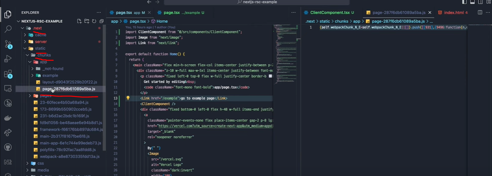
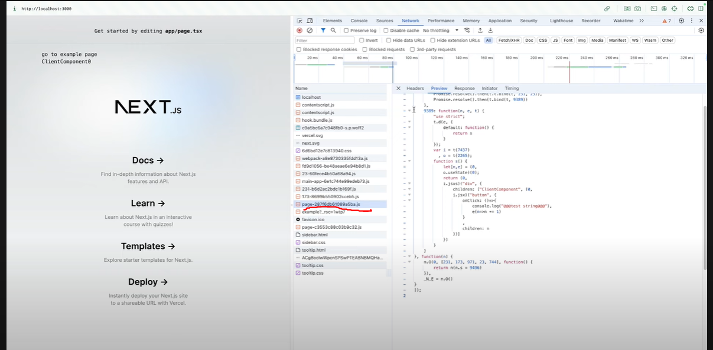

# 컴포넌트란?

`데이터 인자 (props 혹은 state)`를 받아 `jsx`를 return 하는 자바스크립트 함수입니다.

## 클라이언트 컴포넌트가 렌더링되는 과정

1. 컴포넌트(jsx)가 babel을 만나면 리액트 엘리먼트로 트랜스파일링됩니다. 

>참고로 바벨은 빌드타임에 동작합니다. <br> 즉 빌드시 컴포넌트 -> 리액트 엘리먼트로 전환됩니다.


리액트 엘리먼트가 확장되면 `fiber` 즉 `node`가 되고 이 node는 `Virtual DOM의 node들`입니다.

즉 컴포넌트가 재렌더링된다는 의미는 리액트 컴포넌트가 `babel`을 만나 `리액트 엘리먼트`로 `트랜스파일링`되고

엘리먼트 내부의 `node`들이 가지고 있는 정보를 기반으로 `Virtual DOM`을 통해 렌더링된다는 의미입니다. 


# 서버 컴포넌트란?

말 그대로 서버에서 생성되는 컴포넌트입니다. 

## 생성 과정

next.js는 서버에서 `rendering work`가 `chunk`로 `스플릿`이 됩니다. 분리가 되는거죠.

스플릿 되는 기준은

1. route segment

2. suspense boundary

입니다. 

<BR>

리액트는 서버 컴포넌트를 `리액트 서버 컴포넌트 페이로드 (React ServerComponent Payload)` 라는 특별한 포맷으로 렌더링합니다.


### RSC Payload

그럼 이 `RSC Payload`에는 뭐가 있을까요?

1. 서버 컴포넌트 렌더링 결과물

2. 빈자리(placeholder) -> 클라이언트 컴포넌트가 어디에 렌더링 될 것인지 + 클라이언트 컴포넌트의 자바스크립트 파일 위치(참조할 수 있는) 에 대한 표시를 해놓은 placeholder

3. 서버컴포넌트가 클라이언트 컴포넌트로 전달할 props 들

이렇게 3가지가 payload에 포함되어 있습니다. 

## 서버 컴포넌트 렌더링 일련 과정

이제 본격적으로 컴포넌트가 화면에 렌더링되는 일련의 과정을 알아볼까요?

### 1. 서버 내 html 렌더링

위 3가지 정보를 포함한 rsc payload가 준비되면 리액트는 서버에서 `rsc payload`와 `클라이언트 컴포넌트 자바스크립트 인스트럭션(자바스크립트 명령어 덩어리)` 를 활용해 html을 만들고 렌더링합니다.

이러한 과정을 서버에서 거친 뒤 만들어진 html을 클라이언트(브라우저)에서 **즉시** 보여줍니다. 이 과정을 `preview`라고 합니다. 위 과정은 최초 페이지 진입시에만 발생합니다. 

## 2. reconcile(재조정)

`reconcile(리컨실, 재조정)` 단계에서 `rsc payload`가 사용됩니다.

어떤걸 재조정하느냐. 바로 클라이언트 컴포넌트와 서버 컴포넌트를 기반으로 `리액트 컴포넌트 tree`를 만듭니다. 이 tree는 곧 `Virtual DOM` 입니다.

상술한 `placeholder`를 채우는 과정이 reconcile입니다. 즉 클라이언트 컴포넌트가 들어갈 빈자리를 채우는 과정이 재조정입니다.


## 3. hydrate

세 번째 단계는 `hydrate`입니다. `인터렉션` 가능하게 하는 과정이죠.

이 단계에선 `자바스크립트 인스트럭션`을 가져와서 수행합니다.

useState에 포함되어 있는 value이나 setState 함수, 이벤트 핸들러 등 이런 로직과 관련된 자바스크립트 인스트럭션을 활용해서 인터렉션 가능하도록 만들어주는 과정입니다. 

<br>

# 예시

이론을 배웠으니 실제 예시 코드와 렌더링 과정을 알아봅시다.



next.js 에 다음과 같은 클라이언트 컴포넌트를 선언했습니다.

해당 컴포넌트에는 useState가 선언되어있고 state를 할당한 상태입니다.

상술했던 자바스크립트 인스트럭션은 

```js
const [value, setValue] = useState(0)

onClick={()=>{
    어쩌구저쩌구~
}}
```
와 같은 것들을 의미합니다. 

<br>
<br>




 next.js 프로젝트를 빌드하면 .next 라는 디렉토리가 생성되는데 빌드 결과물이 저장되는 공간입니다.


 <br>

 이 상태에서 
 
 ```shell
 npm start
 ```
 
 명령어로 프로덕트 상태를 띄워본 뒤 `localhost:3000` 의 preview를 살펴보면 아래와 같습니다. 



위 preview에 보여지는 뼈대가 바로 상술한 리액트가 rsc payload와 클라이언트 컴포넌트 자바스크립트 인스트럭션(자바스크립트 명령어 뭉치기) 를 활용해 서버에서 만든 html을 가져온 모습입니다. 

아직 hydrate 과정을 거치지 않은 상태이기 때문에 인터렉션은 동작하지 않습니다. 0 이라는 버튼을 눌러도 아무 반응없을 겁니다.

css 또한 없는 상태죠

value state의 초기값 즉 default value 값인 0도 html에 구성되어 있음을 확인할 수 있습니다. 즉 자바스크립트 인스트럭션의 일부(value 값 0)는 html 조합에 사용된다는 것을 알 수 있습니다. `onClick` 과 같은 `이벤트 핸들러`는 사용하지 않기에 일부만 사용하는 겁니다. 

 <br>
  <br>

이렇게 html을 받아온 뒤 reconcile -> hydrate 과정을 거치게 됩니다. 

hydrate 과정을 거치면서 인터렉션한 화면이 구성되는데 상술했던 나머지 자바스크립트 인스트럭션(onClick과 같은 이벤트 핸들러)을 가져와서 적용시키는 것 입니다. 





  <br>
    <br>

아래 코드는 .next > static > chunks > page어쩌구저쩌구hash값.js 파일에 존재하는 코드입니다.



여기서 page는 root page를 의미하고 라우트 이름에 해당되는 해시값이 할당됩니다. 

즉 번들된 자바스크립트파일인 것이죠.

page라는 가장 기본적인 라우트 세그먼트를 방문하게 되면 웹팩(번들러)가 스플릿해준 이 chunk된 js 조각을 가져와 hydrate 해줍니다. 



실제로 개발자모드를 통해 방금 봤던 청크js파일과 동일한 js파일을 받아와 hydrate 한 것을 확인할 수 있습니다.

이런 방식으로 next.js 는 서버컴포넌트를 렌더링하고 hydrate 한답니다! 끝!


<br>
<br>
<br>

<details>

<summary>참고문헌</summary>

<div markdown="1">

https://www.youtube.com/watch?v=XdiMjKSCOfc

</div>

</details>