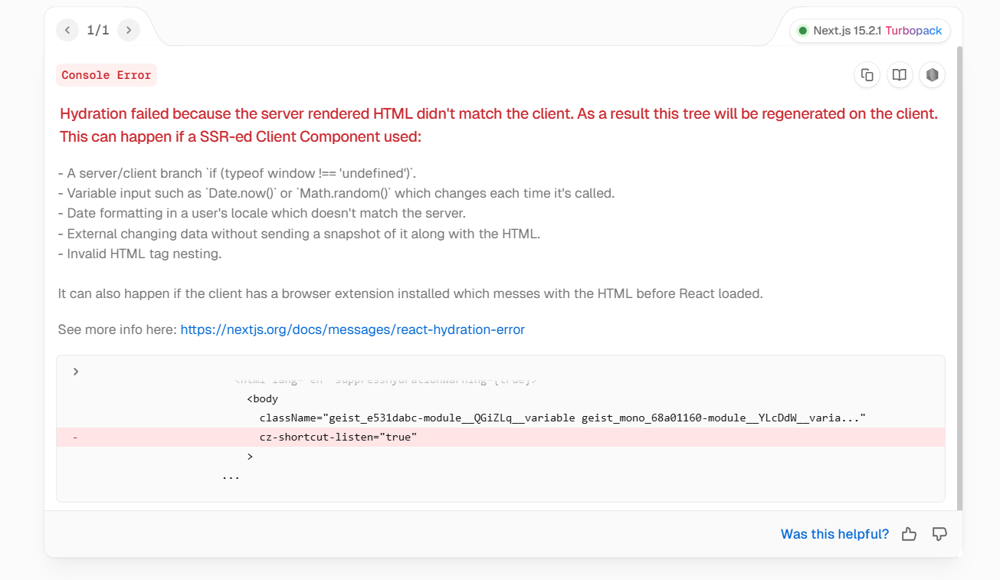
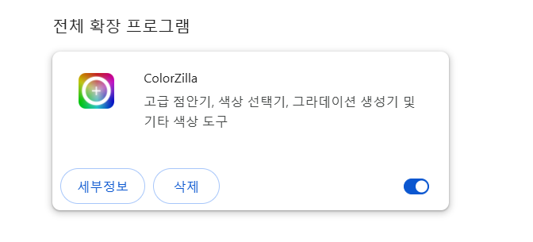
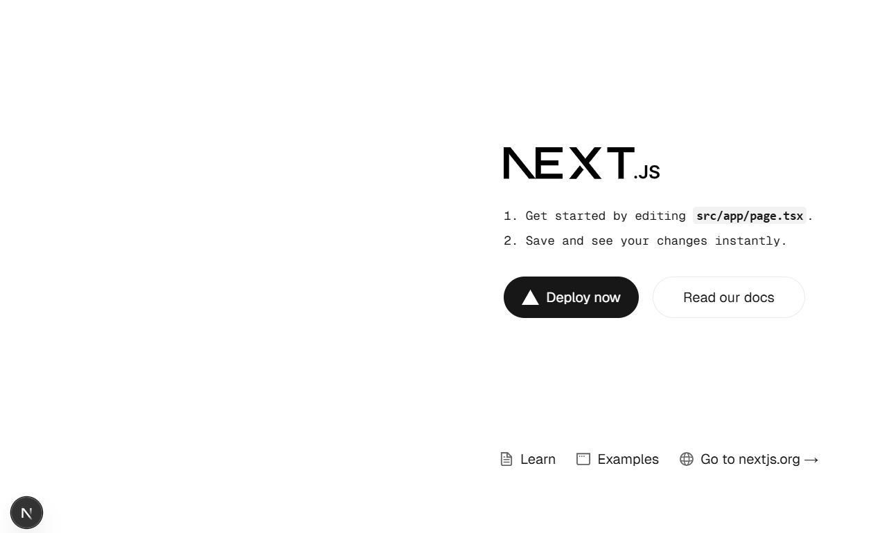

# 문제발생

새로운 프로젝트를 만들기 위해 next.js 를 설치했는데 설치하자마자 `hydration` 에러가 발생했습니다.



당황스럽군요... 일단 당황하지않고 에러를 살펴봅시다.

```html
<body cz-shortcut-listen="true"></body>
```

정체모를 ` cz-shortcut-listen="true"` 라는 키워드가 body태그에 달려있네요.

```html
<html lang="en">
  <body className="{`${geistSans.variable}" ${geistMono.variable} antialiased`}>
    {children}
  </body>
</html>
```

하지만 제 실제 코드에는 저런게 없습니다. 방금 install한 프로젝트인데 있을리가 없죠.

# 원인

어떤 원인인지 구글링해보니

https://github.com/vercel/next.js/discussions/72035

해당 깃허브링크에서 찾을 수 있었습니다.

> I discovered that the cz-shortcut-listen="true" attribute, added by the Colorzilla browser extension, was causing the issue. <br> <br> Colorzilla 브라우저 확장 프로그램에 추가된 cz-shortcut-listen="true" 속성이 문제를 일으키고 있다는 것을 발견했습니다.

Colorzilla 크롬 확장프로그램은 colorzilla extension/add-on라는 기능을 통해 body 태그에 `cz-shortcut-listen="true"` 속성을 주입한다고 합니다.

그리고 이 속성은 next.js 15 버전의 hydration 에러를 일으킨다고 합니다.

# 해결

깃허브 토론장 분위기로 봐선 아직 온전히 해결되지 않은 버그인 것 같습니다. 삭제말곤 방법이 없어보이는군요.



자주 애용하던 확장프로그램이었지만... 눈물을 머금고 삭제해줍니다.

사랑했다.. colorzilla...



정상적으로 동작합니다!!

<br>
<br>
<br>

<details>

<summary>참고문헌</summary>

<div markdown="1">

https://github.com/vercel/next.js/discussions/72035

https://dev-astra.tistory.com/669

</div>

</details>
