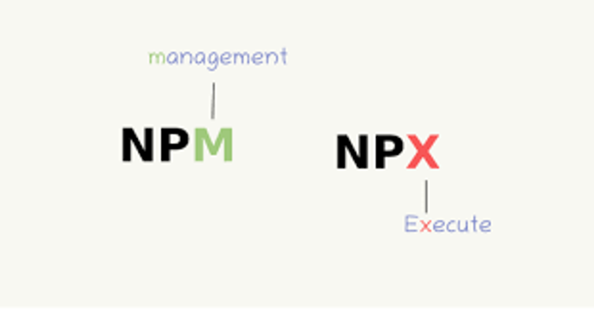

자바스크립트 패키지 관리 모듈

node.js package를 실행할 때 사용하는 모듈

명령줄에서 직접 로컬로 설치된 명령줄 도구를 실행할 수 있도록 npm에서 제공하는 명령어/툴입니다.

Node.js 도구를 전역에 설치하지 않고도 실행할 수 있게 해줍니다.

패키지를 설치하고 실행 → 이후 삭제

일회용 프로그램을 설치할 때 유용하다.

- npm(node pacakage module)의 5.2.0 버전부터 새로 추가되어 기본 패키지로 제공되기 시작했다. npm과 비교 대상이 아닌 npm을 좀 더 편하게 사용하기 위해 npm에서 제공하는 하나의 도구이다.
- npx는 npm 레지스트리에 있는 패키지를 더 쉽게 설치하고 관리하도록 도와주는 CLI(Command-line interface) 도구이다. npx는 npm을 더 편하게 사용하기 위해 탄생한만큼 npm을 통해 설치하는 모든 종류의 Node.js 기반의 파일을 간단하게 설치 및 실행할 수 있도록 도와준다.
- 매번 다운로드 받아서 설치하고 실행하기 때문에 실행할 때마다 최신버전임을 확신할 수 있다.
- 용량관리에 용이하다. 설치 후 패키지를 바로 삭제하므로
- 실행할 때 마다 다운로드 받아야하기 때문에 속도가 느리다.

npm = Package Manager (관리)
npm은 그 자체로 어떤 패키지로 “실행”하지 않는다.
npx = Package Runner (실행)

즉 실행파일이 따로 있고 패키지 파일이 따로 있다. 우리가 컴퓨터에 어떤 프로그램을 설치하려면 인터넷에서 어떤 프로그램 설치파일을 다운받고 그 파일을 따로 실행시켜야 프로그램이 설치되는 것처럼.
