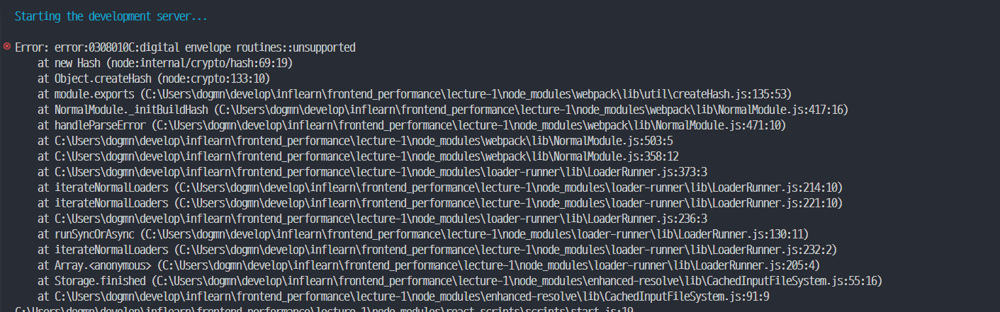
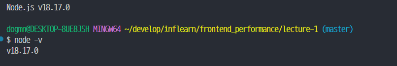
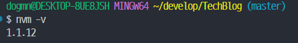
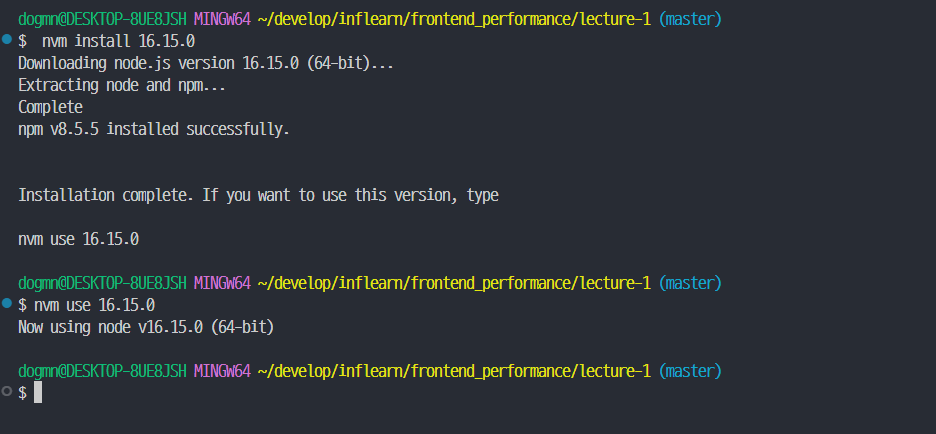
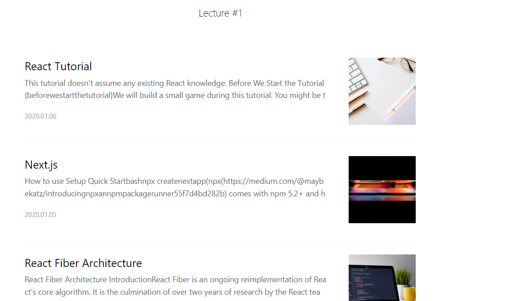

인프런에서 프론트엔드 성능 최적화 강의를 듣기 위해 강의자료를 clone 한 후

```shell
npm run start
```

명령어를 실행했더니...



네...역시나 뭐하나 얌전히 되는 꼴을 못봅니다.

검색해보니 node 버전이 달라서 생긴 오류라는군요.

## nvm을 이용한 node 버전 맞추기



현재 제 node 버전은 18버전입니다.

강의에서 진행하는 노드버전은 16이기 때문에 해당 버전에 맞춰 진행하도록 하겠습니다.

### nvm 다운로드

https://github.com/coreybutler/nvm-windows

위 링크로 접속한 후 다운로드 받으시면 됩니다.

<br>

nvm이 잘 다운받아졌는지 확인해봅시다. 설치된 nvm 버전을 알려주는 명령어입니다.

```shell
nvm -v
```



정상적으로 설치가 되었군요.

<br>

nvm으로 설치된 node 버전을 확인하는 명령어입니다.

```shell
nvm list
```

<br>

NVM 으로 설치 가능한 Node.js version 확인하는 명령어입니다. 설치하고 싶은 node 버전이 여기 없어도 설치가능하니 걱정안하셔도 됩니다.

```shell
 nvm list available
```

<br>

전 16버전이 필요했기에 16버전을 설치해줬습니다.



<br>

다시 프로젝트를 실행하면



잘되는군요!!

<br>
<br>
<br>

<details>

<summary>참고문헌</summary>

<div markdown="1">

https://naraewool.tistory.com/350

</div>

</details>
