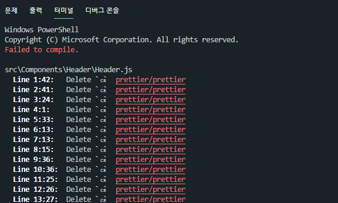
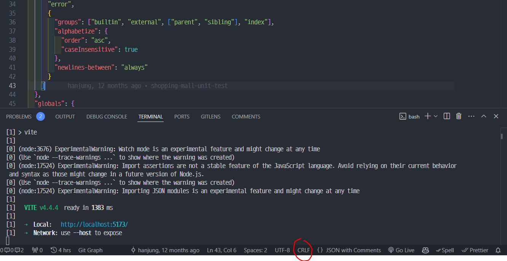
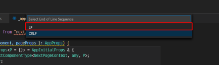

# 개요

인프런 강의 github 소스코드를 clone 한 후 `npm run dev` 명령어를 실행시키니



ESLint에서 오류가 발생했습니다.

# 원인

`delete ␍ prettier/prettier` 에러는 Prettier가 코드 내에서 줄 끝(Line Ending) 스타일에 문제가 있다고 판단한겁니다.

운영체제 마다 사용하는 줄끝 스타일에 차이가 있는데

- Unix/Linux : Line Feed (LF)
- Windows : Carriage Return (CR)

다음과 같습니다.

때문에

`delete ␍ prettier/prettier` 에러는 줄끝 스타일을 `Carriage Return (CR)`로 하지말고 `Line Feed (LF)`으로 설정하라는 의미입니다.

# 해결방법

위 에러를 해결하는 가장 간단한 방법은 vscode 우측 하단에 있는 줄 끝 스타일 변경 버튼을 통해 스타일을 설정하는겁니다.





줄끝 스타일을 LF로 변경해주면 됩니다.

하지만 이 방법은 현재 선택한 파일 줄끝스타일만 변경하기 때문에 프로젝트 내 존재하는 모든 파일들의 줄끝 스타일을 일일히 변경해야하는 번거로움이 있습니다.

즉 아주 비효율적인 방법이죠.

# 진짜 해결방법

근본적인 원인인 ESLint 자체에서 수정을 해주는 방법으로 문제를 해결해 보겠습니다.

`.eslint.json(.esLint.js)` 파일을 열어 아래 코드를 추가해주면 됩니다.

```js
"rules": {
        "prettier/prettier": [
            "error",
            {
                "endOfLine": 'auto',
            },
        ],
    },
```

<br>
<br>
<br>

<details>

<summary>출처</summary>

<div markdown="1">

https://noogoonaa.tistory.com/62

</div>

</details>
