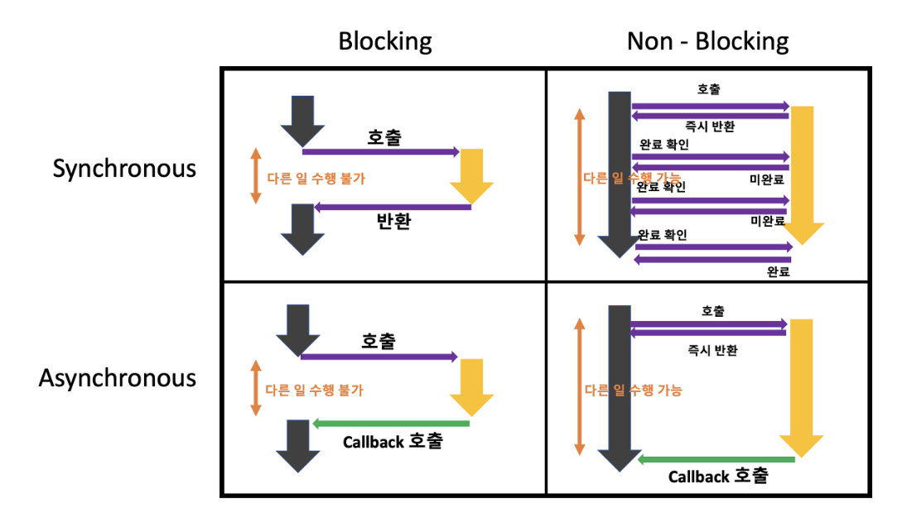

# Blocking & Non-Blocking

- 현재 작업이 **block(차단, 대기)** 되느냐 아니냐에 따라 다른 작업을 수행할 수 있는지에 대한 관점
- 다른 주체가 작업할 때 **자신의 제어권이 있는지 없는지로 구분**

---

## Blocking

- 자신의 작업을 진행하다가 다른 주체의 작업이 시작되면 다른 작업이 **끝날 때까지 기다렸다가 자신의 작업을 시작**하는 것을 의미
- **호출된 함수**가 자신이 할 일을 모두 마칠 때까지 **제어권을 계속 가지고서** 호출한 함수에게 바로 돌려주지 않는 상황을 의미

EX

A : B야 너 설거지 좀 해

B : 알았어. 그럼 너 나 설거지하는거 좀 지켜봐. (A에 대한 제어권이 B에게 존재)

즉, A 는 다른 작업을 하지못하고 B가 설거지를 다 할 때까지 지켜봐야 한다.

## Non-Blocking

- 다른 주체의 작업에 관련없이 자신의 작업을 하는 것을 의미
- **호출된 함수**가 자신이 할 일을 모두 마치지 않았더라도 바로 **제어권을 건네주어** 호출한 함수가 다른 일을 진행할 수 있도록 해주는 상황을 의미

EX.

A : B야 너 설거지 좀 해

B : 알았어. 나 설거지할게. 넌 너 할 일하러가. (A에 대한 제어권이 A에게 존재)

즉, A 는 B가 설거지를 하는동안 다른 일을 할 수 있다.

# 동기(Synchonous) & 비동기(Asynchonous)

- 요청한 작업에 대해 **완료 여부**를 신경 써서 **작업을 순차적으로 수행**할지 아닌지에 대한 관점
- 결과를 돌려주었을 때 **순서와 결과에 관심이 있는지 없는지 다른 말로 신경을 쓰는지 안쓰는지**로 판단 → 호출한 함수가 호출된 함수의 결과값을 처리하느냐 마느냐의 차이

---

## 동기(Synchonous)

- 요청한 작업에 대한 **완료 여부 판단** → 작업이 완료되어야 다음 작업을 수행
- 요청한 작업이 완료되지 않았다면? → 다음 작업을 수행하지 않으므로 대기
- 요청한 작업이 완료되어야 다음 작업을 수행하므로 자연스럽게 **순서대로 요청한 작업을 수행**하게 된다.
- 즉 **순서대로** 작업을 처리하기 때문에 **요청한 작업의 완료 여부에 관심**을 가진다.

EX.

A : B야 설거지 좀 해줘. 너 설거지끝나면 나 식기건조기 돌려야해

B : 알겠어. (설거지를 한다)

A : (B가 설거지를 끝마칠 때까지 기다린다.)

B : A야, 설거지 끝났어

A : 수고했어. (식기건조기를 돌린다.)

## 비동기(Asynchonous)

- 요청한 작업에 대한 **완료 여부를 판단하지 않는다.** → 순서에 상관없이 작업을 수행한다.
- 때문에 요청 순서와 작업 완료 순서가 일치하지 않는다.
- 호출한 함수가 호출된 함수의 결과값을 처리하지 않기 때문에 **완료 여부에 관심이 없다.**
- 즉 완료 여부에 관심이 없기 때문에 **완료 순서가 요청 순서와 일치하지 않는다.**

EX

A : B야 설거지 좀 해줘. 난 바닥 청소하고 있을게

B : 그래 알겠어.

(A, B는 각자 할 일을 한다.)

# Blocking & non-Blocking과 동기 & 비동기의 조합

### 1. Sync Blocking (동기 + 블로킹)

- Blocking : **호출한 함수(A)**의 제어권이 **호출된 함수(B)**에게 있다. 때문에 **B**가 작업하는동안 **A**는 대기한다.
- Sync : **호출한 함수(A)**는 **호출된 함수(B)**의 결과값에 관심이 있기 때문에 **B**의 작업이 끝난 후 **A**의 작업을 시작한다. 즉 순차적으로 작업을 수행한다.

## 2. Async Blocking (비동기 + 블로킹)

- Blocking : **호출한 함수(A)**의 제어권이 **호출된 함수(B)**에게 있다. 때문에 **B**가 작업하는동안 **A**는 대기한다.
- Async : **호출한 함수(A)**는 **호출된 함수(B)**의 **결과값에 관심이 없다**. 하지만 제어권이 **B**에게 있으므로 **B**의 작업이 끝나야 **A**는 작업할 수 있다.

## 3. Sync Non-Blocking (동기 + 논블로킹)

- Non-Blocking : **호출한 함수(A)**의 제어권이 **호출한 함수(A)**에게 있다. **B**가 작업하는동안 **A**는 자유롭게 작업할 수 있다.
- Sync : **호출한 함수(A)**는 **호출된 함수(B)**의 결과값에 관심이 있다. 때문에 **A**는 지속적으로 **B**의 작업 현황을 물어본다. 대신 물어보는 동안 **A** 또한 본인의 작업을 진행한다.

## 4. Async Non-Blocking (비동기 + 논블로킹)

- Non-Blocking : **호출한 함수(A)**의 제어권이 **호출한 함수(A)**에게 있다. **B**가 작업하는동안 **A**는 자유롭게 작업할 수 있다.
- Async : **호출한 함수(A)**는 **호출된 함수(B)**의 **결과값에 관심이 없다.** 때문에 **A**,**B** 서로 영향을 주지 않고 각자 작업을 수행한다.

## 🔔**비동기와 논블로킹 개념 차이**

**관점의 차이**

### 비동기

작업 완료 여부에 신경쓰지 않기 때문에 **순서에 관계없이** 여러 작업 동시에 진행될 수 있다. 즉 **순서**에 의해 작업 처리 방식이 결정된다.

### 논블로킹

**누군가에 의해 제어받지 않기** 때문에 여러 작업이 동시에 진행될 수 있다. 즉 **제어권(통제권**)에 의해 작업 처리 방식이 결정된다.

출처

[https://inpa.tistory.com/entry/👩‍💻-동기비동기-블로킹논블로킹-개념-정리](https://inpa.tistory.com/entry/%F0%9F%91%A9%E2%80%8D%F0%9F%92%BB-%EB%8F%99%EA%B8%B0%EB%B9%84%EB%8F%99%EA%B8%B0-%EB%B8%94%EB%A1%9C%ED%82%B9%EB%85%BC%EB%B8%94%EB%A1%9C%ED%82%B9-%EA%B0%9C%EB%85%90-%EC%A0%95%EB%A6%AC)

https://musma.github.io/2019/04/17/blocking-and-synchronous.html

