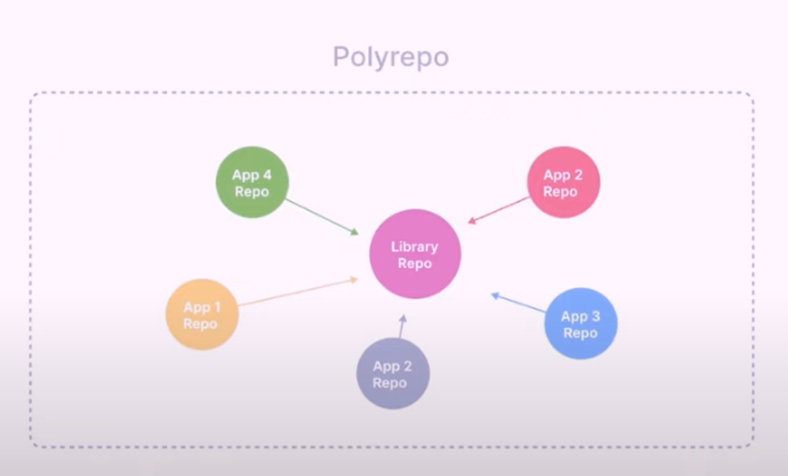
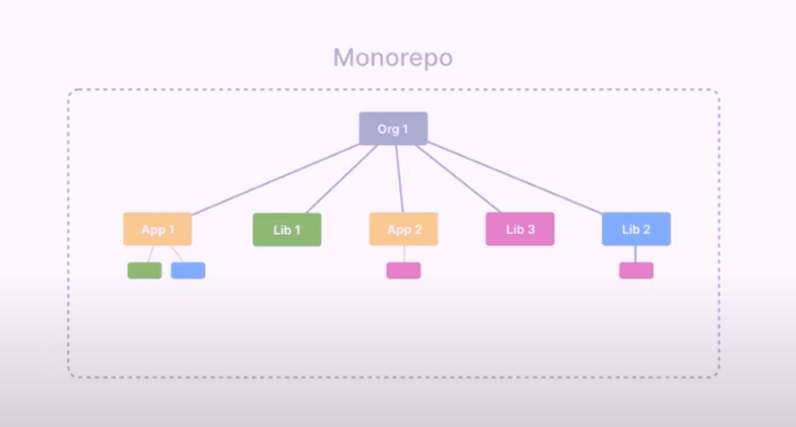

# 모노레포와 멀티레포

리포지토리를 관리하는 방법은 시스템의 각 모듈을 개별 리포지토리에서 관리할 것인지, 하나의 리포지토리에서 관리할 것인지에 따라서 달라집니다. 이때 나눠서 관리하는 것을 멀티레포, 하나로 관리하는 것을 모노레포라 정의합니다.

## 멀티레포

- 시스템의 서비스별로 리포지토리를 각자 만들어서 관리합니다.
- 서비스 간의 연동이 소스 단위로 이루어지지 않습니다.
- 각 서비스가 별도의 폴더로 구성됩니다.

### 장점

- 강한 오너쉽 확보
- 리포지토리 별로 오너를 지정
- 마스터의 코드가 깨질 여지가 적습니다.
- 코드 베이스가 아예 나뉘어 있음
- 서로 간의 작업 충돌로 마스터 코드가 깨질 가능성이 적습니다.
- 형상 관리, CI 속도가 빠릅니다.
- 리포지토리의 크기가 작기 때문에, 리파지토리 훅을 기반으로 동작하는 도구들의 속도가 빨라집니다.

### 단점

- 코드 재사용이 쉽지 않으므로, 중복 코드 가능성이 높아짐
- 다른 리포지토리의 코드를 사용하기 위해서 해야 할 별도의 작업이 존재 (ex. 라이브러리 리포 제작)
- 하나의 피쳐 개발을 위해 여러 리포지토리에 머지를 해야하는 번거로움이 존재합니다.
- 코드 리뷰가 분리
- 버전 연동이 깨질 위험 존재
- 하나의 브레이킹 체인지가 다른 리포지토리로 즉시 전파되지 않습니다.
- 프로젝트가 거대화됨에 따라 의존 그래프가 매우 복잡(**디펜던시 헬**)
- 서로의 코드에 변화가 생길 때 이를 대처하기가 쉽지 않습니다. (**디펜던시 헬**)

### 예시

프로젝트 A와 비슷한 형태의 프로젝트 B가 새로 추가되는 상황을 가정해봅시다.

1. 새로운 Project B 레포지토리를 추가한다.
2. ci/cd, lint, test, ts등등의 설정을 새로 해준다.
3. Project A에서 재사용하고 싶은 코드가 있는 경우에는 이를 위한 Library A 레포지토리를 새로 만들어준다.
4. 2번 반복.

프로젝트 A, B 서비스 디자인이 비슷하여 공통 UI들이 많다면 굳이 UI, 모듈을 새로 만들 필요 없이 프로젝트 사이에서 공유하면 되는데 멀티레포 구조이기 때문에 프로젝트 간 코드 공유가 어려운 문제가 발생합니다.

 

## 모노레포

> “A monorepo is a single repository containing muliple distinct projects, with well defined relationships.”   “모노레포란 잘 정의된 관계를 가진, 여러개의 독립적인 프로젝트들이 있는 하나의 레포지토리이다.”

- 시스템의 각 서비스를 모두 하나의 리포지토리에서 일괄 관리하는 방법.
- 서비스 간의 연동이 소스 단위로 이루어집니다.
- 최상위 폴더부터 트리 구조로 서비스 폴더가 구성.

### 장점

- 지속적인 소스의 무결성 보장
- 리포지토리는 항상 모든 서비스가 연동된 올바른 상태를 유지합니다.
- 통합된 버전 관리
- 모든 서비스가 연동된 상태에서 손쉽게 하나의 버전으로 관리 가능
- 코드의 공유와 재사용이 용이
- 소스 단위의 연동이 이루어진 상태
- 간편한 의존성 관리
- 전체 서비스의 의존 관계가 한 리포지토리내에서 확인 및 설정 가능
- 원자 단위 변화
- 변화가 여러 스텝이 아니라 한 리포지토리에서 한 스텝으로 이루어집니다.
- 여러 프로젝트팀 간의 협업 용이
- 하나의 리포지토리에서 함께 작업하며, 여러 서비스에 손쉽게 접근 가능
- 유연한 팀 바운더리 설정과 코드 오너쉽을 가져갈 수 있습니다.
- 하나의 리포지토리, 하나의 서비스에 제한된 코드 오너쉽을 유지하지 않아도 됩니다.
- 통합 CI 및 테스트 가능
- 모든 소스가 연동된 상태. CI 및 테스트 구성이 용이
- 전체 코드가 트리 구조로 명확합니다.
- 한 번의 코드 리뷰에 모든 변화 요약 가능

### 단점

- 무분별한 의존성 연결 가능
- 의존성 연결이 쉽기 때문에 오히려 과도한 의존 관계가 나타날 수 있음
- 형상 관리 및 CI 속도 저하
- 리포지토리의 크기가 크기 때문에, 리파지토리 훅을 기반으로 동작하는 도구들의 속도 감소

 

## 주요 특징 비교

### 코드 오너쉽

코드 오너쉽의 경우 모노레포, 멀티레포의 측면보다는 마이크로 서비스의 구축 여부가 더 중요합니다. 각 서비스가 도메인에 맞게 잘 분리가 되어 있다면, 서비스별로 오너쉽을 부여할 수 있을 것입니다.

모노리딕 시스템에서는 아직 서비스의 분리가 미비하고, 하나의 서비스 안에서 여러 부분으로 오너쉽을 나눠 가져야만 합니다. 이 때문에 코드의 오너쉽이 모호하게 분리됩니다. 이를 해결하기 위한 가장 좋은 방법은 마이크로 서비스로 시스템을 나누는 것이고, 그것이 힘들다면 도구의 도움을 받아서 폴더별로 코드의 오너를 지정하는 방법이 있습니다.

### 브레이킹 체인지 전파

멀티레포의 경우 각 리포지토리 별로 소스를 관리하기 때문에 브레이킹 체인지가 일어났을 경우 이를 의존하는 모듈에 자동으로 변화가 전파되지 않습니다. 반대로, 모노레포의 경우 하나의 소스에서 작업을 진행하기 때문에 브레이킹 체인지가 발생했을 경우, 즉시 에러로 검출이 가능합니다.

### 코드 리뷰

멀티레포의 경우 여러 리포지토리에 변경이 필요한 피쳐 작업이 있을 때, 코드 리뷰 또한 여러 리포지토리로 퍼트려야 합니다. 모노레포의 경우 하나의 리포지토리에서 하나의 작업으로 처리가 되므로 코드 리뷰 효과가 명확하게 진행이 됩니다.

### 의존성 관리

모노레포의 경우 모든 소스가 한 리포지토리에서 관리되므로, 의존성 관리에 유리합니다. 모든 의존 관계를 한 리포지토리에서 확인 가능하며, 관련 설정 파일도 한곳에서 모아서 관리가 가능합니다. 반대로 멀티레포는 각 리포지토리가 자신의 의존관계만을 알고 있기 때문에 전체적인 의존관계를 파악하기 쉽지 않습니다.

### 버전 관리

멀티레포와 모노레포의 장단점이 존재한다. 멀티레포의 경우 서비스별로 형상 관리가 유지되기 때문에, 버전 관리를 서비스 단위로 독립적으로 하는 데 유리합니다. 하지만 이는 위에서 살펴보았듯이 각 서비스 간의 버전 충돌 문제를 야기합니다. 모노레포의 경우 각 서비스의 통합 버전 관리가 기본 베이스가 됩니다. 모든 소스가 연동된 상태에서 버전 관리가 이루어지기 때문에 서비스별로 버전 전략을 다르게 가져가며 배포에 어려움이 있습니다. 이러한 세밀한 버전 관리의 경우 브랜치 전략을 고도화하고, 도구의 도움을 받아 해결해야 합니다.

### 도구 속도

멀티레포가 더 유리하다. 멀티레포는 각 작은 리포지토리별로 각자 도구들이 동작하게 되며, 작업의 단위가 작아지기 때문에 속도가 더 빠릅니다. 하지만, 이는 리포지토리 내에서도 특정 부분에 대해서만 형상 관리, CI 등을 제공하는 툴을 사용해서 해결할 수 있습니다.

 
 
 

참고문헌

https://tech.buzzvil.com/handbook/multirepo-vs-monorepo/

https://sion-log.vercel.app/toss-monorepo

