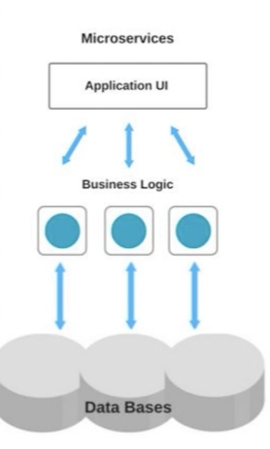

# 아키텍처란?

소프트웨어 개발에서 아키텍처는 서비스의 구성과 동작에 대한 대응 방식을 구조적으로 표현하고 결정한 것을 뜻합니다.

# 모놀리식 아키텍처 (Monolithic Architecture)

<small>맥가이버 칼이 여러 공구를 몸통 하나에 갖춘 것처럼, 모놀리식 아키텍처 역시 단일 서비스에 여러 기능이 들어가 있습니다.</small>

 

모놀리식 아키텍처(Monolithic Architecture, MA)는 하나의 통합된 코드 베이스로 여러 비즈니스 기능을 수행하는 전통적인 소프트웨어 개발 모델입니다.

단일 애플리케이션 내에 서비스의 모든 로직이 통으로 들어가 있는 구조죠.

 

이렇게 서비스를 애플리케이션 하나로만 처리할 때의 가장 큰 장점은 뭐니뭐니해도 간결하다는 점입니다.

중앙 집중된 구조이기 때문에 분산된 애플리케이션에 비해 엔드 투 엔드 테스트(End-to-End, E2E: 사용자 관점에서 애플리케이션의 흐름을 처음부터 끝까지 테스트하는 것)를 더 빠르게 수행할 수 있어요.

단일 애플리케이션에 비즈니스 로직부터 UI, 콘텐츠 등 모든 구성 요소를 이루는 코드가 들어있기 때문에 디버깅하기도 간편합니다.

소규모 애플리케이션이라면 단순하면서도 견고한 구조를 만들기 좋아요.

 

하지만 서비스 규모가 커짐에 따라 모놀리식 아키텍처의 단점도 제기되기 시작했습니다.

단일 애플리케이션이 커지면 자연히 구동부터 빌드, 배포에 드는 시간이 오래 걸리죠. 더욱이 하나로 된 거대한 시스템 구조를 제대로 파악하지 않으면 특정 컴포넌트나 모듈에서 발생하는 성능 문제나 장애가 다른 영역에까지 영향을 주게 됩니다.

아무리 작은 부분만 수정하더라도 전체 애플리케이션을 통째로 컴파일해서 배포해야 하는 만큼 배포가 잦은 환경에서는 번거롭죠.

기능별로 알맞은 기술이나 언어, 프레임워크를 따로 선택하기도 까다롭고요.

 

## 장점

1. 어떤 기능(서비스)이든지 개발되어있는 환경이 같아서 복잡하지않습니다.(단순하고 통일성 있는 구조)
2. 쉽게 고가용성 서버 환경을 만들 수 있습니다. (같은 어플리케이션으로 하나더 만들면 됩니다.)
   3.End-to-End 테스트가 용이합니다. (MSA의 경우 테스트에 필요한 서비스들을 모두 동작시켜야함)
3. 손쉬운 모니터링, 디버깅
4. 단일 코드베이스 → 간편한 개발

## 단점

1. 한 프로젝트의 덩치가 너무 커져서 어플리케이션 구동시간이 늘어나고 빌드,배포 시간도 길어집니다.
2. 조그마한 수정사항이 있어도 전체를 다시 빌드하고 배포를 해야합니다.
3. 많은 양의 코드가 몰려있어 개발자가 모두를 이해 할 수 없고 유지보수도 힘듭니다.
4. 일부분의 오류가 전체에 영향을 미칠 수 있습니다.
5. 기능별로 알맞는 기술, 언어, 프레임워크를 선택하기가 까다롭습니다. 즉, 기술 유연성 낮아 스택의 제한이 생깁니다.
6. 위축된 확장성

## 적합한 경우

1. 기술적 복잡도가 낮은 소규모 프로젝트
2. MVP 수준의 단일 비즈니스 또는 신설 도메인 등
3. 시장 진입을 위해 빠르고 간편하게 기능 개발 및 배포를 수행해야 할 때

 

# 마이크로 서비스 (MicroService)

마이크로서비스 아키텍처(MicroService Architecture, MSA)는 단일 애플리케이션으로 이루어진 모놀리식 아키텍처와 달리 서비스를 아주 작은 서비스(Microservice) 단위로 나눠 각 서비스에서 독립적으로 서비스를 구성하는 모델입니다.

중앙 집중적인 관리 체계 대신 경량화된 API나 메시지로 직접 통신하며 접근하는 방식을 취하고 있어요.

 

MSA의 장점은 서비스를 잘게 쪼개면서 개발 구조가 민첩하고 유연해졌다는 점입니다.

각 서비스를 독립적으로 개발하고 배포할 수 있어서 작업 시간이 단축되고 확장성도 높죠.

배포가 빠르고 잦은 만큼 애자일 작업 방식을 취하기도 편리하고요.

더욱이 일부분에 문제가 생기면 시스템 전체가 다운될 수 있는 모놀리식 아키텍처와 달리, 한 서비스가 다운되더라도 다른 서비스는 문제없이 작동할 수 있습니다.

서비스에 적합한 언어나 프레임워크 등 기술을 독립적으로 선택할 수 있고, 자체 DB를 서비스마다 가지고 있어서 데이터 무결성을 유지하는 데도 도움이 되죠.

 

물론 단점도 있습니다. 분산된 서비스가 서로 API를 호출하는 과정에서 통신 비용과 지연 시간이 들고, 큰 인프라 비용이 발생할 수 있죠.

장애 추적이나 디버깅, E2E 테스트 역시 쉽지않습니다.

DB가 분리되면서 데이터를 조회하기 어렵고 DB간 데이터 중복이 발생할 수도 있고요.

무엇보다 서비스가 커지는 만큼 복잡해지기 때문에 적절하게 관리하지 않으면 오히려 개발 속도나 운영 성능이 나빠질 수 있어요.

모놀리식 아키텍처에서 마이크로서비스로 전환하는 서비스가 늘어나고 있지만, 반대로 되돌아갔다는 소식 역시 종종 들려오는 이유죠.

# 정리

## 장점

1. 기능별로 마이크로서비스를 개발하고, 작업 할당을 서비스 단위로 하면 개발자가 해당 부분을 온전히 이해할 수 있습니다.

2. 새로 추가되거나 수정사항이 있는 마이크로서비스만 빠르게 빌드, 배포가 가능합니다. (더 민첩한 배포 주기)

3. 해당 기능에 맞는 기술, 언어 등을 선택하여 사용할 수 있습니다. (유연한 확장성, 높은 기술 유연성)

4. 일부분의 오류가 있으면 해당 기능에만 오류가 발생하고 그 부분만 빠르게 고쳐서 정상화가 가능합니다. (유지 관리 안정성)

## 단점

1. 무엇보다 관리가 힘듭니다. 작은 여러 서비스들이 분산되어있기 때문에 모니터링, 디버깅, 통합 테스트가 힘듭니다.

2. 서로를 호출하여 전체 서비스가 이루어지기 때문에 무조건 다른 서비스를 호출하는 코드가 추가되는데 이부분이 모놀리식 아키텍쳐의 개발보다 조금 까다롭습니다.

3. 통신관련 오류가 잦을 수 있습니다. 마이크로 서비스들 끼리 계속 서로 통신을 하다보니 모놀리식 아키텍쳐에 비해 통신관련 오류가 잦은 경우가 많습니다.

4. 테스트가 불편합니다. 예로 End-to-End 테스트를 위해 UI, Gateway 등등 여러개의 마이크로 서비스를 구동시켜야 합니다.

5. 복잡한 구조, 높은 구현 난이도

6. 인프라 및 자원, 인력에 드는 막대한 비용

7. 까다로운 DB 트랜잭션 관리

## 적합한 경우

1. 기술적 복잡도가 높은 대규모 프로젝트
2. 다양한 기술 스택을 사용하고, 여러 비즈니스별 요구사항이 명확한 경우
3. 장애를 줄이고 시스템 전체의 가용성과 탄력성을 높여야 할 때

 
 
 

참고문헌

https://www.inflearn.com/pages/infcon-2023-tech-msa

https://lion-king.tistory.com/entry/%EB%A7%88%EC%9D%B4%ED%81%AC%EB%A1%9C-%EC%84%9C%EB%B9%84%EC%8A%A4-vs-%EB%AA%A8%EB%86%80%EB%A6%AC%EC%8B%9D-%EC%95%84%ED%82%A4%ED%85%8D%EC%B2%98-MicroService-vs-Monolithic-Architecture-%EA%B0%84%EB%8B%A8-%EC%86%8C%EA%B0%9C-%EB%B0%8F-%EC%A3%BC%EA%B4%80%EC%A0%81-%EC%9D%98%EA%B2%AC

