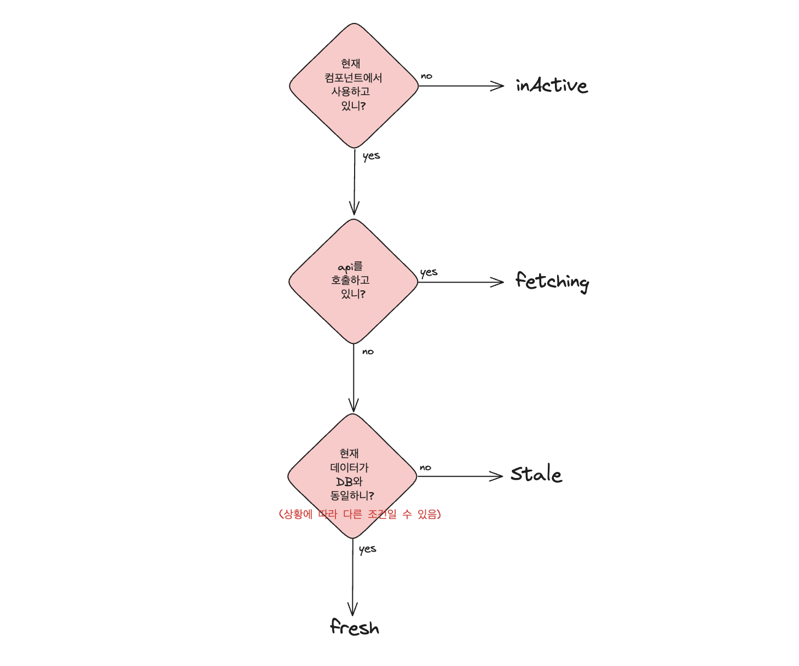
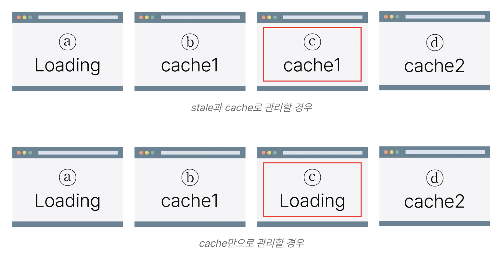

React Query는 서버 데이터 상태를 관리하기 위한 시간 세팅 기능이 있습니다.

바로 staleTime과 gcTime(Cache Time)인데요

각각 어떤 의미인지 알아보도록 합시다.

 

## 서버 데이터 상태

서버로 부터 받아온 데이터의 상태는 3가지로 나눌 수 있습니다.

###  fresh(신선한)

- 그대로 사용 가능한 상태의 데이터를 의미합니다.
- 즉, 현재 DB 저장된 데이터와 같은 데이터 상태입니다. 
- 데이터를 새로 fetching 할 필요가 없는 상태입니다.
- ex. 화면에 보이는 회원의 닉네임과 서버에 저장된 회원의 닉네임이 일치한 경우.

### stale(신선하지 않은)

- 말 그대로 신선하지 않은 데이터를 의미합니다.
- 현재 DB 저장된 데이터와 다른 데이터인 상태입니다. 
- 데이터를 새로 fetching 할 필요가 있는 상태입니다. (서버에 저장된 데이터와 다르므로)
- ex. 사용자가 닉네임을 변경했는데 어떠한 이유로 인해 서버에 저장된 닉네임이 아닌 변경전 닉네임이 화면에 띄워진 경우.

### inactive(사용하지않는)

- 현재 컴포넌트에서 사용하지 않는 데이터입니다.
- 사용자가 볼 일이 없는 데이터입니다. 
- 컴포넌트 혹은 쿼리가 unmount 될 경우 해당 데이터는 inactive 상태가 됩니다. 

참고로 3가지 상태 모두 캐시 저장이 가능합니다. 데이터 자체가 완전 사라져버리는 것은 delete 상태입니다.

 
 

## staleTime

데이터가 fresh → stale 상태로 변경되는 데 걸리는 시간입니다.

만약 `staleTime : 3000` 으로 설정하면 서버 데이터는 5분 뒤에 stale상태가 되는 것이죠. 

만약 fresh 상태일 때 refetch를 시도한다면 캐시된 데이터(fresh 상태) 반환해줍니다.
> 단 React Query 설정에 따라 달라집니다. 별도 설정을 통해 캐시된 데이터가 아닌 서버 데이터를 불러올 수 도 있습니다. 

React Query에서 staleTime 기본값은 0이므로 따로 설정해주지 않는다면 데이터를 화면에 띄운 순간 stale 상태가 됩니다. 그럼, Refetch 트리거 동작 시 서버로부터 데이터를 가져오겠죠. 

 

### 그래서 언제 쓰면 되나요?

stale상태를 활용한다면 데이터를 다시 불러오는 그 비어있는 타임에 loading 페이지가 아닌 stale상태 데이터를 보여줌으로서 사용성을 높이는 목적을 달성할 수 있습니다. 

즉 사용자에게 빈 화면이나 로딩창보다는 전에 사용했던 데이터를 보여주는 목적으로 사용할 수 있답니다. 

 
 

## gcTime(cache Time)

데이터가 inactive한 상태일 때 캐싱된 상태로 남아있는 시간입니다.

특정 컴포넌트가 unmount(페이지 전환 등으로 화면에서 사라질 때) 되면 사용된 데이터는 inactive상태로 바뀌고, 이때 데이터는 gcTime만큼 유지됩니다.

만약 `gcTime : 3000` 으로 설정하면 컴포넌트가 unmount 된 이후 5분 동안은 해당 데이터는 inactive상태로 캐싱되어있는 것이죠. 

gcTime 이후 데이터는 가비지 콜렉터로 수집되어 메모리에서 해제됩니다. 즉 delete 상태가 됩니다. 

delete 상태 데이터는 캐싱되지 않고 삭제됩니다. 

> React Query v5 버전부터 cache Time -> gcTime 으로 명청이 변경됐습니다.   cache Time은 더 이상 쓸모없는 데이터로 변경되는 시간을 의미하는데 cache 라는 표현 자체가 어색하다는 의견이 있었다고 하네요.   그래서 새로운 이름 gcTime(Garbage Collection Time)으로 변경되었습니다.

 

### gcTime은 뭐 쓸 일 있나요? 굳이 왜 필요한거죠?

> 문득 이런 의문이 들었습니다.   애초에 버려질 데이터인데 왜 굳이 다시 사용할 수 있는 시간을 부여하는거지?

대표적인 예로 사용자가 페이지를 벗어난 뒤 다시 돌아왔을 경우 사용됩니다.

ex. 
사용자가 회원가입 페이지에서 개인 정보를 작성 한 뒤 다음 단계로 이동한 상태입니다. 이때 사용자가 정보를 잘못 입력한 것 같아 뒤로가기를 눌렀을 때 inactive 였던 데이터들을 다시 불러와 화면에 그대로 띄워줄 수 있죠.

이러한 설정을 통해 사용자는 이전 페이지로 돌아왔을 때 해당 페이지의 기존 데이터에 접근할 수 있고 사용자 경험이 높아지겠죠.  

> 참고로 inactive라고 사용할 수 없는 데이터는 아닙니다. 최신 데이터는 아니지만 사용 가능한 상태입니다. 

즉 사용자는 gcTime 내 이전 페이지로 돌아온다면 inactive 상태인 데이터를 사용할 수 있습니다. 

만약 gcTime이 지난 후 이전 페이지로 돌아온다면 데이터는 이미 delete 상태가 되었으므로 데이터가 사라진 상태의 화면을 마주할 것 입니다. 

 
 
 

참고문헌

https://velog.io/@kandy1002/React-Query-%ED%91%B9-%EC%B0%8D%EC%96%B4%EB%A8%B9%EA%B8%B0#1-%EB%9D%BC%EC%9D%B4%EB%B8%8C%EB%9F%AC%EB%A6%AC-%EC%9D%B4%EB%A6%84-%EB%B3%80%EA%B2%BD

https://velog.io/@boyeon_jeong/React-query-%EC%BA%90%EC%8B%9C

https://tanstack.com/query/latest/docs/framework/react/reference/useQuery

