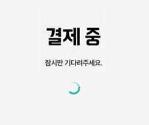

# 낙관적 업데이트(Optimistic Update)란?

낙관적인 업데이트는 서버로 보낸 요청이 정상적일 것이라고 예상하고, 클라이언트의 요청에 대한 응답이 오기 전에 클라이언트의 데이터(UI)를 미리 변경시키는 작업입니다. 사용자가 서버의 응답을 기다리지 않고 즉각적인 피드백을 받을 수 있기 때문에 사용자경험(UX)이 향상되는 기법입니다.

>  '낙관적'의 사전적 정의는 '인생이나 사물을 밝고 희망적인 것으로 보는 것'입니다.  <br>  즉 서버로 보낸 요청이 정상적일 것이라 낙관적?으로 판단하고 미리 클라이언트를 변경시킨다는 의미에서 비롯된 것 같네요. 


# 주요 단계

## 1. 변경 전 저장 상태

- 낙관적 업데이트전 `현재 상태`를 저장합니다. 서버 요청이 실패했을 경우 원래 상태로 `롤백(rollback)`하기 위해 필요합니다. 

## 2. 낙관적 상태 업데이트

- 서버에 데이터를 전송하기 전, `queryClient.setQueryData` 메서드를 통해 로컬 상태를 즉시 업데이트합니다.

- 해당 작업은 사용자가 변경 사항을 즉각적으로 피드백 받을 수 있게 해줍니다.

## 3. 서버 요청 수행

- 서버에 실제 데이터를 전송합니다. `mutate` 메서드를 사용했습니다.

## 4. 성공 or 실패 시 상태 반영

- 서버 요청이 성공하면, 서버로부터 받은 최신 데이터를 다시 상태에 반영합니다. 해당 작업은 `onSettled` 콜백 함수에서 실행됩니다. 

## 5. 실패 시 롤백

- 서버 요청 실패시, 저장해둔 원래 상태롤 롤백합니다. `onError` 콜백함수에서 수행됩니다. 


# 코드

```js
import { useMutation, useQueryClient } from '@tanstack/react-query';
import useToast from '@/src/shared/UIKit/organisms/Toast/lib/useToast';
import { fetchAddFavoriteContents } from '@/src/entities/user/api/fetchAddFavoriteContents';
import { USER_FAVORITE_KEYS } from '@/src/entities/user/query/query/queryOptions';
import { fetchDeleteFavoriteContents } from '@/src/entities/user/api/fetchDeleteFavoriteContents';
import { TResFetchFavoriteContents } from '@/src/entities/user/api/fetchFavoriteContents';

//prevData 기존데이터를 사용자의 post 또는 delete 액션에 따라 업데이트하는 함수
const updateFavoriteContents = (
  prevData: TResFetchFavoriteContents,
  subdirs: string[],
  action: 'post' | 'delete',
) => {
  if (!prevData.isSucceed) return prevData;
//prevData를 받아오지 못했으면 그대로 반환
  return {
    ...prevData,
    body: {
      ...prevData.body,
      subdirs:
        action === 'post'
          ? [...prevData.body.subdirs, ...subdirs]
          //찜 목록 추가
          : prevData.body.subdirs.filter((subdir) => !subdirs.includes(subdir)),
          //찜 목록 삭제
    },
    
  };
};

export const usePostFavoriteContentsMutation = () => {
  const { showToast } = useToast();
  const queryClient = useQueryClient();
  const queryKey = USER_FAVORITE_KEYS.contents();

  return useMutation({
    mutationFn: fetchAddFavoriteContents,
    onMutate: async (variables) => {
      await queryClient.cancelQueries(queryKey);
      //동일한 쿼리에 대한 모든 요청을 취소하여 데이터 충돌 방지
      const previousData = queryClient.getQueryData<TResFetchFavoriteContents>(queryKey);
      //현재 즐겨찾기 데이터를 previousData로 저장

      // 낙관적 업데이트 -> 데이터 UI에 즉시 반영
      queryClient.setQueryData(queryKey, (prevData: TResFetchFavoriteContents) =>
        updateFavoriteContents(prevData, [variables.subdir], 'post')
      );

      return { previousData };
    },
    onError: (_error, _variables, context) => {
      // 응답 에러시 롤백
      queryClient.setQueryData(queryKey, context?.previousData);
      //저장된 스냅샷(previousData)을 다시 쿼리 데이터로 설정하여, 에러가 발생하기 전 상태로 롤백
    },
    onSettled: () => {
      queryClient.invalidateQueries(queryKey);
      //캐시 무효화 -> 서버에서 최신 데이터를 가져와 UI와 동기화
    },
    onSuccess: (data) => {
      if (data?.isSucceed) {
        showToast({
          message: '찜 한 작품에 추가 되었습니다.',
          type: 'basic',
        });
        //서버 데이터를 성공적으로 가져오면 토스트창 띄우기
      }
    },
  });
};

export const useDeleteFavoriteContentsMutation = () => {
  const { showToast } = useToast();
  const queryClient = useQueryClient();
  const queryKey = USER_FAVORITE_KEYS.contents();

  return useMutation({
    mutationFn: fetchDeleteFavoriteContents,
    onMutate: async (variables) => {
      await queryClient.cancelQueries(queryKey);
      const previousData = queryClient.getQueryData<TResFetchFavoriteContents>(queryKey);

     
      queryClient.setQueryData(queryKey, (prevData: TResFetchFavoriteContents) =>
        updateFavoriteContents(prevData, variables.subdirs, 'delete')
      );

      return { previousData };
    },
    onError: (_error, _variables, context) => {
    
      queryClient.setQueryData(queryKey, context?.previousData);
    },
    onSettled: () => {
      queryClient.invalidateQueries(queryKey);
    },
    onSuccess: (data) => {
      if (data?.isSucceed) {
        showToast({
          message: '찜 한 작품에서 삭제 되었습니다.',
          type: 'basic',
        });
      }
    },
  });
};
```

```js
import useIsCheckLogin from '@/src/shared/globalContext/user/lib/hooks/useIsCheckLogin';
import { MouseEvent, useMemo } from 'react';
import { useFavoriteContentsQuery } from '@/src/entities/user/query/query';
import {
  useDeleteFavoriteContentsMutation,
  usePostFavoriteContentsMutation,
} from '@/src/entities/user/query/query/mutation';
import useClientHost from '@/src/shared/API/lib/hooks/useClientHost';

const useFavoriteContents = (subdir: string, restSubdirsForDelete: string[] = []) => {
  const { isCheckLogin } = useIsCheckLogin();
  const host = useClientHost();

  const { data } = useFavoriteContentsQuery();
  const { mutate: postMutate, status: postMutateStatus } =
    usePostFavoriteContentsMutation();
  const { mutate: deleteMutate, status: deleteMutateStatus } =
    useDeleteFavoriteContentsMutation();

  const isMutating = postMutateStatus === 'pending' || deleteMutateStatus === 'pending';

  const isActiveContent = useMemo(
    () => !!data?.subdirs.includes(subdir),
    [data?.subdirs, subdir],  
  );
  //subdir가 현재 찜 목록에 포함되어 있는지를 확인
  // 찜버튼의 활성 상태를 UI에 표시하는데 사용

  const clickHandler = (e: MouseEvent<HTMLButtonElement>) => {
    e.preventDefault();
    e.stopPropagation();

    if (!isCheckLogin()) return;

    if (isActiveContent) {
      deleteMutate({ subdirs: [subdir, ...restSubdirsForDelete], host });
      return;
    }
    //찜 목록에 있는 작품 찜 버튼을 클릭했으니 찜 목록 삭제

    postMutate({ subdir, host });
    //찜 목록 추가
  };

  return {
    isActiveContent,
    isMutating,
    clickHandler,
  };
};

export default useFavoriteContents;

```


```js
import { memo } from 'react';
import Icon from '@/src/shared/UIKit/atom/Icon';
import useContentItemContext from '@/src/shared/UIKit/organisms/ContentItemBase/lib/useContentItemContext';
import useFavoriteContents from '@/src/features/content/lib/useFavoriteContents';

function DetailLikeButton() {
  const {
    contentInfo: { getData },
  } = useContentItemContext();
  //작품 정보 담고있는 Context
  const { isActiveContent, clickHandler } = useFavoriteContents(getData.subdir);

//isActiveContent에 따라 찜 목록 UI 상태 처리
  return (
    <button type={'button'} onClick={clickHandler}>
      <Icon type={isActiveContent ? 'btnLikeOn' : 'btnLikeOff'} />
    </button>
  );
}

export default memo(DetailLikeButton);
```


# 언제쓰면 좋나


위 이미지의 메시지 전송, 좋아요, 즐겨찾기, 투두리스트 체크, 장바구니 담기, 게시글 비공개, 파일 업로드, 북마크 등은 모두, 낙관적 업데이트가 필요한 기능들입니다.

이러한 기능들의 공통점은, 모두 기존의 데이터에 업데이트(mutate)를 일으킨다는 점입니다. 사용자의 동작에 따라 발생한 데이터 업데이트는, 지연 시간(latency) 없이 즉각적인 피드백을 화면에 띄워야 사용자 만족도를 높일 수 있습니다.

# 지양해야하는 경우
물론 낙관적 업데이트가 모든 상태의 업데이트에 필요한 것은 아닙니다. 낙관적 업데이트가 필요하지 않거나, 심지어 사용을 지양해야 하는 경우도 존재합니다.

예를 들어 장바구니에 상품을 담고 결제를 진행한다고 해봅시다.

사용자가 결제 버튼을 클릭하면 어떻게 될까요? 일반적으로 결제 요청이 서버로 전송되고, ‘로딩 중’ 같은 문구나 로딩 스피너가 보일 것입니다.



만약 결제 기능에 낙관적 업데이트를 적용한다면, 결제 응답과 상관없이 장바구니의 상품을 먼저 제거하는 등 UI 먼저 업데이트하게 됩니다. 그 결과는 사용자는 결제했음에도 장바구니에 아직 상품들이 남아 있는 것을 발견합니다.

장바구니의 상품들 상태는 서버의 데이터를 GET 요청하여 보여주는데, 아직 서버의 데이터는 완전하게 업데이트를 끝내지 못했기 때문입니다.

이렇듯 서버 데이터와 화면의 상태 간 일관성이 중요한 경우, 낙관적 업데이트를 지양해야 합니다. 결제나 계정 정보 관리 등의 기능들은 일정 시간의 지연 시간이 필연적이라는 사실을, 많은 사용자가 그동안의 사용자 경험으로 인지하고 있는 부분입니다. 따라서 이러한 상황에는 낙관적 업데이트를 하여 사용자 경험을 저하하기보다는, 중요한 작업의 신뢰성을 유지하기 위해 ‘로딩 중’처럼 서버 응답을 기다리도록 하는 것이 안전합니다.


<br>
<br>
<br>

<details>

<summary>참고문헌</summary>

<div markdown="1">

https://velog.io/@song961003/react-query-Optimistic-Update%EB%82%99%EA%B4%80%EC%A0%81-%EC%97%85%EB%8D%B0%EC%9D%B4%ED%8A%B8

https://tecoble.techcourse.co.kr/post/2023-08-15-how-to-improve-ux-with-optimistic-update/

</div>

</details>
