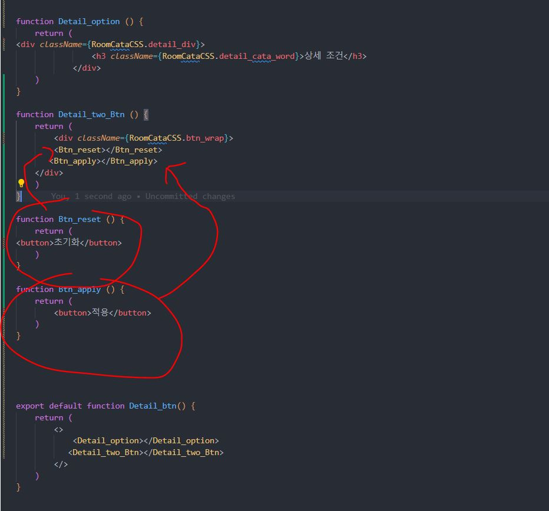

### React 개발에서 피해야 할 좋지 않은 패턴을 의미

## 1. **BIG Components (큰 컴포넌트)**

- 하나의 컴포넌트가 너무 많은 동작 및 로직이 포함되어 크고 복잡하게 되어있는 경우를 의미
- 대신, 작은 단위의 컴포넌트로 분리하고, 각 컴포넌트는 특정 역할을 수행하도록 설계해야 가독성이 좋아지고 유지 보수가 쉬워진다.

예시코드 및 결과물


위 사진처럼 하나의 컴포넌트에 너무 많은 로직들이 들어가 있으면 가독성이 떨어지고 유지보수에도 어려움을 초래할 수 있다.

해결 예시


작은 컴포넌트 별로 분리해 가독성을 높이고 컴포넌트 재사용이 가능해 유지보수가 용이해지는 효과를 얻을 수 있다.

**단, Over-Optimization(지나친 최적화)은 피해야한다.**

Over-Optimization의 예시



극단적인 예시지만 `<button>` 태그 하나조차 컴포넌트로 만들어 오히려 로직의 복잡성만 가중시키는 것을 확인할 수 있다.

Avoid Over-Optimization(지나친 최적화 지양)의 예시


애초에 컴포넌트 크기가 작은경우 굳이 더 작은 컴포넌트 별로 세부화 하기보단 그대로 작성하는 것이 더 효율적이다.

glean이라는 VSCODE 확장프로그램 활용

- React 리팩토링 도구
- JSX를 새로운 컴포넌트로 추출
- 클래스 컴포넌트를 함수 컴포넌트로 변환하는 기능 (반대도 가능)
- 파일간에 기존 Javascript / Typescript 코드를 추출 가능,
- 이전 위치에서 선택한 코드를 내보내고 새 코드를 가져 오는 것을 처리할 수 있음
- 클래스 컴포넌트를 함수 컴포넌트로 또는 그 반대로 변환 할 수 있습니다
- ES2015 모듈 지원
- CommonJS 모듈 지원

사용예시

1. 분리하고 싶은 영역을 선택 후 extract component를 클릭한다.


1. 컴포넌트 경로를 설정한다.


1. 새로운 컴포넌트가 생성됨을 확인한다.


1. 코드가 간결해졌다.


## 2. Avoid Nested Defined Component (중첩 정의 컴포넌트 피하기)

- 컴포넌트 내에서 다른 컴포넌트를 정의하고 중첩하는 것을 의미
- 중첩 정의된 컴포넌트는 재사용하기 어렵고 코드를 복잡하게 만들 수 있습니다.
- 컴포넌트를 외부에서 정의하고 필요한 곳에서 가져와 사용하는 것이 좋다.

**Nested Defined Component** 예시

```jsx
function Component {

function NestedComponent(){
      return (
<div>
<h2>안녕<h2/>
<div/>
)
}

    return (
      <div>
        <NestedComponent />
      </div>
    );
  }
```

컴포넌트 내에서 새로운 컴포넌트를 정의하고 중첩하고 있다.

해결 예시

```jsx

function NestedComponent(){
      return (
<div>
<h2>안녕<h2/>
<div/>
)
}

function Component {

    return (
      <div>
        <NestedComponent />
      </div>
    );
  }
```

외부에서 컴포넌트를 정의한 후 원하는 곳에 사용하는 것이 좋다.

## 3. **Failure to Memoize**

메모이제이션 기술을 사용하지 않아서 발생하는 문제나 성능 저하를 의미

ex) 동일한 함수에 대해 여러 번 호출되는데 이 함수가 매번 동일한 입력에 대해 동일한 결과를 계산하고, 이전 결과를 저장하지 않으면 프로그램의 성능이 저하될 것이다.

해결방법

1. useMemo() 훅 사용

   - **Memoize**: 계산 결과를 저장하고 나중에 동일한 입력에 대한 결과를 다시 계산하는 대신에 저장된 결과를 반환하는 기술
   - 컴포넌트 내에서 계산량이 많은 작업이 반복되는 경우, Memoization을 사용하여 중복 계산을 피할 수 있다.
   - Memoization은 특히 `재귀 함수` 또는 `반복적인 계산`이 많이 발생하는 상황에서 유용하며, 중복 계산을 줄이고 실행 시간을 단축시킬 수 있다.

   Failure to Memoize 예시

   ```jsx
   import React, { useState } from "react";

   function Counter() {
     const [count, setCount] = useState(0);

     // 이 함수는 렌더링될 때마다 실행되지만, 메모이제이션을 사용하지 않음
     // 동일한 계산을 반복 수행하고 있음
     const doubleCount = () => {
       console.log("Calculating double of count...");
       return count * 2;
     };
     //doubleCount함수는 렌더링될 때마다 호출되며, count변수에 대한 계산을 수행한다.
     //count가 변경될 때마다 매번 동일한 계산을 반복 ⇒ 성능 저하

     return (
       <div>
         <p>Count: {count}</p>
         <p>Double Count: {doubleCount()}</p>
         <button onClick={() => setCount(count + 1)}>Increment</button>
       </div>
     );
   }

   export default Counter;
   ```

   해결 예시

   ```jsx
   import React, { useState, useMemo } from "react";

   function Counter() {
     const [count, setCount] = useState(0);

     //useMemo를 사용 ⇒ 계산 결과를 캐싱하고 필요한 때만 다시 계산하도록 변경(메모이제이션 적용)
     const doubleCount = useMemo(() => {
       console.log("Calculating double of count...");
       return count * 2;
     }, [count]);
     // count가 변경될 때만 다시 계산

     return (
       <div>
         <p>Count: {count}</p>
         <p>Double Count: {doubleCount}</p>
         <button onClick={() => setCount(count + 1)}>Increment</button>
       </div>
     );
   }

   export default Counter;
   ```

2. useCallback() 훅 사용

   나쁜 예시

   ```jsx
   import React, { useState } from "react";

   function Counter() {
     const [count, setCount] = useState(0);

     const increment = () => {
       setCount(count + 1);
     };
     //increment함수는 렌더링될 때마다 생성된다.
     //함수 컴포넌트가 렌더링될 때마다 increment 함수가 재정의되기 때문이다.

     return (
       <div>
         <p>Count: {count}</p>
         <ChildComponent onIncrement={increment} />
       </div>
     );
   }
   //따라서 increment 함수는 매번 새로운 참조를 가지게 되며,
   //React는 자식 컴포넌트를 렌더링할 때마다
   //onIncrement 콜백의 참조가 변경되었음을 감지한다.
   //⇒ 불필요한 리렌더링 유발하여 성능 저하

   function ChildComponent({ onIncrement }) {
     console.log("ChildComponent is rendering...");
     return <button onClick={onIncrement}>Increment</button>;
   }

   export default Counter;
   ```

   해결 예시

   ```jsx
   import React, { useState, useCallback } from "react";

   function Counter() {
     const [count, setCount] = useState(0);

     // useCallback을 사용하여 increment 함수를 메모이제이션
     //increment함수는 count값이 변경될 때만 다시 생성되며,
     //이전과 같이 렌더링될 때마다 반복적으로 생성되지 않는다.
     const increment = useCallback(() => {
       setCount(count + 1);
     }, [count]);

     return (
       <div>
         <p>Count: {count}</p>
         <ChildComponent onIncrement={increment} />
       </div>
     );
   }

   function ChildComponent({ onIncrement }) {
     console.log("ChildComponent is rendering...");
     return <button onClick={onIncrement}>Increment</button>;
   }
   //즉 onIncrement 콜백의 참조가 변경되지 않아
   //불필요한 리렌더링을 방지

   export default Counter;
   ```

   `useCallback`을 사용하여 함수를 Memoization하면 함수가 렌더링될 때마다 재생성되는 것을 방지하고, 자식 컴포넌트와의 상호작용에서 불필요한 리렌더링을 최소화하여 React 애플리케이션 성능을 개선할 수 있다.

## 4. **Pointless Divs(의미없는 div박스)**

- 웹 개발에서 사용되는 요소가 불필요하게 많이 사용되는 상황을 가리키는 용어

문제점

1. HTML코드를 복잡하게 만든다.
2. 렌더링 성능을 저하
3. 웹 사이트의 접근성을 해침

예시

1. **의미없는 래핑**

   요소가 다른 요소를 감싸고 있는데 아무런 의미나 스타일 변경을 제공하지 않는다.

   아무의미없는 div박스

```
<div>
  <p>Some text</p>
</div>
```

해결방법

- 의미있는 요소 사용

```
<article>
  <p>Some content</p>
</article>
```

- <></> (React.Fragment) 를 사용

```jsx
<>
  <p>Some content</p>
</>
```

1. **스타일링을 위한 불필요한**: 스타일을 적용하기 위해 div를 사용하였지만, 이러한 스타일이 다른 요소에 직접 적용될 수 있는 경우

div에 class 속성을 줬지만 굳이 이럴 필요가 없다.

```jsx
<div class="box">
  <p>Some content</p>
</div>
```

해결 방법

• 직접 스타일 적용

```jsx
<p class="box">Some content</p>
```

## 5. **Chaotic Files(어수선한 파일)**

- 비효율적인 파일 관리 및 확장자 관리를 의미

**Chaotic Files을 피하기 위해선**

1. **일관된 네이밍 규칙 채택:** 파일 이름을 일관되게 작성하고, 파일이 어떤 종류의 코드를 포함하고 있는지 쉽게 파악할 수 있도록 명명 규칙을 정의합니다. 예를 들어, 모든 JSX 파일에는 **`.jsx`** 확장자를 사용하고, JavaScript 변수와 함수를 포함하는 파일은 **`.js`** 확장자를 사용하는 등의 규칙을 정의할 수 있습니다.
2. **폴더 구조 설계:** 프로젝트의 폴더 구조를 설계하여 파일을 카테고리화하고 모듈화합니다. 이렇게 하면 관련 파일을 쉽게 찾을 수 있으며, 코드베이스의 구조가 더 명확해집니다.
3. **문서화와 주석:** 파일이나 폴더에 설명을 추가하거나 주석을 사용하여 각 파일의 역할과 사용법을 문서화합니다. 이를 통해 다른 개발자들이 프로젝트를 이해하고 작업할 때 도움을 받을 수 있습니다.
