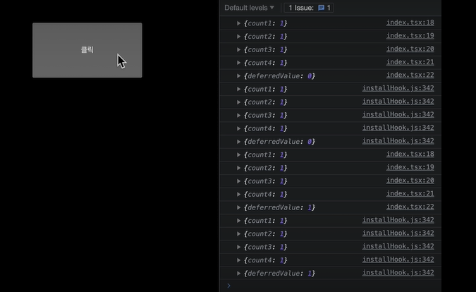
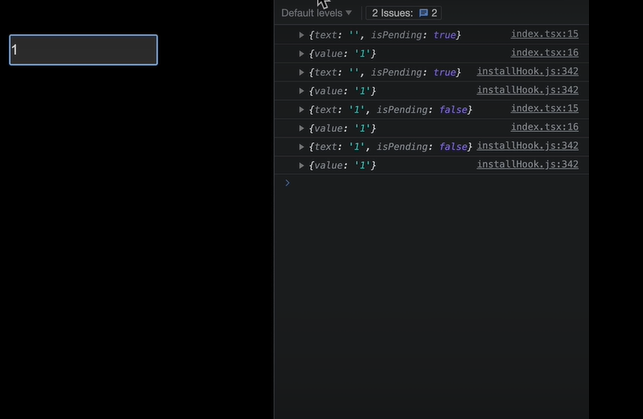
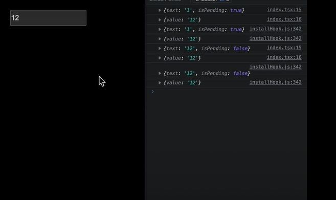

# 개요

서비스에서 무거운 계산을 하는 로직이 실행되면 메인 스레드가 거기서 블록되기 때문에 다음 작업을 처리하지 못하게 됩니다.

극단적으로 무거운 작업을 하게 된다면 다음 입력을 받지 못할 정도로 프레임이 저하되는 현상이 발생할 수도 있습니다. 

이럴 경우 유저와 상호작용이 불가능해지는 상태가 발생하고, 유저에게 좋은 경험을 제공하지 못하게 됩니다.


이 문제를 근본적으로 해결하기 위해서 React 팀에서는 사용자의 상호작용이 있으면 무거운 작업은 메인 스레드가 놀고 있을 때 처리하고, 유저 입력이 들어오면 다시 유저와의 상호작용에 집중하는 방식을 채택했습니다.

 즉 상태 변화의 우선순위를 나누고, 우선순위가 높은 이벤트가 발생하면 그 작업을 먼저 핸들링하고, 이후에 우선순위가 낮은 상태를 핸들링하는 방식입니다. 


 # useDeferredValue

useDeferredValue는 상태 값 변화에 낮은 우선순위를 지정하기 위한 훅입니다.

아래 코드에서 count2의 값을 가장 낮은 우선순위로 상태를 변경하고 싶을 경우에는 useDeferredValue로 count2를 래핑하면 됩니다.

```jsx
import { useDeferredValue, useState } from "react";

export default function Home() {
  const [count1, setCount1] = useState(0);
  const [count2, setCount2] = useState(0);
  const [count3, setCount3] = useState(0);
  const [count4, setCount4] = useState(0);

  const deferredValue = useDeferredValue(count2);

  const onIncrease = () => {
    setCount1(count1 + 1);
    setCount2(count2 + 1);
    setCount3(count3 + 1);
    setCount4(count4 + 1);
  };

  console.log({ count1 });
  console.log({ count2 });
  console.log({ count3 });
  console.log({ count4 });
  console.log({ deferredValue });

  return <button onClick={onIncrease}>클릭</button>;
}

```

`onIncrease 함수`를 실행하게 되면 count2의 값은 바뀌게 되었는데 deferredValue의 값은 다른 상태변화가 다 발생하고 **가장 나중에** 변경되게 됩니다. 




사진을 보면 deferredValue 값은 모든 state 값이 바뀐 뒤 나중에 바뀌는 것을 확인할 수 있습니다. 


# useTransition

useTransition hook도 상태 변화의 우선순위를 지정하기 위한 hook입니다. 

useTransition은 [isPending, startTransition] 값을 반환하는데, isPending은 상태 변화가 지연되고 있음을 알리는 boolean 타입이고, startTransition은 상태 변화를 일으키는 콜백함수를 전달받고 해당 콜백함수는 낮은 우선순위로 실행되게 됩니다.

```jsx
import { useState, useTransition } from "react";

export default function Home() {
  const [text, setText] = useState("");
  const [value, setValue] = useState("");
  const [isPending, startTransition] = useTransition();

  const onChange = (e: React.ChangeEvent<HTMLInputElement>) => {
    startTransition(() => {
      setText(e.target.value);
    });
    setValue(e.target.value);
  };

  console.log({ text, isPending });
  console.log({ value });

  return <input type="text" onChange={onChange} />;
}
```

onChange 함수가 실행되면 setText와 setValue가 실행되면서 상태가 변하게 됩니다.

하지만 setText는 startTransition 함수로 래핑 되어있기에 상태변화의 우선순위가 낮아지고, 다른 상태변화가 전부 일어난 후 setText가 실행되어 text 상태가 변하게 됩니다.





사진을 보면 `isPending` 상태가 `true`일 땐 `text` 상태값이 변하지 않지만 `isPending` 상태가 `false` 로 변하면  `text` 상태값이 변하는 것을 확인할 수 있습니다.

## useDeferredValue vs useTransition

useDeferredValue와 useTransition hook은 상태변화의 우선순위를 낮게 하는 hook입니다. 그렇다면 두 hook의 차이점은 무엇일까요?

useDeferredValue는 **값**을 래핑해서 사용합니다. 아래 예시 코드를 보면 `count2`라는 값을 래핑 해서 count2 값이 바뀌어도 deferredValue는 다른 상태변화가 전부 일어난 후에 바뀌게 됩니다. 

```js
  const deferredValue = useDeferredValue(count2);
```

즉, useDeferredValue는 값을 래핑 해서 값의 변화의 우선순위를 낮춥니다.


useTransition은 useDeferredValue와 다르게 값이 아닌, **함수**를 래핑합니다. 

아래 예시 코드를 보면  `() => { setText(e.target.value) }` 함수를 래핑하고 있습니다. 

래핑 된 함수의 우선순위를 낮춰서 다른 상태 변경이 전부 일어난 후 해당 함수를 실행하게 됩니다.

```jsx
 startTransition(() => {
      setText(e.target.value);
    });
```

마치 useMemo는 값을 메모이제이션하고 useCallback은 함수를 메모이제이션 하는 것과 같이 값이냐 함수냐로 구분하는 것과 비슷한 구조라 보시며 될 것 같습니다.


<br>
<br>
<br>

<details>

<summary>참고문헌</summary>

<div markdown="1">

https://doiler.tistory.com/83

</div>

</details>
