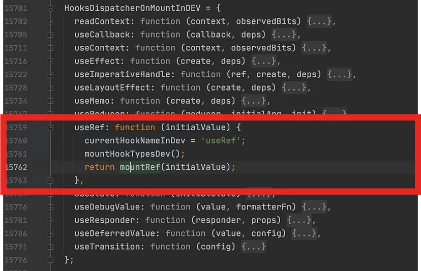

useRef는 리액트 컴포넌트의 불필요한 Re-rendering을 하지 않고 값만 보존하기 위해 사용하는 hook입니다.

리액트 개발 경험이 있다면 한 번쯤은 써보셨을 겁니다.

useRef가 리렌더링을 막아준다는 것은 알겠는데.. 도대체 어떤 원리로 리렌더링을 막아주는 걸까요??

문득 궁금해져서 딥다이브 해보았습니다.

# react-dom 까보기

react 코드의 시작은 ReactDOM.render입니다.

react-dom 내부를 까보면 useRef가 어떤 원리로 동작하는지 알 수 있을 겁니다.

```js
import ReactDOM from "react-dom";
```


node_modules를 뒤적거리다보면

development 환경일 때는 `node_modules/react-dom/cjs/react-dom.development.js` 파일을 사용한다는 것을 알 수 있습니다.

## react-dom.development.js 까보기


react-dom.development.js파일을 열어보니 IIFE로 실행되는 react-dom 코드를 발견할 수 있었습니다.

<br>


react-dom이 IIFE로 실행이 될 때

`React.__SECRET_INTERNALS_DO_NOT_USE_OR_YOU_WILL_BE_FIRED` 라는 친구를

`ReactSharedInternals`라는 IIFE 내에 있는 전역 변수에 할당합니다.

## ReactSharedInternals

그렇다면 ReactSharedInternals는 어디서 온 걸까요??


<small>node_modules/react/cjs/react.development.js 내부</small>

<br>

ReactSharedInternals가 어디에서 왔는지 살펴보니,

\_\_SECRET_INTERNALS_DO_NOT_USE_OR_YOU_WILL_BE_FIRED는

react 내부코드(node_modules/react/cjs/react.development.js )에서 export를 하고 있다는 것을 확인할 수 있었습니다.

<br>

## 중간 정리

즉 react-dom은 component가 mount되거나 update될 때 ReactSharedInternals에 있는 hook 함수를 이용해서 react-dom의 어떤 전역변수에 접근할 수 있게 되고, component가 업데이트되어도 그 어떤 전역변수에서 값을 가져다 씁니다.

계속 들어가봅시다!

<br>
<br>

## renderWithHooks

그럼 그 전역변수는 어디에 있는걸까요??


react-dom에 있는 renderWithHooks 이라는 함수입니다.

render가 일어날 때는 react-dom에서 renderWithHooks 함수가 호출된다는 것을 알 수 있네요.

<br>

빨간 네모 박스를 보면

renderWithHooks 함수에서 처음 component가 mount를 할 때는

ReactCurrentDispatcher.current에 HooksDispatcherOnMountInDEV를 할당해줍니다.

### 그렇다면!! ReactCurrentDispatcher 과 HooksDispatcherOnMountInDEV 는 또 어디서 왔을지 찾아봅시다.

# ReactCurrentDispatcher


ReactCurrentDispatcher의 정체입니다.

ReactSharedInternals 객체의 메서드 ReactCurrentDispatcher를 ReactCurrentDispatcher에 할당해주네요.

## HooksDispatcherOnMountInDEV

\
HooksDispatcherOnMountInDEV의 정체입니다.

HooksDispatcherOnMountInDEV은 hook API를 호출했을 때 작동될 함수들을 모아놓은 곳이군요.

즉, useRef()함수를 호출하면 이 함수들이 호출되는 것이었습니다.

> 여기서 중요한 점은 내부코드에서 사용한 것들은 모두 객체라는 점입니다. <br> 자바스크립트에서 객체는 변수에 할당하면 주소값을 참조합니다. <br> 즉, 객체는 얕은 복사를 하죠?

때문에 react-dom이 react에서 export하고 있는 것을 가져다 쓸 때 **객체의 주소값을 참조**하는 방식을 채택한겁니다.

react-dom에서 해당 객체를 변경하면 react에서도 변경된 객체를 쓰게 됩니다.

 <br>

## 중중간 정리

react-dom코드가 IIFE로 실행될 때 react에서 export하는

\_\_SECRET_INTERNALS_DO_NOT_USE_OR_YOU_WILL_BE_FIRED를 가져와서

ReactSharedInternals 라는 변수에 할당해서 어떠한 행위를 합니다.

그리고 react-dom이 객체에 변경을 하게 되면 react의 객체도 변경됩니다. (얕은 복사)

## mountRef



HooksDispatcherOnMountInDEV 내부 useRef의 메서드에서 반환되는 mountRef 함수입니다. mount할 때 작동하는 함수인 것 같군요.

이 useRef는 mountRef 함수를 호출하고 있으니 이제 mountRef를 보겠습니다.

<br>


**ref**를 return 하고 있네요. 드디어 익숙한 친구가 등장했네요.

우리가 useRef()를 호출하면 return 되는 { current: null }객체입니다.

mountWorkInProgressHook()라는 함수가 리턴하는 값을 hook이라는 변수에 할당하고,

hook.memoizedState에 ref를 할당해주네요.

# mountWorkInProgressHook


mountWorkInProgressHook함수를 살펴보니 workInProgressHook이 null이면 currentlyRenderingFiber$1에 무언가를 할당해줍니다.

hook -> workInProgressHook 할당,

workInProgressHook -> currentlyRenderingFiber$1.memoizedState 할당하는 구조입니다.

# currentlyRenderingFiber$1


마지막으로 currentlyRenderingFiber$1를 찾아보았습니다.

react-dom이 IIFE로 코드가 실행될 때 그 내부에 있는 변수라는 것을 알 수 있습니다.

<br>
<br>

# 최종 정리

- useRef()는 react의 내부 코드에 있는 함수입니다. 이 함수는 react-dom에서 만든 함수입니다.
- useRef() 함수를 이용해서 react-dom의 IIFE로 실행된 코드 내부에 선언된 전역변수에 접근할 수 있습니다.
- useRef()의 경우에는 이 여러 전역변수들 중에서 currentlyRenderingFiber$1.memoizedState 의 값을 사용합니다.
- 전역에 있는 객체의 값을 사용하고 있다보니 전체 라이프사이클이 유지되는 동안 항상 같은 값이 유지됩니다.

<br>
<br>
<br>

<details>

<summary>참고문헌</summary>

<div markdown="1">

https://flyingsquirrel.medium.com/react-%EC%BD%94%EB%93%9C-%EA%B9%8C%EB%B3%B4%EA%B8%B0-useref%EB%8A%94-dom%EC%97%90-%EC%A0%91%EA%B7%BC%ED%95%A0-%EB%95%8C-%EB%BF%90%EB%A7%8C-%EC%95%84%EB%8B%88%EB%9D%BC-%EB%8B%A4%EC%96%91%ED%95%98%EA%B2%8C-%EC%9D%91%EC%9A%A9%ED%95%A0-%EC%88%98-%EC%9E%88%EC%96%B4%EC%9A%94-f0359ad23f3b

</div>

</details>
