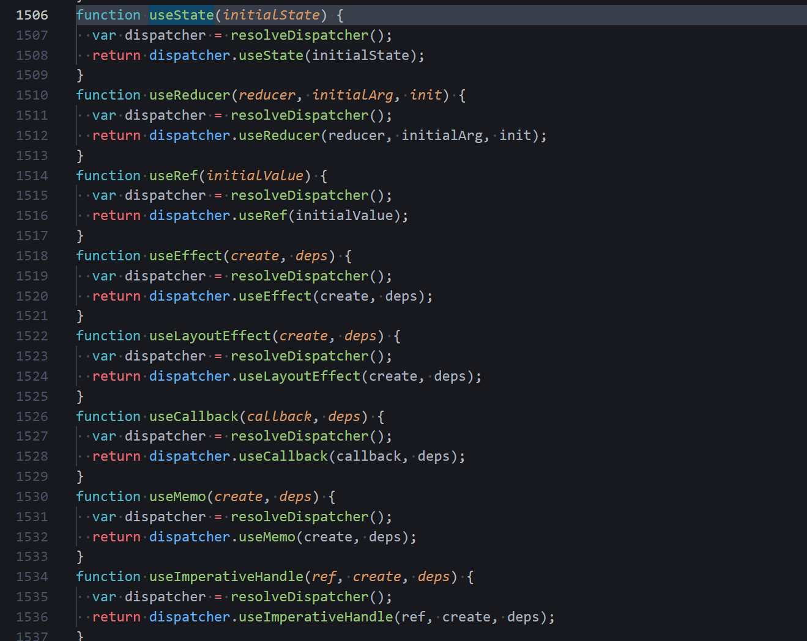

비동기적으로 동작하는 useState의 성질로 인한 State 값 업데이트 이슈를 해결하면서 문득 useState의 동작원리에 대해 궁금해졌습니다.

<BR>

# 함수형 컴포넌트의 상태 관리

클래스형 컴포넌트는 render() 메서드를 통해 상태 변경을 감지할 수 있지만 함수형 컴포넌트는 렌더링이 발생하면 함수 자체가 다시 호출됩니다.

때문에 상태를 관리하려면 함수가 다시 호출되었을 때 **이전 상태를 기억**하고 있어야 합니다.

useState는 이 문제를 **클로저**를 통해 해결합니다.

<br>
<br>

# useState는 어디서 오나?

본격적으로 useState 모듈을 분석해봅시다.

우리는 useState를 사용할 때 import 구문을 사용합니다.

```js
import { useState } from "react";
```

즉 'react'라는 모듈에서 useState를 가져온다는 뜻 입니다. 그럼 react'라는 모듈로 이동해볼까요?



위 사진은 node_modules/react/cjs/react.development.js 내부에 각종 hooks 함수가 선언된 곳입니다.

모든 리액트 훅들이 여기서부터 만들어진다 생각하면 될 것 같습니다.

<br>

## function useState 분석

```js
export function useState(initialState) {
  const dispatcher = resolveDispatcher();
  return dispatcher.useState(initialState);
}
```

리액트 모듈에서 찾아본 useState의 초기 상태입니다.

resolveDispatcher의 리턴 값을 dispatcher에 할당한 뒤 dispatcher의 useState 메서드에 initialState를 인자로 전달해 배열을 반환하는 구조입니다.

이 안에 우리가 사용하는 state와 setState가 있다는 이야기입니다.

<BR>

## resolveDispatcher 함수

```js
function resolveDispatcher() {
  const dispatcher = ReactCurrentDispatcher.current;

  if (__DEV__) {
    if (dispatcher === null) {
      console.error("Some error msg...");
    }
  }

  return ((dispatcher: any): Dispatcher);
}
```

그럼 resolveDispatcher 함수는 어떤 구조인지 알아보겠습니다.

resolveDispatcher 함수는 어디선가 ReactCurrentDispatcher 라는 친구를 가져와 ReactCurrentDispatcher의 current 값을 할당받습니다.

<br>

## ReactCurrentDispatcher 함수

```js
const ReactCurrentDispatcher = {
  /**
   * @internal
   * @type {ReactComponent}
   */
  current: (null: null | Dispatcher),
};
```

그렇다면 ReactCurrentDispatcher는 또 뭘까요?

ReactCurrentDispatcher.current는 **전역**에 선언된 객체의 프로퍼티입니다.

여기서 알 수 있는 것은 useState의 리턴 값의 출처(ReactCurrentDispatcher.current)가 전역에서 온다는 점입니다.

즉 리액트가 실제로 클로저를 활용해 함수 외부의 값에 접근하는 사실을 알 수 있습니다.

<br>

# 정리

- useState를 포함한 hooks는 react 모듈에 선언되어있는 함수입니다.
- 실행 될 때 마다 dispatcher를 선언하고 useState 메소드 실행해서 그 값을 반환합니다.
- dispatcher는 전역 변수 ReactCurrentDispatcher로부터 가져옵니다.

<br>
<br>
<br>

# 그렇다면 setState 함수는 어떻게 상태를 변경시키나?

아주아주 간단하게 작성한 react 모듈 코드를 예로 들겠습니다.

> 실제 react로직은 이렇게 단순하지 않습니다. 실제 react 로직은 딥다이브할 용기가 나지않아 여기까지 하겠습니다.

<br>

```js
// React 모듈

let _value;

export function useState(initialState) {
  if (_value === undefined) {
    _value = initialState;
  }
  const setState = (newState) => {
    _value = newState;
  };
  return [_value, setState];
}
```

아주 기초적인 App 함수 예시코드입니다.

```js
import { useState } from "react";

function App() {
  const [state, setState] = useState(0);

  return (
    <div>
      <p>{state}</p>
      <button onClick={() => setState(1)}>Click</button>
    </div>
  );
}
```

App 컴포넌트 함수는 실행되면 먼저 useState를 호출해서 반환값을 비구조화 할당으로 추출해 변수에 저장합니다.

```js
const [state, setState] = useState(0);
```

여기서 중요한건, **App도 jsx를 반환하는 함수**라는 겁니다. 즉, 렌더링이 시작되면 이 App 함수가 호출되어 새로운 jsx을 반환합니다.

`react 모듈` 코드를 보면, useState 밖에 전역으로 선언된 \_value가 있습니다.

```js
let _value;
```

우리가 useState를 통해 관리하는 'State'는 바로 이 \_value입니다.

즉, setState는 App함수에 선언된 state가 아니라, 자신이 선언된 위치에서 접근할 수 있는 `_value`를 변경합니다! 단지 우리 눈에는 state를 변경하는 것처럼 보이는 것이죠. 내부 로직을 모르니까요. 이때 사용되는 개념이 클로저입니다.

## setState가 state를 변경하는 원리

이제 진짜로 setState가 어떻게 state를 변경하는지 알아보겠습니다.

### 1. 웹이 로딩되고 최초로 App함수가 호출

App은 useState를 호출하고 인수로 0을 전달합니다.

```js
const [state, setState] = useState(0);
```

useState는 실행될 때 마다 초기값을 전달받지만, 아래 로직을 통해 내부적으로 \_value값이 undefined인지 확인해서, 최초의 호출에만 초기값을 \_value에 할당하고, 이후 초기값은 사용되지 않습니다.

```js
if (_value === undefined) {
  _value = initialState;
}
```

이후 \_value와 그 값을 재할당하는 setState 함수를 배열에 담아 반환합니다.

이렇게 반환한 배열을 우리는 구조분해할당 문법을 통해 사용하는 것이죠.

<br>

### 2. setState(1) 호출

전달 받은 값 인자 1을 react 모듈 상단의 \_value에 할당합니다. 이때 컴포넌트 리렌더링을 trigger합니다.

<br>

### 3. setState가 실행되어 리렌더링이 발생

리액트는 리렌더링 과정에서 해당 컴포넌트 함수가 실행되고, 새로운 jsx를 반환합니다.

setState가 리렌더링을 트리거하며 App함수가 두 번째로 실행되었을 때 **다시 인수 0**을 useState에 전달하며 호출합니다.

useState는 내부적으로 \_value값을 확인하고, undefined가 아닌 값이 할당되어 있기 때문에 초기값 할당문을 실행하지 않습니다.
즉 \_value값은 undefined가 아니므로

```js
if (_value === undefined) {
  _value = initialState;
}
```

해당 로직은 실행되지 않고

```js
const setState = (newState) => {
  _value = newState;
};
```

해당 로직이 실행됩니다.

즉 setState 인자로 1이 들어왔으므로 \_value = 1 을 통해 \_value에 1을 할당하고
useState가 현재 시점의 \_value(1)와 setState를 배열 형태로 반환합니다.

마지막으로 두 번째 실행된 App 함수 내부에서 useState가 반환한 값을 비구조화 할당으로 추출해 변수에 할당합니다.

즉, setState 함수는 자신과 함께 반환된 변수를 변경시키는 것이 아닙니다.

```js
const [state, setState] = useState(0);
```

보시는 것처럼 우리는 const 로 변수를 할당합니다. const는 상수이기 때문에 변하지 않죠.

즉 useState는 반환할 **react 모듈의 \_value**를 변경시키고, 컴포넌트를 리렌더링 시킵니다.

그리고 변경된 값은 useState가 가져오는 것이죠.

<br>
<br>

## 결론

정리하자면

- useState는 클로저를 활용해서 값을 업데이트합니다.
- setState는 state를 변경시키는게 것이 아니라 react 모듈 내부의 \_value를 변경시킵니다
- 변경된 \_value는 useState를 통해 가져오고 그것을 우리가 사용하는 것 입니다. \
- setState 호출 이후 로직에서도 state의 값은 이전과 동일합니다.

> 위 예시는 react로직을 아주 단순히 표현했을 뿐, 실제와 많이 다릅니다. <br> useState를 여러번 사용해도 각기 다른 상태 값과 갱신 함수를 사용할 수 있는건 단순히 \_value가 아니라 여러 값을 저장하고 있기 때문입니다. <br> 이에 관해서는 딥다이브하기 무서워서 한 발 물러서겠습니다..

<br>
<br>
<br>

<details>

<summary>참고문헌</summary>

<div markdown="1">

https://seokzin.tistory.com/entry/React-useState%EC%9D%98-%EB%8F%99%EC%9E%91-%EC%9B%90%EB%A6%AC%EC%99%80-%ED%81%B4%EB%A1%9C%EC%A0%80

https://velog.io/@jjunyjjuny/React-useState%EB%8A%94-%EC%96%B4%EB%96%BB%EA%B2%8C-%EB%8F%99%EC%9E%91%ED%95%A0%EA%B9%8C#-%EB%A7%88%EB%AC%B4%EB%A6%AC

</div>

</details>
