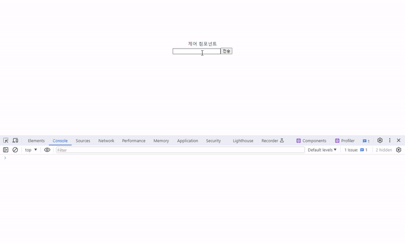
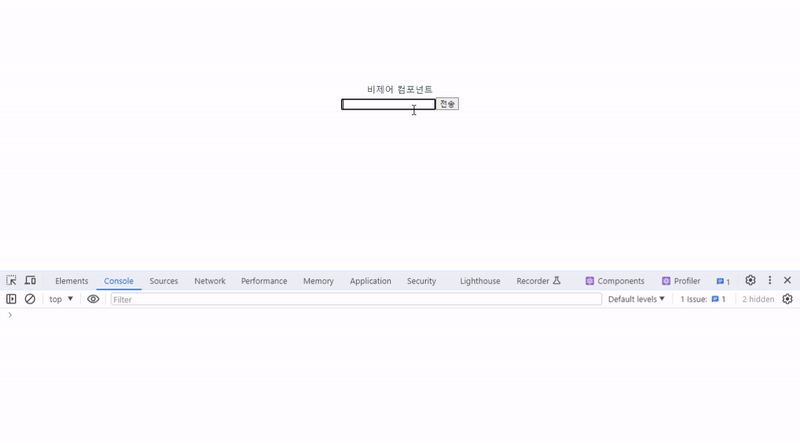

# 제어 컴포넌트 vs 비제어 컴포넌트

form 데이터를 리액트에서 2가지 방식으로 다루고 있습니다.

값이 제어되는 컴포넌트를 제어 컴포넌트, 값이 제어되지 않는 컴포넌트를 비제어 컴포넌트라고 합니다.

그렇다면 값이 제어되는 것은 무엇이고, 제어되지 않는 것은 무엇일까요?

<br>

## 제어 컴포넌트

보통 HTML에서 input, textarea, select와 같은 폼 엘리먼트는 사용자의 입력을 기반으로 state를 관리하고 업데이트합니다.

이때 리액트에서는 입력 값을 setState로 값을 저장하여 관리하는 방식을 제어 컴포넌트라고 합니다.

즉, form 데이터 변경에 따라 컴포넌트도 렌더링되는 것을 의미합니다.


```js
import React, { useState } from 'react';
 
function MyInput() {
  const [inputValue, setInputValue] = useState(null);
 
  const handleChange = (e) => {
    setInputValue(e.target.value);
  };
 
  return <input onChange={(e) => handleChange(e)} value={inputValue} />;
}
```
제어 컴포넌트는 사용자가 입력한 값과 저장되는 값이 실시간으로 동기화됩니다.




<br>
<br>

### 제어 컴포넌트 언제 사용할까

1. 유효성 검사
2. 실시간으로 input 값을 검사해야 하는 경우
3. 조건에 따라 버튼이 활성화 되어야 하는 경우

### 제어 컴포넌트 사용 시 문제점

state로 관리하다보니 입력한 데이터 상태와 저장한 데이터 상태가 항상 일치한다. 즉, 사용자가 입력한 모든 데이터가 동기화됩니다.

모든 데이터가 동기화 된다는 것은 불필요한 값도 갱신이 된다는 것으로 불필요한 렌더링, 이를 통한 자원 낭비의 문제로도 연결 될 수 있습니다.

이를 해결하기 위한 방법으로는 쓰로틀링과 디바운싱을 사용할 수 있습니다.

> 쓰로틀링(throttling)이란, 마지막 함수가 호출된 후 일정 시간이 지나기 전에 다시 호출되지 않도록 하는 방법입니다. <br> 주로 스크롤을 올리거나 내릴 때 사용합니다. ex) 스크롤을 올리거나 내릴 때 스크롤 이벤트가 매우매우 많이 발생합니다. 복잡한 로직이 같이 있다면 스크롤 이벤트와 많이 발생하면서 렉이 발생할 수 있는데, 쓰로틀링을 사용하면 몇 초에 한 번, 또는 몇 밀리초에 한 번씩 실행하도록 제한두는 방식입니다. <br> 디바운싱(debouncing)이란, 연이어 호출되는 함수들 중 마지막 함수 또는 맨 처음 함수만 호출되도록 하는 방법입니다. <br> 주로 검색 api 호출할 때 사용합니다. ex) ㅇ,아,안,안ㄴ,안녀,안녕 '안녕'이라고 검색하면 6번의 호출을 하게 되므로 디바운스를 사용하면 마지막 '안녕'을 다 쳤을 때 요청하게됩니다.


<br>
<br>


## 비제어 컴포넌트

비제어 컴포넌트는 기존의 바닐라 자바스크립트처럼 폼을 제출할 때 값을 얻어오는 방식과 유사합니다.

즉, 비제어 컴포넌트는 setState를 쓰지 않고 ref를 통해 DOM 요소에 접근하여 값을 얻습니다.

state로 관리하는 것이 아닌 DOM API를 통해서 관리하는 것입니다.

<br>

```js
import React, { useRef } from 'react';
 
function App() {
  return <MyInput />;
}
 
function MyInput() {
  const inputNode = useRef(null);
 
  return <input ref={inputNode} />;
}
 
export default MyInput;
```
비제어 컴포넌트는 state로 값을 관리하지 않기 때문에 값이 업데이트 될 때마다 리렌더링이 되지 않으므로 성능상의 이점이 있습니다.



<br>
<br>

### 비교 결과

|기능|비제어 컴포넌트|제어 컴포넌트|
|--|--|--|
|<center>일회성 정보 검색 (예: 제출)</center>|<center>O</center>|<center>O</center>|
|<center>제출할 때 값 검증</center>|<center>O</center>|<center>O</center>|
|<center>실시간으로 필드 값의 유효성 검사</center>|<center>X</center>|<center>O</center>|
|<center>조건부로 제출 버튼 비활성화</center>|<center>X</center>|<center>O</center>|
|<center>실시간으로 입력 형식 적용하기 (예: 숫자만 가능하게)</center>|<center>X</center>|<center>O</center>|
|<center>하나의 데이터에 대한 여러 입력</center>|<center>X</center>|<center>O</center>|
|<center>동적 입력</center>|<center>X</center>|<center>O</center>|

<BR>

> 실시간으로 값에 대한 피드백 => 제어 컴포넌트 사용 <BR> 즉각적인 피드백 불필요, 제출 시에만 값이 필요, 불필요한 렌더링 제거로 성능 향상 => 비제어 컴포넌트 사용 <BR> 이러한 form을 최적화하여 사용할 수 있도록 제공하는 React-Hook-Form이 있습니다.

상황에 맞게 판단하여 사용하는 것이 가장 바람직하다 볼 수 있습니다.


<BR>
<BR>
<BR>


<details>

<summary>참고문헌</summary>

<div markdown="1">

https://react.dev/learn/sharing-state-between-components#controlled-and-uncontrolled-components

</div>

</details>
