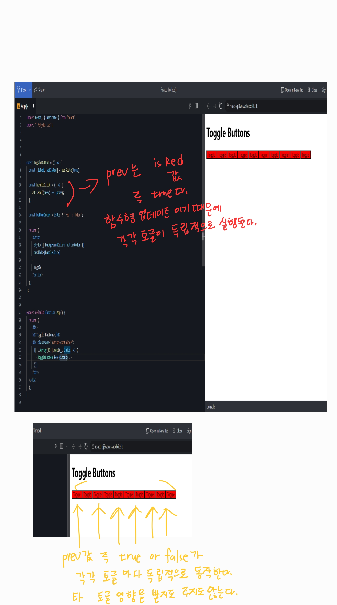

리액트 state함수를 동기적으로 사용할 수 있게 해준다. 그리고 변경된 값을 기억한다. 

```jsx
export default function App() {
  const [value, setValue] =  useState(0)

  const onClick = () => {
    setValue(prev1 => prev1+1)  //1번함수
    setValue(prev2 => prev2+1)  //2번함수
    setValue(prev3 => prev3+1)  //3번함수
  }

  
  return (
    <div className="App">
      <button onClick={onClick}>+</button>
      <h1>{value}</h1>
    </div>
  );
}
```

클릭시

1번함수가 실행된다. 여기서 prev1은 value값을 말한다. +1 했으므로 prev1 은 1이 되고 이 값은 저장된다. 

이 상태에서 2번 함수가 실행된다. 즉 1번함수가 완료된 이후 2번함수가 실행된다. state함수의 비동기성 이슈를 해결하는 모습이다. 

2번함수의 prev2는 value값 1 이다. 1+1하므로 2가 된다. 이건 prev2 이고 이 값은 value값으로 업데이트 된다.

3번함수도 똑같이 진행되고 최종적으로 3이 출력된다. 

위 state함수들은 함수형 프로그래밍이므로 prev를 통일하든 위 코드처럼 prev1,2,3 으로 다르게 쓰든 똑같이 동작한다. 독립적인 함수이기 때문에. 

