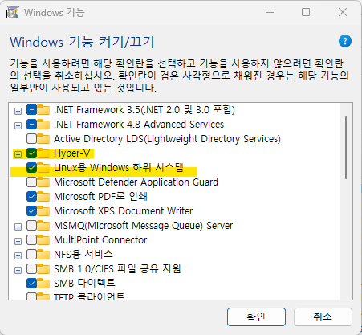

window 11 환경에 ubuntu를 설치해도보록 하겠습니다. 

설치하기 전 간단하게 WSL과 ubuntu 개념을 짚고 가겠습니다.

# WSL란

window subsystem for linux의 약자로 윈도우에서 리눅스 운영체제를 설치해 활용할 수 있게 해주는 소프트웨어입니다.


Mac OS, Linux는 모두 UNIX 기반 OS입니다. 

UNIX는 개발환경에 특화되어있는 OS입니다. 많은 개발자들이 맥북을 구매하고 앱등이가 되어버리는 이유 중 하나죠.

하지만 window는 UNIX 기반이 아니기때문에 개발자의 골머리를 썩히는 일이 종종 일어납니다. 때문에 window 사용하는 개발자들이 핍박받는 일도 있었죠.

이러한 window를 향한 박해와 조롱을 극복하기 위해 나온 것이 wsl입니다. 

Windows와 Linux를 통합하는 가상 환경을 띄워 윈도우에서 리눅스 운영체제를 사용하게 해줌으로써 window가 가지고 있던 고질적인 DX 이슈를 해결해주는 아주 착한 녀석입니다.


# ubuntu

그렇다면 ubuntu는 뭘까요??

Ubuntu는 Linux 배포판 중 하나입니다. Linux는 unix 기반 오픈소스이다보니 수정, 배포가 자유롭습니다. 때문에 Red Hat, Debian, Mendriva 등등 다양한 Linux 배포판 존재하는데요. 그 중 하나라고 보시면 됩니다. 

대부분의 리눅스 배포판들이 서버용으로 사용되고 있는 것에 반해, 우분투는 개인 사용자와 데스크탑 환경에 최적화되도록 사용자 편의를 중점으로 개발된 것이 특징입니다.

간단하게 Linux 개인최적화 튜닝버전이라 생각하시면 될 것 같네요.


# 설치

이제 본격적으로 제 노트북에 wsl, ubuntu를 설치해봅시다.

## 목적

상술한대로 window 환경에서 사용할 수 없던 linux 운영체제를 사용하기 위해 wsl이라는 친구를 설치하고 linux 배포판 중 하나인 ubuntu를 사용하는 것이 해당 과정의 목적입니다. 

## 1. wsl 설치 환경 세팅

기본적으로 wsl을 설치하기 위해선 윈도우 10 이상의 운영체제를 가지고 있어야하고 Hyper-V 가상화 지원 가능한 PC여야 합니다

위 조건이 충족된다면

아래와 같이 제어판 -> 프로그램 및 기능 -> Windows 기능 켜기/끄기 접속 -> Hyper-V는 폴더, Linux용 Windows 하위 시스템를 클릭해 주시고 "확인"을 눌러줍니다. 




그리고 아래명령어를 실행하면...

```shell
 wsl --install
```

<br>

네 역시 에러가 뜹니다. 

```shell

wsl: WSL 설치가 손상된 것 같습니다(오류 코드: Wsl/CallMsi/Install/REGDB_E_CLASSNOTREG).
아무 키나 눌러 WSL을 복구하거나 CTRL-C 취소하세요.
이 프롬프트는 60초 후 시간이 초과됩니다.
```

<br>

빠르게 gpt 한테 물어봅니다. 

powershell에서 아래 명령어를 실행하라는군요.

```powershell
dism.exe /online /enable-feature /featurename:Microsoft-Windows-Subsystem-Linux /all /norestart
```

이 명령어는 WSL설치하는 명령어라고 합니다. wsl가 설치안되어있었으니 wsl 명령어를 알아먹을리가 없죠.


<details>

<summary>명령어 각 부분의 자세한 설명은 여기를 참고하세요.</summary>

<div markdown="1">

- dism.exe: Deployment Image Servicing and Management의 약자로, Windows 운영 체제의 이미지를 관리하고 서비스하는 도구입니다.

- /online: 현재 실행 중인 운영 체제를 대상으로 작업을 수행한다는 의미입니다.

- /enable-feature: Windows 기능을 활성화하겠다는 명령입니다.

- /featurename:Microsoft-Windows-Subsystem-Linux: 활성화할 기능의 이름이 "Microsoft-Windows-Subsystem-Linux"라는 의미입니다. 이것이 바로 WSL(Windows Subsystem for Linux)입니다.

- /all: 선택한 기능과 관련된 모든 상위 기능들도 함께 활성화한다는 의미입니다.

- /norestart: 설치 후 자동으로 재부팅하지 않도록 하는 옵션입니다.


</div>

</details>

<br>

wsl 설치 후 wsl -intall 하니 정상적으로 설치가 진행됩니다.

```
 wsl --install
다운로드 중: Ubuntu
설치 중: Ubuntu
배포가 설치되었습니다. 'wsl.exe -d Ubuntu'을 통해 시작할 수 있습니다.
```

## 2. ubuntu 세팅

ubuntu 터미널창이 열리는 걸 확인할 수 있습니다. 


이제 사용할 ubuntu 계정을 만들면 됩니다. 


## 3. IDE 적용

제가 사용하는 IDE 커서에 잘 적용됐는지 확인해볼까요


잘 적용됐네요. 


참고로 ubuntu-24.04는 현재 우분투의 최신버전입니다. 버전은 각자 취향, 개발환경에 맞게 다운로드 받으시면 됩니다. microsoft store에서 다운로드 가능합니다. 


<br>
<br>
<br>

<details>

<summary>참고문헌</summary>

<div markdown="1">

https://hgk5722.tistory.com/486#LINUX%EC%-A%A-%--Windows%--%ED%--%--%EC%-C%--%--%EC%-B%-C%EC%-A%A-%ED%--%-C%--%EC%--%A-%EC%A-%--%ED%--%--%EA%B-%B-

</div>

</details>