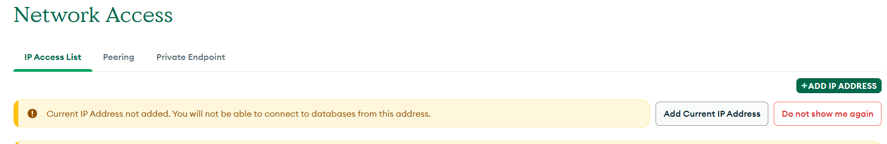
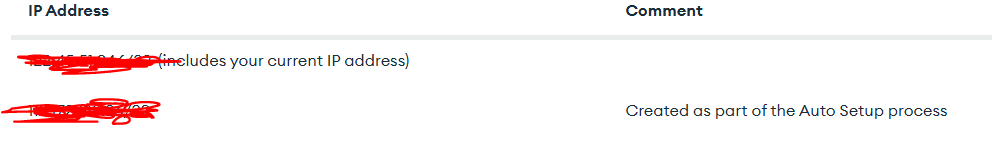
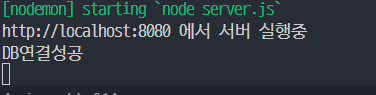

코딩애플 mongoDB 강의를 들으며 node 공부하던 중

node 서버를 실행시키니 느닷없이 에러가 났습니다.

```shell

http://localhost:8080 에서 서버 실행중
[nodemon] restarting due to changes...
[nodemon] starting `node server.js`
(node:11468) [MONGODB DRIVER] Warning: useNewUrlParser is a deprecated option: useNewUrlParser has no effect since Node.js Driver version 4.0.0 and will be removed in the next major version
(Use `node --trace-warnings ...` to show where the warning was created)
(node:11468) [MONGODB DRIVER] Warning: useUnifiedTopology is a deprecated option: useUnifiedTopology has no effect since Node.js Driver version 4.0.0 and will be removed in the next major versionhttp://localhost:8080 에서 서버 실행
중
MongoServerSelectionError: BC3B0000:error:0A000438:SSL routines:ssl3_read_bytes:tlsv1 alert internal error:c:\ws\deps\openssl\openssl\ssl\record\rec_layer_s3.c:1605:SSL alert number 80

    at Topology.selectServer (C:\Users\dogmn\develop\코딩애플\forum\node_modules\mongodb\lib\sdam\topology.js:321:38)
    at async Topology._connect (C:\Users\dogmn\develop\코딩애플\forum\node_modules\mongodb\lib\sdam\topology.js:200:28)
    at async Topology.connect (C:\Users\dogmn\develop\코딩애플\forum\node_modules\mongodb\lib\sdam\topology.js:152:13)
    at async topologyConnect (C:\Users\dogmn\develop\코딩애플\forum\node_modules\mongodb\lib\mongo_client.js:233:17)
    at async MongoClient._connect (C:\Users\dogmn\develop\코딩애플\forum\node_modules\mongodb\lib\mongo_client.js:246:13)
    at async MongoClient.connect (C:\Users\dogmn\develop\코딩애플\forum\node_modules\mongodb\lib\mongo_client.js:171:13) {
  errorLabelSet: Set(0) {},
  reason: TopologyDescription {
    type: 'ReplicaSetNoPrimary',
    servers: Map(3) {
      'cluster0-shard-00-00.hvyom.mongodb.net:27017' => [ServerDescription],
      'cluster0-shard-00-01.hvyom.mongodb.net:27017' => [ServerDescription],
      'cluster0-shard-00-02.hvyom.mongodb.net:27017' => [ServerDescription]
    },
    stale: false,
    compatible: true,
    heartbeatFrequencyMS: 10000,
    localThresholdMS: 15,
    setName: 'atlas-ezk1bk-shard-0',
    maxElectionId: null,
    maxSetVersion: null,
    commonWireVersion: 0,
    logicalSessionTimeoutMinutes: null
  },
  code: undefined,
  [cause]: MongoNetworkError: BC3B0000:error:0A000438:SSL routines:ssl3_read_bytes:tlsv1 alert internal error:c:\ws\deps\openssl\openssl\ssl\record\rec_layer_s3.c:1605:SSL alert number 80

      at TLSSocket.<anonymous> (C:\Users\dogmn\develop\코딩애플\forum\node_modules\mongodb\lib\cmap\connect.js:285:44)
      at Object.onceWrapper (node:events:628:26)
      at TLSSocket.emit (node:events:513:28)
      at emitErrorNT (node:internal/streams/destroy:151:8)
      at emitErrorCloseNT (node:internal/streams/destroy:116:3)
      at process.processTicksAndRejections (node:internal/process/task_queues:82:21) {
    errorLabelSet: Set(1) { 'ResetPool' },
    beforeHandshake: false,
    [cause]: [Error: BC3B0000:error:0A000438:SSL routines:ssl3_read_bytes:tlsv1 alert internal error:c:\ws\deps\openssl\openssl\ssl\record\rec_layer_s3.c:1605:SSL alert number 80
    ] {
      library: 'SSL routines',
      reason: 'tlsv1 alert internal error',
      code: 'ERR_SSL_TLSV1_ALERT_INTERNAL_ERROR'
    }
  }
}

```

흠 뭘까요... 일단 db에 연결이 안된 것 같으니 확인해봅시다.

```js
console.log("DB 상태:", db); // 추가해서 확인

//DB 상태: undefined
```

맙소사... db를 찾을 수 없다는군요. 어제까지만해도 잘되던 친구가 왜 갑자기 db를 못찾는다고 징징거릴까요.

# 범인은 IP

구글링 결과

핵심은 여기였습니다.

```shell
MongoServerSelectionError: 8085020601000000:error:0A000438:SSL
routines:ssl3_read_bytes:tlsv1 alert internal
error:ssl/record/rec_layer_s3.c:861:SSL alert number 80
```

잘 되던 MongoDB 통신이 시작하자마자 터진다거나 && SSL 에러 메세지가 보인다면

내가 새로운 곳에서 개발하고 있지는 않는지 생각해보라는군요.

## mongoDB IP 확인

몽고DB > Network Access 탭을 들어가보면



새로운 ip가 발견되었다고 친절하게 설명해줍니다.



추가해줍시다.



연결성공!!

<br>
<br>
<br>

<details>

<summary>참고문헌</summary>

<div markdown="1">

https://velog.io/@tjdgus0528/MongoDB-MongoServerSelectionError

https://codingapple.com/forums/topic/%EB%AA%BD%EA%B3%A0%EB%94%94%EB%B9%84-%EA%B0%91%EC%9E%90%EA%B8%B0-%EC%97%90%EB%9F%AC-%EB%9C%A8%EB%A9%B4%EC%84%9C-%EC%97%B0%EA%B2%B0-%EC%95%88%EB%90%A8/

</div>

</details>
