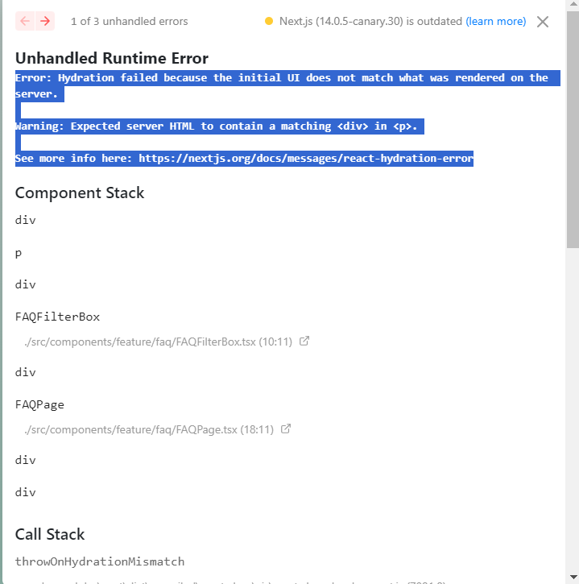
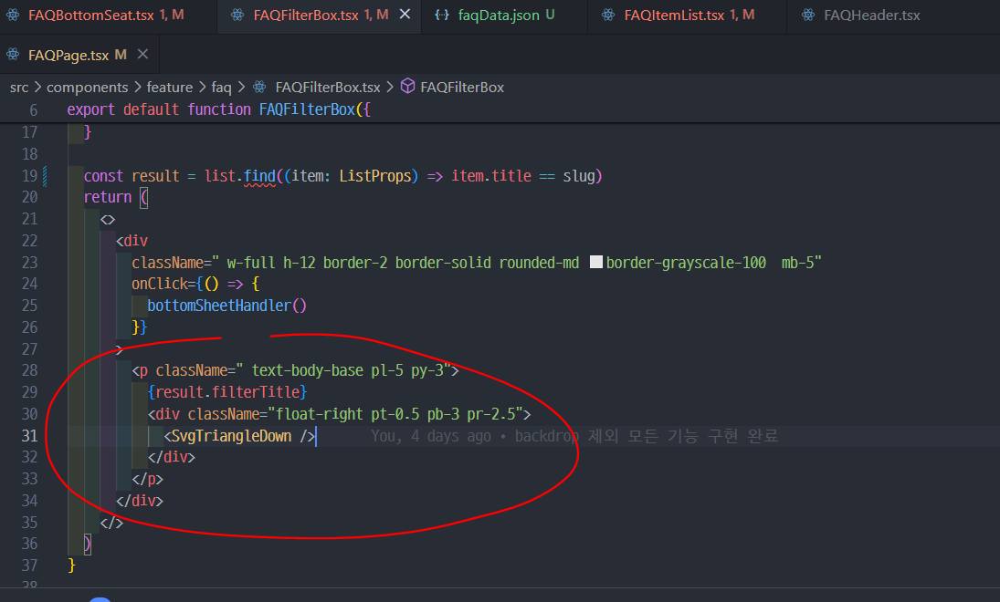

Error: Hydration failed because the initial UI does not match what was rendered on the server.

Warning: Expected server HTML to contain a matching

See more info here: https://nextjs.org/docs/messages/react-hydration-error**

**Error: There was an error while hydrating. Because the error happened outside of a Suspense boundary, the entire root will switch to client rendering.**

다음과 같은 에러가 떴다. 이유가 뭘까

[velog](https://velog.io/@juurom/TIL-react-hydration-error-원인-및-해결방법-feat.-react-calendar)

위 링크에서 아주 자세히 설명해준다.

결론적으로 원인은



p태그 안에 div태그가 배치된 것이 문제였다,

```tsx
<div className=" text-body-base pl-5 py-3">
  {result.filterTitle}
  <div className="float-right pt-0.5 pb-3 pr-2.5">
    <SvgTriangleDown />
  </div>
</div>
```

위 코드처럼 p태그를 div태그로 변환하니 에러가 사라졌다!!
