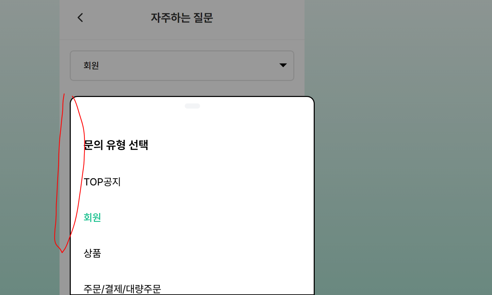
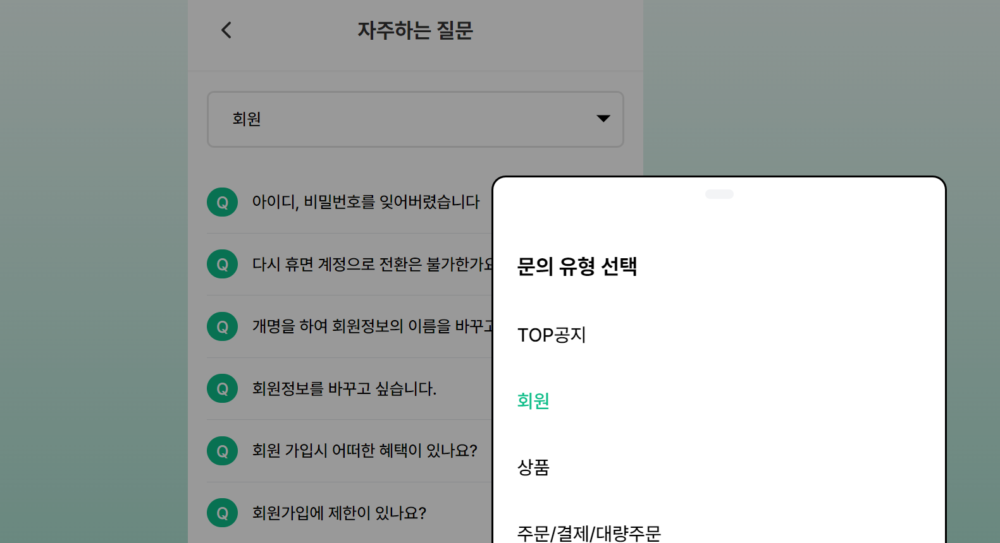
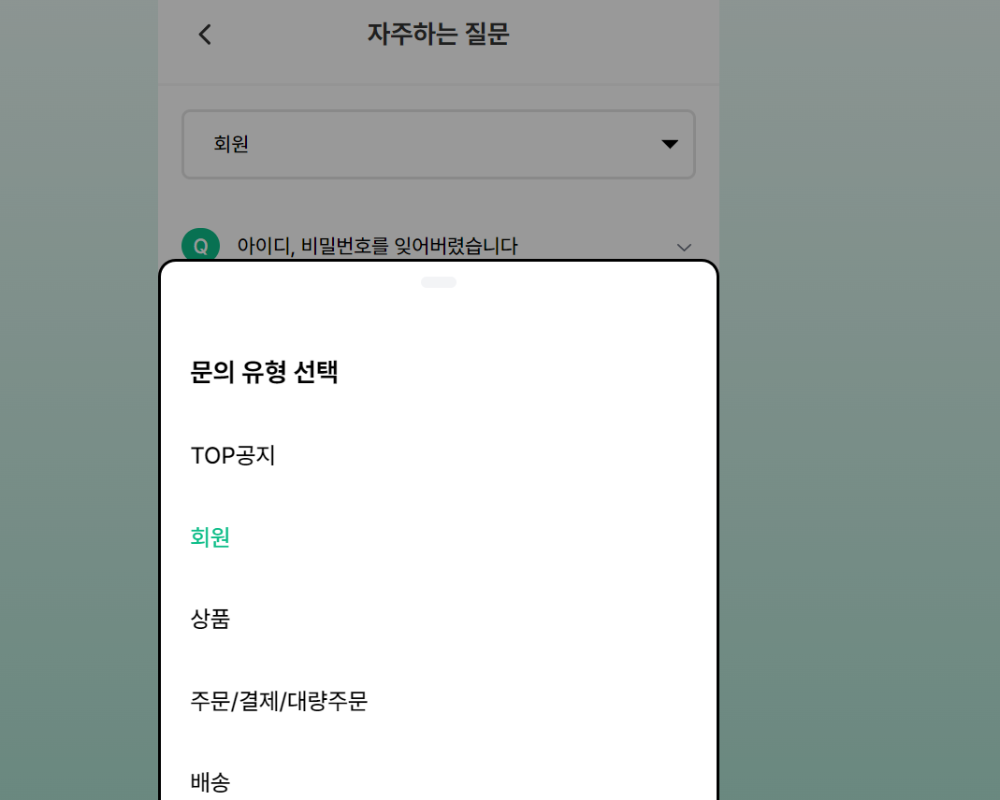

```jsx
//page.tsx
'use client'

import { useParams } from 'next/navigation'
import React from 'react'

import FAQPage from '@/components/feature/faq/FAQPage'

export default function page() {
  const params = useParams<{ FAQId: string, tag: string; item: string }>()
  const { FAQId } = params

  return (
    <div className="h-full w-full p-4">
     //p-4 때문에  바텀스트가 가운데 정렬이 안됨
      <div className=" text-title-lg">
        <FAQPage FAQId={FAQId} />
      </div>
    </div>
  )
}

```

page 컴포넌트 p-4 속성 때문에 가운데 정렬을 시도하면



p-4만큼 공백이 생겨버렸다.

```jsx

//바텀시트 div박스

<div className="fixed bottom-0 z-30 h-2/3 w-96 **justify-center** rounded-t-xl border-2 border-solid border-black bg-white">
```

그래서 어거지로 위치를 조정하니

```jsx

//바텀시트 div박스

<div className="fixed left-[576px] bottom-0 w-96 h-2/3 border-solid border-black border-2 bg-white rounded-t-xl z-30">
```



브라우저 크기를 조절하면 엇나가버리는 참사가 발생했다.

해결방법은 생각의외로 간단했다.

```jsx
//바텀시트 div박스

<div className="**fixed mx-auto left-0 right-0** bottom-0 w-96 h-2/3 border-solid border-black border-2 bg-white rounded-t-xl z-30">
```

fixed 하고 가운데 고정시키려면 **`fixed mx-auto left-0 right-0**` 이렇게 주면 된다더라.



성공!!
