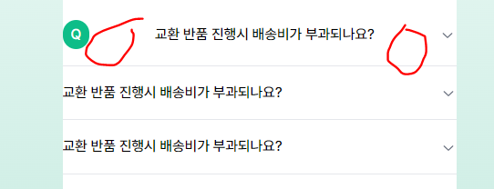

이런 UI를 만들어야하는데



이렇게 여백이 너무 많이 나와버렸다.


위 사진을 보면 저 여백은 padding 영역이 아니라는 것을 알 수 있다.


저 여백까지 포함한 영역이 content 영역이다.

즉 tailwind css 만으로는 저 여백을 지울 수 없다.

컴포넌트 자체를 custom해야한다는 소리인데,,, 어떻게 해결해야할까..

생각의외로 간단하게 해결했다.

```js
<Accordion type="single" collapsible className="w-full" key={idx}>
  <AccordionItem value="item-1">
    <AccordionTrigger className=" text-body-base">
      <div>
        **
        <span className="py-1 px-2  bg-brand-primary-500 rounded-3xl text-body-base text-white">
          Q
        </span>
        <span className="pl-3">{item.Question}</span>
      </div>
      **
    </AccordionTrigger>
    <AccordionContent className="text-body-base">
      <div className="pl-10">{item.Answer}</div>
    </AccordionContent>
  </AccordionItem>
</Accordion>
```

그냥 아코디언 컴포넌트 내부에 span태그를 2개 넣으면 된다. 이렇게 쉽다니…

깔끔하게 해결됐다.

아 물론 따로 padding 작업을 한 것이다.
