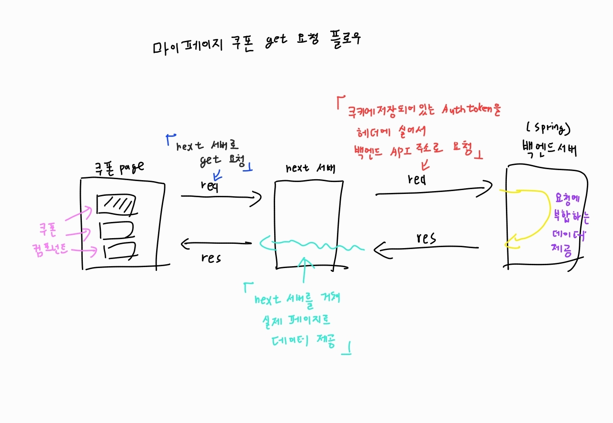

# 구현기능

1. 마이페이지 쿠폰 접속하면 유저가 보유하고 있는 쿠폰 리스트업

# 구현방법



```jsx

//cpuponbox.tsx 컴포넌트

'use client'

import React, { useEffect, useState } from 'react'

import { fetchCouponList } from '@/api/resource/coupon'
import { useModalState } from '@/components/provider/modalProvider'

export default function CouponBox() {
  const [couponList, setCouponList] = useState([])

  const state = useModalState()

  useEffect(() => {
    async function getCouponList() {
      const res = await fetchCouponList()
      //fetchCouponList()  api/resource/coupon 에서 import 해오기
      setCouponList(res.data)
    }
    getCouponList()
  }, [state])

  console.log('쿠폰리스트', couponList)

  return (
    <>
      <div className="mb-5 h-40 w-full rounded-md border-2 border-solid border-grayscale-100 p-5">
        <p className=" text-body-2xl">10,000원 할인</p>
        <p className="text-body-md">10,000원 할인 쿠폰</p>
        <div className="  mb-4 text-gray-400">
          <p>20,000원 이상 주문 시</p>
          <p>일부 상품 제외</p>
        </div>
        <p className="text-purple-800">2024년 4월 24일 24시까지</p>
      </div>
    </>
  )
}

```

```jsx

//api/resouce/coupon.tsx
//쿠폰 호출 관련 함수 저장소
//feature나 렌더링page에서 수행할 함수를 정의한 곳

import { basePath, commonHeader } from '@/api/util/instance'

export async function fetchCouponList() {
  console.log('fetchCouponList')
  const res = await fetch(`${basePath}/api/mycoupon`, {
    method: 'GET',
    headers: commonHeader,
  })

  if (!res.ok) {
    throw new Error('Failed!!!!!!!')
  }
  const response = await res.json()
  console.log('응답은', response)
  return response
}

```

```jsx

//api/mycoupon/route.tsx
//next서버 역할하는 라우트 파일
//로그인하면 쿠키에 저장되는 authToken을 가져오는 곳
//백엔드 서버에 실제 요청을 이행하는 곳 

import { cookies } from 'next/headers'
import { NextRequest, NextResponse } from 'next/server'

import { baseURL } from '@/api/util/instance'

export async function GET(req: NextRequest) {
  const authToken = cookies().get('AUTH_TOKEN')?.value
  const hasCookies = cookies().has('AUTH_TOKEN')
  try {
    const requestHeaders = new Headers(req.headers)
    // console.log('cookie', cookies().getAll())
    if (hasCookies) {
      requestHeaders.set('Authorization', `Bearer ${authToken}`)
    }
    console.log('쿠폰 목록 !! Authorization', requestHeaders)

    const res = await fetch(`${baseURL}/items/getcouponList`, {
      method: 'GET',
      headers: requestHeaders,
      // headers: commonHeader,
    })
    const response = await res.json()
    return NextResponse.json(response)

    // return res
  } catch (error) {
    console.log('couponList에러', error)
    return NextResponse.json({ msg: 'error' })
  }
}

```