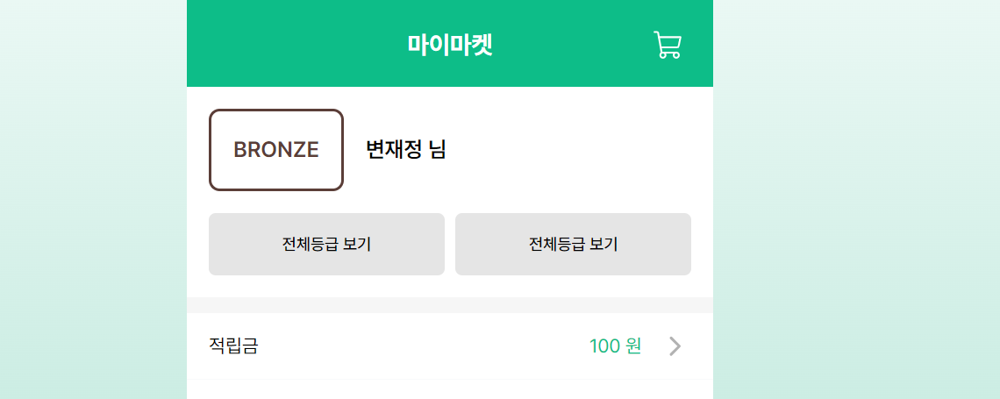

```jsx

//로그인 후 mypage의 page.tsx

import React from 'react'

import { memberType } from '@/app/(main)/(myPage)/myPage/page'
import { Button } from '@/components/ui/button'

export default function LoggedInProfile({ member }: { member: memberType }) {

  return (
    <div>
      <div className="flex items-center gap-4 ">
        <div
          className={`border-tier-color-${member.memberGrade} text-tier-color-${member.memberGrade} rounded-lg border-2 p-4 text-title-md`}
        >
								{/* 멤버 등급별로 색상 구분을 줬다.   */}
          {member.memberGrade}
        </div>
        <span className="text-title-md">{member?.memberName} 님</span>
      </div>
      <div className="mt-4 flex justify-around gap-2 text-center text-button-sm">
        <Button variant={'gray'} size={'lg'}>
          전체등급 보기
        </Button>
        <Button variant={'gray'} size={'lg'}>
          전체등급 보기
        </Button>{' '}
      </div>
    </div>
  )
}

```

```jsx

//tailwind.config.ts

'tier-color': {
          BRONZE: '#5B3E38',
          SILVER: '#4D5B66',
          GOLD: '#C1AE7B',
          PLATINUM: '#BBE8E7',
          DIAMOND: '#146994',
        },

//멤버등급별 색상 클래스 값을 추가해줬다.
```



색상 적용 완료!
