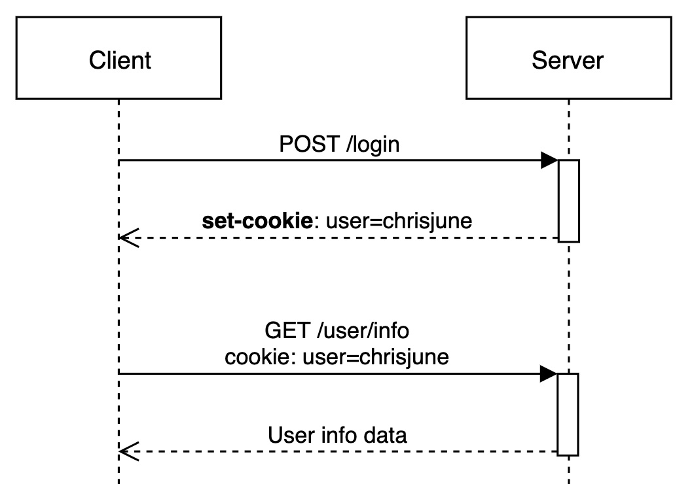

# Web Storage

- HTML5부터 제공하는 기능으로, 특정 데이터를 서버가 아닌 클라이언트 웹브라우저 저장할수 있도록 제공하는 기능이다.
- Web Storage의 종류로는 LocalStorage와 SessionStorage 가 있다.
- Cookie와 비슷한 기능이며, Web Storage는 key/value 쌍으로 데이터를 저장하고, key를 기반으로 데이터를 조회한다.
- 영구저장소(LocalStorage)와 임시저장소(SessionStorage)를 따로 두어 데이터의 지속성을 구분할 수 있어 응용 환경에 맞는 선택이 가능하다.
- Web Storage는 쿠키와 마찬가지로 사이트의 도메인 단위로 접근이 제한된다. 예를 들면, A도메인에서 저장한 데이터는 B도메인에서 조회할 수 없다. 이는 데이터의 보안 측면에서 당연하다.
- 몇 가지 쿠키의 단점을 극복하는 개선점이 도입되었다. 하지만 쿠키를 배제한다는 의미는 아니다. HTML5 에서도 여전히 쿠키를 이용 가능하다.

## Web Storage의 특징

- 저장된 데이터가 클라이언트에 존재할 뿐 서버로 전송은 이루어지지않으므로 서버 전송이 없다. 이는 네트워크 트래픽 비용을 줄여준다. → 더 많은 정보를 저장할 수 있다.
- 문자열 뿐만 아니라 객체정보를 저장할 수 있다. 문자열 기반 데이터 이외에 구조화된 객체를 저장할 수 있다. 단, 객체정보를 저장할 때 문자열 형식으로 저장된다.
- 용량의 제한이 없다.
- 만료 기간의 설정이 없어서 한번 저장한 데이터는 영구적으로 저장이 가능하다.
- 개발자는 브라우저 내 웹 스토리지 구성 방식을 설정할 수 있다

## Web Storage의 종류

Web Storage는 데이터의 지속성과 관련하여 두가지 용도의 저장소를 제공한다.

### 1. **LocalStorage**

- 사용자가 데이터를 지우지 않는 이상, 브라우저나 OS를 종료해도 계속 브라우저에 남아있음 (영구성) 단, 동일한 브라우저를 사용할 때만 해당
- 지속적으로 필요한 데이터 저장(자동 로그인 등)
- key/value 의 pair로 데이터를 저장한다.
- Javascript/HTML 을 통해서만 데이터에 접근 가능하다.
  ```jsx
  localStorage.setItem("데이터이름", "데이터");
  localStorage.getItem("데이터이름");
  localStorage.removeItem("데이터이름");
  ```
- 만료기간이 없기 때문에 직접 지울때까지 남아있다.
- 5MB의 저장 공간을 가진다.
- Local Storage의 데이터는 api 호출에 담을 수 없어 서버에 전송이 불가능하다. (= client 에서만 저장 데이터 조회 가능)
- string data(문자열)로만 저장이 가능하다. 따라서 객체나 배열등의 데이터를 용이하게 사용하려면 직렬화(String화) 가 필요하다.
- **오리진(Origin)**(도메인,프로토콜,포트) 단위로 접근이 제한되는 특성 덕분에 **CSRF로 부터 안전**
- XSS로부터 위험 - local storage에 접근하는 Js 코드로 쉽게 접근 가능

### 2. **SessionStorage**

- 데이터가 오리진 뿐만 아니라 브라우저 탭에도 종속되기 때문에, 윈도우나 브라우저 탭을 닫을 경우 제거됨 → 세션 스토리지는 각 세션마다 데이터가 개별적으로 저장되기 때문에 데이터의 세션이 끝나면 데이터가 지워진다.
- 예를 들어, 브라우저에서 여러개의 탭을 실행하면 탭마다 개별적으로 데이터가 저장되는 것이다.
- 같은 도메인이라도 세션이 다르면 데이터에 접근할 수 없다.
- 일시적으로 필요한 휘발성 데이터 저장(일회성 로그인 정보, 입력폼 저장 등)
- Session Storage의 데이터는 api 호출에 담을 수 없어 서버에 전송이 불가능하다. (= client 에서만 저장 데이터 조회가능)
- 5-10 MB의 저장 공간을 가진다.
- 서로 다른 세션 스토리지는 서로 영향을 주지 않으며 독립적으로 동작한다.

# Cookie

- 클라이언트(브라우저)에 저장되는 키와 같이 들어있는 작은 파일이다.
- 클라이언트의 상태 정보를 로컬에 저장했다가 참조한다.
- 클라이언트에 300개까지 쿠키저장 가능, 하나의 도메인당 20개의 값만 가질 수 있으며, 하나의 쿠키값은 4KB까지 저장이 가능하다.
- Response Header에 Set-Cookie 속성을 사용하면 클라이언트에 쿠키를 만들 수 있다.
- 쿠키는 사용자가 따로 요청하지 않아도 브라우저가 Request 시에 Request Header를 넣어서 자동으로 **서버**에 전송한다.
- 옵션을 지정하여 보낼 수 있는데, 자주 쓰이는 옵션들은 아래와 같다.
  `Expires` : 쿠키 만료 날짜를 알려줄 수 있다.
  `Max-Age` : 쿠키 수명을 알려줄 수 있다. 이 옵션이 있을 경우 Expires이 무시된다.
  `HttpOnly` : 자바스크립트에서 쿠키에 접근할 수 없도록 한다. XSS를 막기위해 set-cookie에 HttpOnly를 활성화하는 것이 좋다.
  `Domain` : 도메인을 명시하여 해당 도메인에서만 쿠키가 전송되게 할 수 있다.
  `Path` : Path(경로)를 명시하여 해당 Path(경로)의 요청에서만 쿠키가 전송되게 할 수 있다.

## Cookie의 동작 방식



1. 클라이언트가 로그인 요청
2. 서버에서 클라이언트 정보를 담은 쿠키를 생성
3. HTTP 헤더에 쿠키를 포함시켜 응답
4. 브라우저가 종료되어도 쿠키 만료 기간이 있다면 클라이언트에서 보관
5. 클라이언트가 쿠키 저장소에 저장해놓은 쿠키와 함께 내 정보 페이지를 요청한다.
6. 서버에서 HTTP 요청의 쿠키를 읽어 클라이언트를 식별하고, 클라이언트에게 응답해준다.

> 자유이용권을 손목에 차고 놀이공원 입장 후 손목에 차고 있는 이용권만 보여주면 놀이공원 내 모든 시설을 이용할 수 있는 것과 비슷한 개념이라 생각하면 된다.

## Cookie의 사용 예

1. 방문 사이트에서 로그인 시, "아이디와 비밀번호를 저장하시겠습니까?"
2. 쇼핑몰의 장바구니 기능
3. 자동로그인
4. 팝업에서 "오늘 더 이상 이 창을 보지 않음" 체크

## Cookie의 단점

- HTTP 요청 시 자동으로 모든 쿠키가 전송되어 불필요한 트래픽이 증가하기도 함
- 방문했던 웹 사이트에 대한 정보 및 개인정보가 기록되어 남기 때문에 사생활 침해의 소지가 있음
- 서버가 가지고 있지 않고 사용자에게 저장되기 때문에 임의로 수정이 가능하고 가로채기 쉬워 보안에 취약함
- 도메인 같으면 항상 쿠키를 보내기 때문에 보안에 취약
  - XSS(Cross-Site Scripting) 공격
    - 권한이 없는 사용자(이하 해커)가 웹사이트에 Script를 삽입하여 의도치 않은 동작을 일으키는 공격. 주로 JavaScript로 작성된 Script를 통해 공격이 가해진다.
    - 대부분 자바스크립트를 이용한 공격이 이루어지며 SQL Injection과 함께 웹 취약점 중 가장 기초적인 취약점으로 알려져 있다.
    - 워낙 공격패턴이 다양하고 변화가 많이 이루어지기 때문에 사실상 완벽한 방어가 힘들고 지금까지도 굉장히 위험한 취약점이다.
    - set-cookie에 HttpOnly를 설정하면 브라우저에서 쿠키에 접근할 수 없도록 제한할 수 있다.
  - CSRF(Cross Site Request Forgery) 공격 (가장 취약한 공격)
    - 인터넷 사용자(희생자)가 자신의 의지와는 무관하게 공격자가 의도된 행위(수정, 삭제, 등록 등)를 특정 웹사이트에 요청하게 만드는 공격
    - 쿠키가 자동으로 전송된다는 특징을 이용해 사이트에 로그인 되어있는 유저에게 악성 스크립트를 실행시켜 악의적인 요청을 하는 것
      → 상기한 단점들 때문에 일시적으로 필요한 가벼운 데이터 저장이 필요할 때 사용

# Web Storage와 Cookie의 비교

1. **Cookie**는 매번 서버로 전송된다.
   - 웹사이트에서 쿠키를 설정하면 이후 모든 웹 요청은 쿠키 정보를 포함해 서버로 전송된다. Web Storage는 저장된 데이터가 클라이언트에 존재할 뿐 서버로 전송되지는 않는다. 이는 네트워크 트래픽 비용을 줄여준다.
2. **Web Storage**는 단순 문자열을 넘어(스크립트) 객체정보를 저장할 수 있다.
   - 문자열 기반 데이터 외에 체계적으로 구조화된 객체를 저장할 수 있다. 이는 개발 편의성을 제공해주는 장점이다.(단, 브라우저의 지원 여부를 확인해봐야 한다.)
3. **Web Storage**는 용량의 제한이 없다.
   - 쿠키는 개수와 용량에 제한이 있다. 클라리언트에 최대 300개의 쿠키를 저장할 수 있으며, 하나의 사이트(도메인)에서는 최대 20개를 저장할 수 있다. 또한, 하나의 쿠키값은 최대 4KB로 제한되어 있다.
     그러나 Web Storage에는 제한이 없다. 쿠키도 하위키를 이용하면 이러한 제한을 일부 해소할 수는 있으나, 대용량으로 쿠키를 저장할 일은 없다.
4. **Web Storage**는 영구 데이터 저장이 가능하다.
   - 쿠키는 만료일자를 지정하게 되어있어 언젠가 제거 된다. 만약 만료일자를 지정하지 않으면 세션쿠키가 된다. 만일 영구 쿠키를 원한다면 만료일자를 굉장히 멀게 설정하여 해결할 수 있다.Web Storage는 만료기간의 설정이 없다. 즉, 한 번 저장한 데이터는 영구적으로 존재하게 된다.
5. 서버가 HTTP 헤더를 통해 **Web Storage** 객체를 조작할 수 없다. 웹 스토리지 객체 조작은 모두 자바스크립트 내에서 수행되기 때문이다.

참고.

session과 session storage는 다른 것
