프로젝트 완성 후 아키텍처 설계도를 제작하기 위해 클라우트 크래프트라는 플랫폼을 사용했습니다.

별로 안유명한건지.. 사용방법을 찾아봐도 자료가 많이없더라구요...

혹시 이 플랫폼을 처음 사용하시는 분들을 위해 사용방법을 간단하게 작성해보겠습니다.

# 1. 클라우드 크래프트 가입 및 로그인

저는 구글 로그인으로 가입했습니다. 구글 아이디 로그인 후 클라우드 크래프트에서 사용할 아이디와 비밀번호를 생성한 후 로그인해주시면 됩니다.

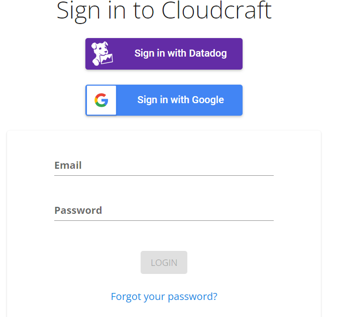

 
 

# 2. 메인페이지 및 사용법

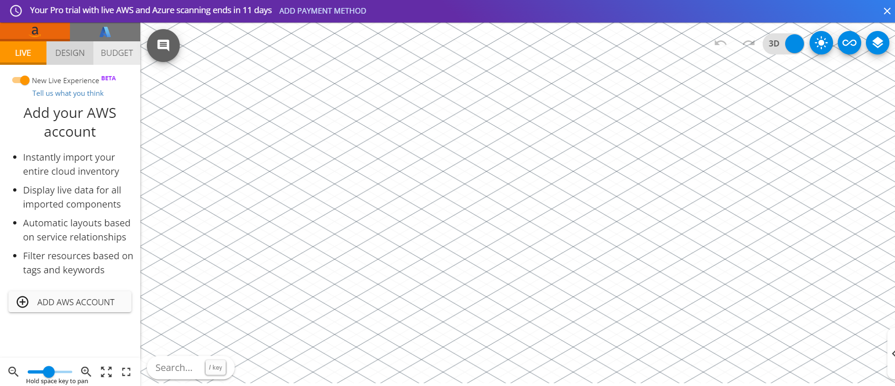

로그인하시면 다음과 같은 화면을 마주하게 됩니다.

이 공간에서 작업을 수행하시면 됩니다.

왼쪽 사이드바를 보시면 AWS와 AZURE 아이콘을 보실 수 있습니다. 클릭하면 각각 플랫폼 서비스의 아이콘을 사용할 수 있는데 Compute, Storage, Database 등 카테고리 별로 분류해놓은 것 같습니다.

 

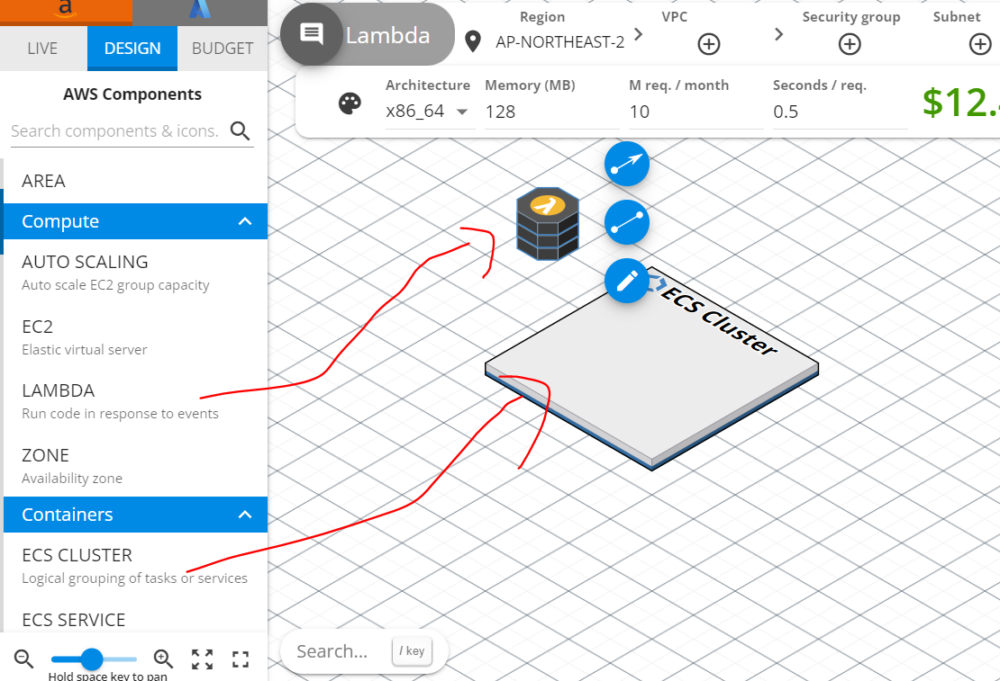

그리고 AWS 혹은 AZURE 서비스 아이콘은 크기조절이 안됩니다. 이유는 저도 잘 모르겠네요. 아니면 제가 방법을 못 찾은걸수도 있습니다. 참고하세요.

> 참고로 LIVE도 뭔지 잘 모르겠고... BUDGET은 아이콘 사용시 유료차감된다는 뜻인지... 아무튼 잘 모르겠습니다..ㅎㅎ

 
 

# 3. Common 영역 사용법

Common 영역은 말그대로 AWS, AZURE 두 플랫폼 공통 요소로 구성되어있습니다.

 

### 1. 블록

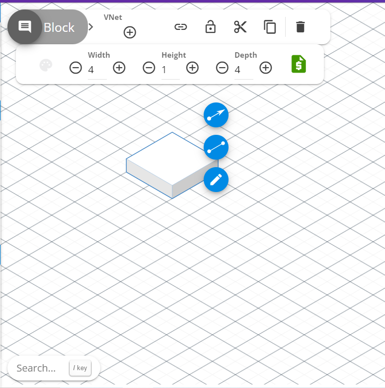

가장 많이 사용되는 요소 중 하나입니다.

보통 블록 윗면에 기술스택 아이콘을 올리는 방식으로 아키텍처를 구상합니다.

 

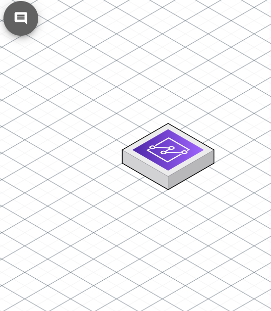

이런식으로 말이죠

 

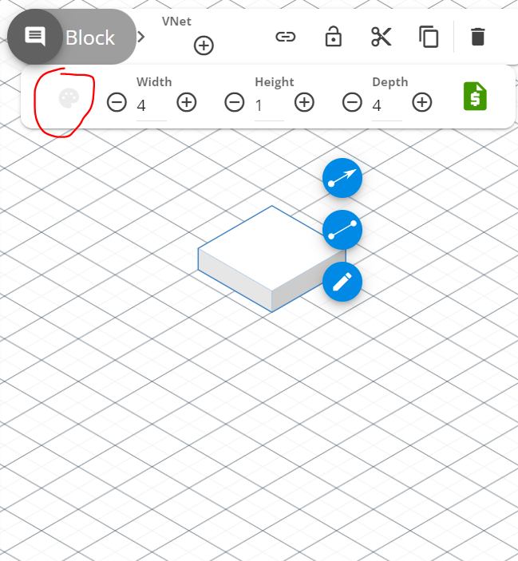

빨간원 부분을 클릭하면 블록 색상 변경이 가능합니다. 클라우드크래프트에서 기본제공하는 색상 외 색상코드를 알고 있다면 그 어떠한 색도 입할 수 있습니다.

width, height, depth로 블록 크기 조절도 가능합니다.

 

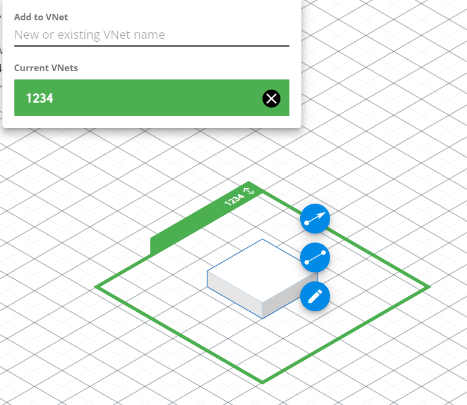

VNet은 네트워크 연결을 의미하는데 일종의 테두리 (묶음)을 의미한다 보시면 됩니다. 위 사진처럼 영역이 형성됩니다.

 

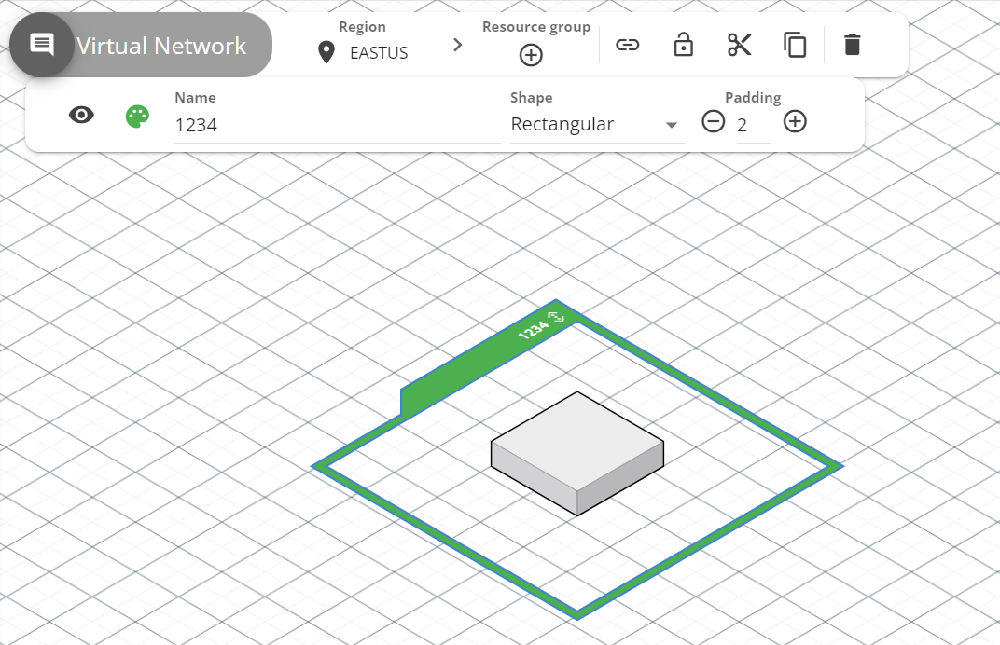

vnet을 클릭하면 영역 색상, padding 등을 변경할 수 있습니다.

사진을 보시면 region, resource group 속성이 있는데 뭔지 잘 모르겠습니다...

 

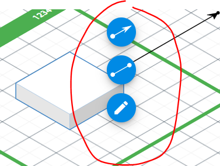
화살표 및 text label을 지정하는 속성입니다.

 

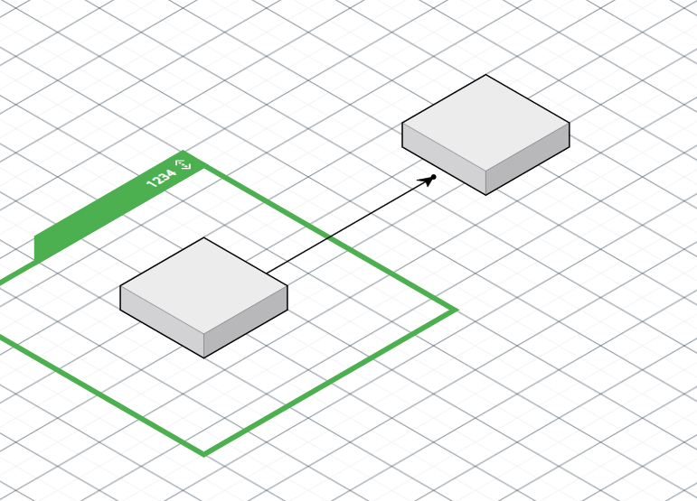

이런 식으로 말이죠

 

> 텍스트는 말그대로 텍스트입니다. 딱히 설명드릴게 없어서 스킵하겠습니다.

 

 

### 2. 아이콘

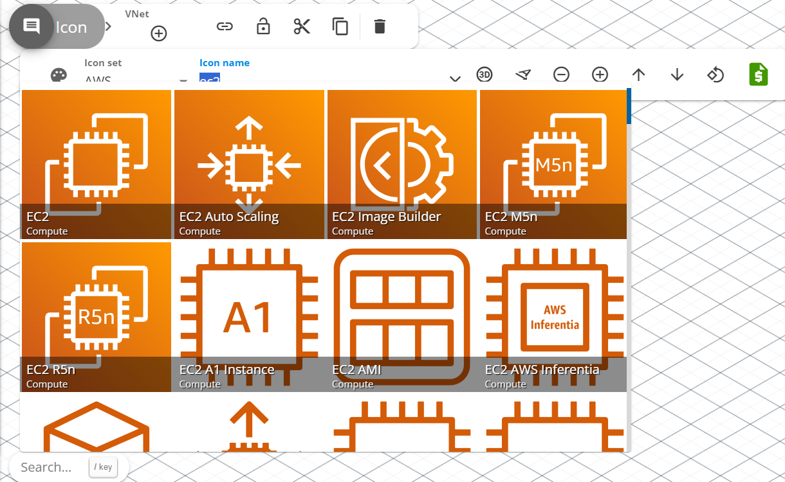

AWS, AZURE 서비스 아이콘을 사용할 수 있습니다.

icon name에 원하는 서비스를 검색해서 찾을 수 있습니다.

 

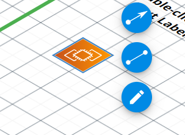

모양은 단순 사각형입니다. 위에 언급한 서비스 아이콘과 다르게 블록처럼 크기 및 속성 변경이 가능합니다.

아이콘을 클릭하면 아이콘 사각형이 생성됩니다.

 
 

### 3. 이미지

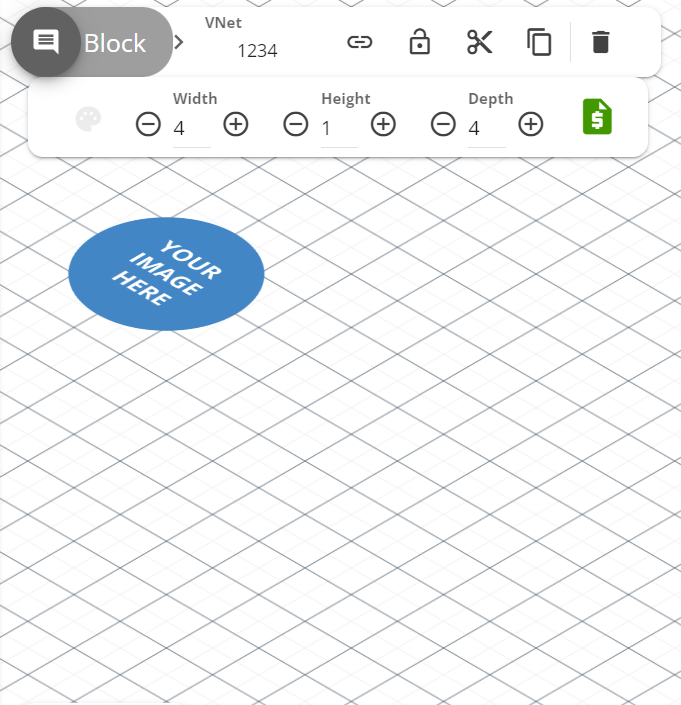

이미지 파일을 불러와 사용할 수 있습니다. jpg, png 등 다양한 확장자를 지원하는 듯 합니다.

블록, 아이콘과 마찬가지로 크기, 색상 등 속성 변경이 가능합니다.

 
 

### 4. 영역

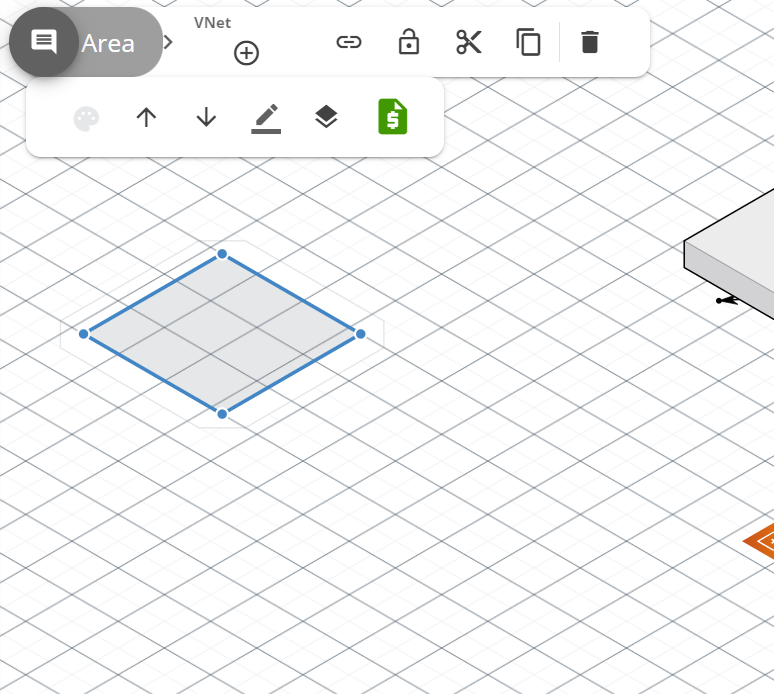

AREA 입니다.

말그대로 영역입니다.

보통 AREA에 VNet을 추가해서 네트워크 영역을 만들곤 합니다.

 

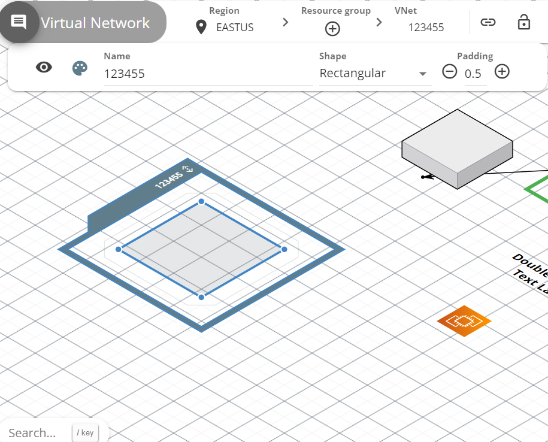

이런식으로 말이죠.

 
 

# 저장

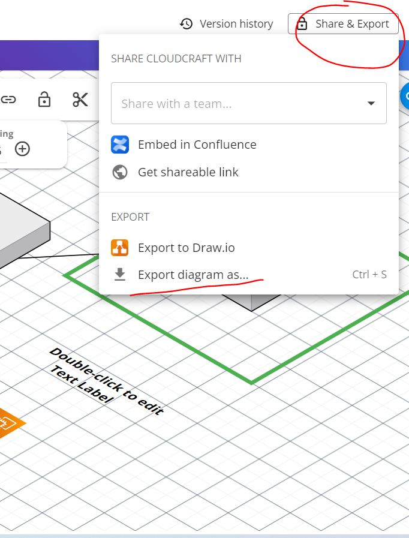

저장은 우측 상단 export를 누르시면 됩니다.

 

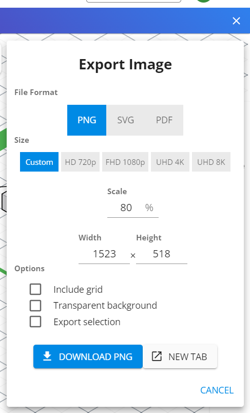

이미지 비율을 지정할 수 있는데 전 아직 한번도 안해봤습니다..

 

> 개인적으로 클라우드 크래프트 접속 후 초기 화면 비율을 건드리지 않고 작업하시는걸 추천드립니다.  
> 비율을 건드리는 순간 작업물 저장 시 어디까지 이미지로 저장될 지 알수가 없습니다.   저장 시 전체 영역이 저장되지 않는 경우가 있습니다.

 
 

이 정도만 아셔도 아키텍처 구상도를 만드는데 무리가 없을겁니다.

 
 

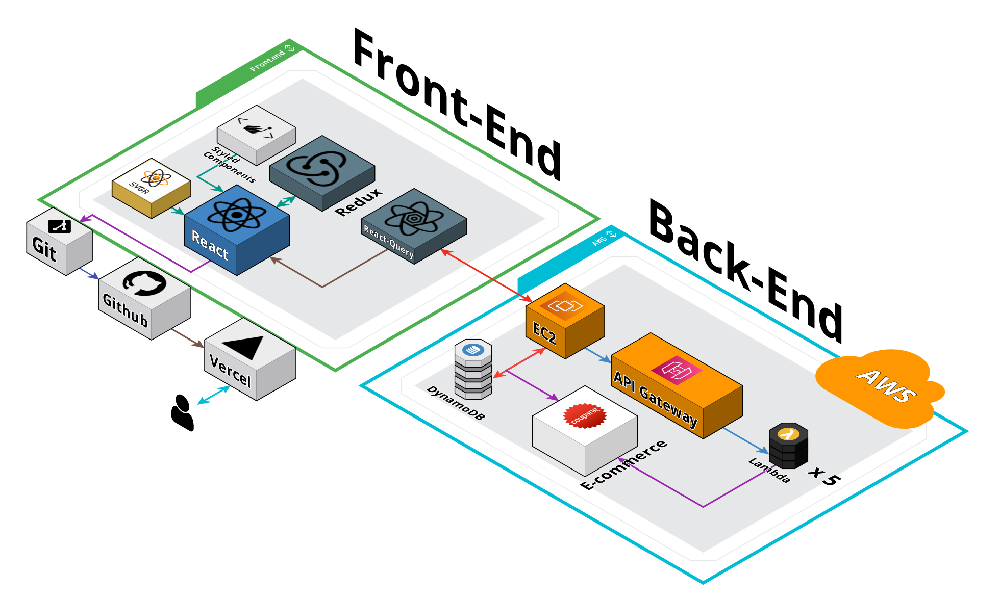

제작 예시입니다. 참고하실분은 참고하세용

두서없는 글 읽어주셔서 감사합니다.
