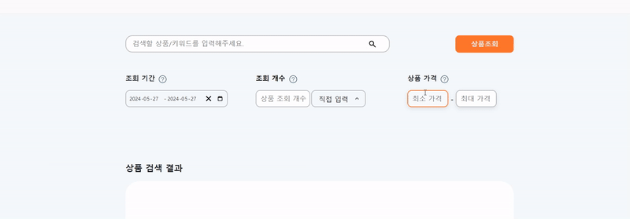

```tsx
//PriceRange.tsx

//스타일 컴포넌트 생략

import Tooltip from "components/common/Tooltip";

export default function PriceRange({
  minPrice,
  setMinPrice,
  maxPrice,
  setMaxPrice,
  isFetching,
}: {
  minPrice: string;
  setMinPrice: React.Dispatch<React.SetStateAction<string>>;
  maxPrice: string;
  setMaxPrice: React.Dispatch<React.SetStateAction<string>>;
  isFetching: boolean;
}) {
  const maxPriceChange = (e: React.ChangeEvent<HTMLInputElement>) => {
    setMaxPrice(e.target.value);
  };
  const minPriceChange = (e: React.ChangeEvent<HTMLInputElement>) => {
    setMinPrice(e.target.value);
  };

  return (
    <>
      <PriceContainer>
        <InputTitleField>
          <InputTitle>상품 가격</InputTitle>
          <Tooltip content="가격을 입력하면 해당 범위 내 키워드가 조회됩니다. 최소 가격을 설정하지 않으면 10000원부터 조회됩니다." />
        </InputTitleField>
        <Input
          type="text"
          name="minPrice"
          value={minPrice}
          onChange={minPriceChange}
          placeholder="최소 가격"
          disabled={isFetching}
          maxLength={12}
          onKeyUp={(e) =>
            (e.currentTarget.value = e.currentTarget.value.replace(
              /[^0-9]/g,
              "",
            ))
          }
        ></Input>
        <span> - </span>
        <Input
          type="text"
          onKeyUp={(e) =>
            (e.currentTarget.value = e.currentTarget.value.replace(
              /[^0-9]/g,
              "",
            ))
          }
          name="maxPrice"
          maxLength={12}
          value={maxPrice}
          onChange={maxPriceChange}
          placeholder="최대 가격"
          disabled={isFetching}
        ></Input>
      </PriceContainer>
    </>
  );
}
```

기존 가격입력 컴포넌트는 단순 입력 기능만 존재했습니다. 조건에 부합하지 않는 값 입력 시 Modal창을 띄워 에러핸들링을 했지만 실시간 유효성 검사를 적용하는 것도 사용자 경험 증대에 도움이 될거라 판단해 `React Hook Form`을 이용해 구현해보았습니다.

<br>
<br>
<br>

# 구현 과정

## 1. React Hook Form 설치

`React Hook Form`을 적용하는 방법은 크게 어렵지 않습니다.

```shell
npm i react-hook-form
```

먼저 라이브러리를 설치해주고

```tsx
import { useForm } from "react-hook-form";

const { register, watch } = useForm<FormValues>();

const a: number = watch("a");
const b: number = watch("b");
```

구조분해 문법을 이용해 `register`, `watch` 함수를 가져와줍니다.
`register` 함수는 `React Hook Form`과 input 태그를 연결시키는 함수이고, `watch` 함수는 input의 입력값을 감시하여 변경사항을 감시하는 역할을 합니다.

<br>
<br>

## 2. Register 함수 적용

다음 input 다음과 같은 속성을 부여해줍니다.

```tsx
<Input
  id="a"
  type="text"
  {...register("a")}
  placeholder="최소 가격"
  disabled={isFetching}
  onKeyUp={(e) => {
    e.currentTarget.value = e.currentTarget.value.replace(/[^0-9]/g, "");
    setMinPrice(a);
  }}
></Input>
```

이전 코드에서 사용하던 `value={maxPrice}` `onChange={maxPriceChange}` 속성을 제거하고 register 함수를 이용해 input에 이름을 부여해줍니다.

`{...register("a")}` 속성을 통해 input에 a라는 이름을 부여해줬습니다.

이제 input 값은 a라고 생각하시면 될 것 같습니다.

그리고 `onKeyUp` 속성을 이용해 input에 키를 입력할 때 실시간으로 값(`MinPrice`, `MaxPrice`)이 변경되도록 설정해줬습니다.

<br>

## 3. watch함수 적용 및 실시간 유효성 검사 구현

다음은 watch 함수를 이용해 실시간으로 input 값을 감시하도록 설정해줍니다.

`const a: number = watch("a");`

이 코드를 통해 watch 함수는 input값을 실시간으로 감시하고 `a` 를 이용해 실시간 유효성 검사를 구현할 수 있는 환경이 마련됐습니다.

```tsx

//생략

<Input>...

 {!Number(a) && Number(b) && Number(b) < 10000 ? (
          <ErrorMessage>
            최소가격 미 입력시 <br />
            최대가격이 10000보다 커야 합니다.
          </ErrorMessage>
        ) : Number(a) && !Number(b) ? undefined : Number(a) &&
          Number(a) > Number(b) ? (
          <ErrorMessage>최소가격이 최대가격보다 커야 합니다.</ErrorMessage>
        ) : undefined}

```

에러메시지를 띄울 곳에 다음과 같은 로직을 구현했습니다.

위 로직은 다음과 같은 조건을 충족하는 로직입니다.

1. 최소가격 input 값(`Number(a)`)이 없고 최대가격 input 값(`Number(b)`)이 존재하는 상태에서 최대가격 input 값이 10000 이하인 경우 에러 메시지 출력
2. 최소, 최대 가격 input 값 둘 다 존재할 경우 최소가격 input 값 > 최대가격 input 값 일 경우 에러 메시지 출력

<br>

## 4. 결과 및 완성 코드



정상적으로 동작하는 것을 확인할 수 있습니다.
<br>
<br>
<br>

```tsx
import Tooltip from "components/common/Tooltip";
import { useForm } from "react-hook-form";

interface FormValues {
  a: number;
  b: number;
}

//스타일 컴포넌트 생략

export default function PriceRange({
  setMinPrice,
  setMaxPrice,
  isFetching,
}: {
  setMinPrice: React.Dispatch<React.SetStateAction<number>>;

  setMaxPrice: React.Dispatch<React.SetStateAction<number>>;
  isFetching: boolean;
}) {
  const { register, watch } = useForm<FormValues>();

  const a: number = watch("a");
  const b: number = watch("b");

  return (
    <>
      <PriceContainer>
        <InputTitleField>
          <InputTitle>상품 가격</InputTitle>
          <Tooltip content="가격을 입력하면 해당 범위 내 키워드가 조회됩니다. 최소 가격을 설정하지 않으면 10000원부터 조회됩니다." />
        </InputTitleField>
        <Input
          id="a"
          type="text"
          {...register("a")}
          placeholder="최소 가격"
          disabled={isFetching}
          onKeyUp={(e) => {
            e.currentTarget.value = e.currentTarget.value.replace(
              /[^0-9]/g,
              "",
            );
            setMinPrice(a);
          }}
        ></Input>
        <span> - </span>
        <Input
          id="b"
          type="text"
          {...register("b")}
          placeholder="최대 가격"
          disabled={isFetching}
          onKeyUp={(e) => {
            e.currentTarget.value = e.currentTarget.value.replace(
              /[^0-9]/g,
              "",
            );
            setMaxPrice(b);
          }}
        ></Input>
        {!Number(a) && Number(b) && Number(b) < 10000 ? (
          <ErrorMessage>
            최소가격 미 입력시 <br />
            최대가격이 10000보다 커야 합니다.
          </ErrorMessage>
        ) : Number(a) && !Number(b) ? undefined : Number(a) &&
          Number(a) > Number(b) ? (
          <ErrorMessage>최소가격이 최대가격보다 커야 합니다.</ErrorMessage>
        ) : undefined}
      </PriceContainer>
    </>
  );
}
```

위 코드는 완성된 코드입니다.
