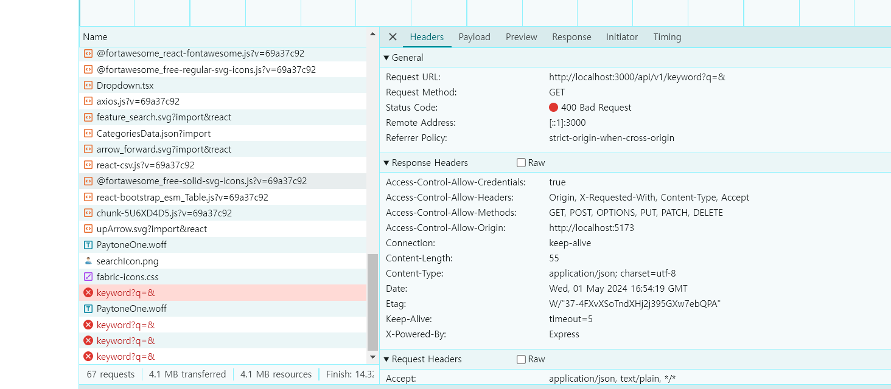
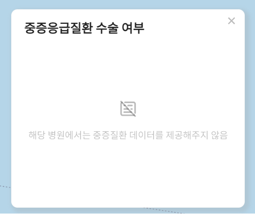
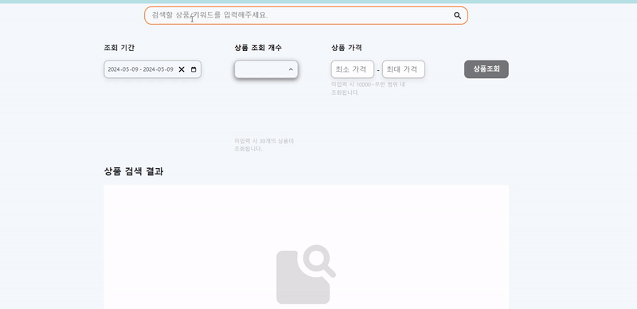

react-query에서 ErrorBoundary와 useQueryErrorResetBoundary를 결합해 선언적으로 에러가 발생했을 때 Fallback UI를 보여줄 수 있다고 합니다.

useQueryErrorResetBoundary는 ErrorBoundary와 함께 사용되는데 이는, 기본적으로 리액트 공식 문서에서 기본 코드 베이스가 제공되긴 하지만 좀 더 쉽게 활용할 수 있는 react-error-boundary 라이브러리가 존재하고, react-query 공식 문서에서도 해당 라이브러리 사용을 예시로 제공해 주기 때문에 react-error-boundary를 설치해서 사용해보도록 하겠습니다.

> Error Boundary 컴포넌트는 생명주기 메서드를 사용해야 하기 때문에 클래스 컴포넌트로 작성하는 방법밖에 없다고합니다. 그렇기 때문에 React 공식 문서에서도 직접 구현하는 것 보다는 react-error-boundary 라이브러리를 사용하는 것을 권장합니다.

# react-error-boundary 설치

```shell
 npm i react-error-boundary

```

라이브러리를 설치해줍니다.

# react-error-boundary 라이브러를 활용한 에러페이지 제작

```tsx
//QueryErrorBoundary.tsx

import { useQueryErrorResetBoundary } from "@tanstack/react-query";
import { ErrorBoundary } from "react-error-boundary";

interface Props {
  children: React.ReactNode;
}

const QueryErrorBoundary = ({ children }: Props) => {
  const { reset } = useQueryErrorResetBoundary();

  return (
    <ErrorBoundary
      onReset={reset}
      fallbackRender={({ resetErrorBoundary }) => (
        <div>
          에러가 발생했다!
          <button onClick={() => resetErrorBoundary()}>돌아가기</button>
        </div>
      )}
    >
      {children}
    </ErrorBoundary>
  );
};

export default QueryErrorBoundary;
```

다음과 같이 에러 발생 시 띄워줄 페이지를 만들어줬습니다.

에러가 발생하면 `fallbackRender` ui가 렌더링되고 에러가 발생하지 않으면
{children}이 렌더링됩니다.

<br>

## children 설정

```tsx
//Main.tsx

import React from "react";
import ReactDOM from "react-dom/client";
import App from "App.tsx";
import { Provider } from "react-redux";
import store from "store/store.js";
import { BrowserRouter } from "react-router-dom";
import { QueryClient, QueryClientProvider } from "@tanstack/react-query";
import { GlobalStyles } from "styles/GlobalStyle";
import QueryErrorBoundary from "components/feature/result/QueryErrorBoundary";
export type RootState = ReturnType<typeof store.getState>;

const queryClient = new QueryClient({
  defaultOptions: {
    queries: {
      throwOnError: true,
      retry: 0,
    },
  },
});

ReactDOM.createRoot(document.getElementById("root")!).render(
  <React.StrictMode>
    <QueryClientProvider client={queryClient}>
      <QueryErrorBoundary>
        <BrowserRouter>
          <GlobalStyles />
          <Provider store={store}>
            <App />
          </Provider>
        </BrowserRouter>
      </QueryErrorBoundary>
    </QueryClientProvider>
  </React.StrictMode>
);
```

만들어놓은 `<QueryErrorBoundary>` 컴포넌트로 App 컴포넌트들을 감싸줍니다. 즉 App 컴포넌트가 children이 되겠죠.

그리고 `QueryClient`에

```tsx
const queryClient = new QueryClient({
  defaultOptions: {
    queries: {
      retry: 0,
    },
  },
});
```

다음과 같은 속성을 추가해줍니다.

`retry: 0,`는 react-query는 api 호출 시 에러가 발생하면 보통 3번 재호출을 시도합니다. 굳이 필요없으니 재호출 횟수를 0으로 만들어줍시다.

이제 에러가 발생하도록 서버를 종료한 후 호출을 시도해봅시다




정상적으로 에러 페이지가 띄워집니다.

<br>
<br>
<br>

# 컴포넌트 내에서 에러를 띄우도록 수정

하지만 뭔가 좀 애매합니다. css를 적용시키지 않은 것과 별개로 제가 만약 사용자라면 일부 영역의 데이터를 가져오지 못한 상황인데 모든 페이지가 보이지 않는다면 불편할 수 있다고 생각했습니다.



위 사진처럼 컴포넌트 내에서 에러를 명시하고 나머지부분은 그대로 남겨두는 것이 사용자경험 측면에서 효율적인 방안일 것입니다.

<br>

<details>

<summary>ErrorBoundary가 아닌 다른 방법으로 구현</summary>

<div markdown="1">

## Result 컴포넌트만 에러 처리

본 프로젝트에서 서버 데이터를 받아오는 컴포넌트는 Result 컴포넌트뿐입니다. 즉 Result 컴포넌트에서만 에러핸들링이 이루어지고 나머지 컴포넌트들은 독립적으로 화면에 띄워지도록 하면 됩니다.

```tsx
//FallbackUI.tsx

const FallbackUI = () => {
  return (
    <div>
      <p>에러가 발생했어요</p>
      <button>돌아가기 버튼</button>
    </div>
  );
};

export default FallbackUI;
```

먼저 에러 발생시 띄워줄 컴포넌트를 제작합니다. 기능구현이 목적이므로 정말 간단하게 만들었습니다.

<br>

```tsx
//mainPage.tsx

const { isError, data, refetch, isFetching } = FetchData(apiURL);

{
  resultVisible ? (
    <Result isError={isError} searchData={searchData} isFetching={isFetching} />
  ) : (
    <EmptyResult />
  );
}
```

`useQuery`에서 `isError` 값을 가져와서 props로 전달해줬습니다. `isError` 는 말 그대로 에러가 일어났는지 안났는지를 나타내는 `boolean` 값입니다.

<br>

```tsx
import FallbackUI from "./FallbackUI";

export default function Result({
  searchData,
  isFetching,
  isError,
}: {
  searchData: SearchData;
  isFetching: boolean;
  isError: boolean;
}) {
  if (isFetching) return <SkeletonContainer></SkeletonContainer>;

  if (isError) {
    return (
      <div>
        <FallbackUI />
      </div>
    );
  }
  return (
    <>
      <ExcelDownloader searchData={searchData} />
      <ResultTable searchData={searchData} />
    </>
  );
}
```

데이터를 불러오는 상태 : `isFetching`

에러가 발생한 상태 : `isError`

정상적으로 데이터를 불러온 상태

총 3가지 상태로 분기처리 후 각각 상태에 맞춰 렌더링 되도록 했습니다.


잘 렌더링됩니다 다행이네요...

<br>
<br>
<br>

## 사실,,,,

이 코드의 문제점은 컴포넌트 내에서 에러, 로딩, 데이터fetching 성공 3가지 상태를 모두 관리하기 때문에 상당히 비효율적인 코드라는 것입니다.

또 다른 문제점은 에러 발생 후처리가 없다는 것입니다. 에러가 발생했지만 사용자입장에선 '음... 그래서 뭐 어떻게 하라고?' 라는 의문이 들 수도 있습니다. 사용자 경험 저하로 이어질 수 있겠죠.

때문에 `ErrorBoundary` 와 `QueryErrorResetBoundary` 컴포넌트를 활용해 <FallbackUI /> 컴포넌트 내에 버튼을 만들고 버튼을 클릭하면 에러를 처리하고 이전 상태로 돌아가게 만드는 기능을 구현하려했습니다.

`ErrorBoundary` 와 `QueryErrorResetBoundary` 컴포넌트를 이용하면 위 코드처럼 명령형 프로그래밍이 아닌 선언형 프로그래밍을 구현할 수 있어 코드가독성이 높고 api호출 상태별 관리를 컴포넌트 별로 독립적으로 운영할 수 있습니다.

<br>
<br>

하지만 구현에 실패했습니다... 정말 열심히 이것저것 시도하고 찾아봤는데 안되더군요. 오늘도 억까당했습니다. 남들 다 된다는데 왜 저만 안될까요?ㅎㅎ

찾아보니 react query에서 발생한 에러는 가장 가까운 ErrorBoundary로 throw 된다고 합니다. 즉 react query를 포함하는 컴포넌트가 ErrorBoundary에 감싸진 형태여야한단느 뜻이죠. 하지만 제 프로젝트는 react query로 비동기함수를 호출해 받아온 data를 Result 컴포넌트가 props로 전달받는 방식이기때문에 문제가 생긴 듯 합니다. 문제를 해결하려면 react query를 직접 참조하는 MainPage.tsx 를 ErrorBoundary를 감싸줘야합니다. 하지만 이런 구조는 제가 원하는 구조가 아닙니다..


다른 분 블로그에서 가져온 이미지인데 이런식으로 비동기함수 호출하는 컴포넌트와 렌더링되는 컴포넌트를 별도로 분리해서 운영하는 것이 목표입니다..

일단 차선책으로 ui만 띄우고 나중에 구현해보도록 하겠습니다. 너무 스트레스받았어요ㅠㅠㅠ

</div>

</details>

<br>
<br>

# ErrorBoundary와 QueryErrorResetBoundary를 활용한 에러 핸들링

`ErrorBoundary`는 컴포넌트 근처에 발생한 throw된 에러를 받아 처리하는 역할을 합니다.
즉 `ErrorBoundary`의 하위 컴포넌트에서 에러가 발생하면 `ErrorBoundary`가 에러를 받아 처리한다는 의미입니다.

그리고 `ErrorBoundary` 컴포넌트 하위 컴포넌트에서만 에러 핸들링을 하기 때문에 위에 언급했던 것처럼 모든 페이지가 중단되는 것이 아닌 해당 컴포넌트만 `fallback ui`를 띄워주고 나머지 컴포넌트는 사용자가 정상적으로 이용할 수 있습니다.

`QueryErrorResetBoundary`는 에러가 발생했을 때 에러를 초기화시켜주는 역할을 합니다. `QueryErrorResetBoundary` 컴포넌트의 `reset` 과 `resetErrorBoundary`를 활용하면 에러를 초기화시키고 이전 ui로 되돌리거나 refetch를 하는 등 다양한 동작을 실행할 수 있습니다.

<br>

구현한 코드는 다음과 같습니다.

```tsx
<QueryErrorResetBoundary>
  {({ reset }) => (
    <ErrorBoundary
      onReset={() => {
        reset();
      }}
      FallbackComponent={({ resetErrorBoundary }) => (
        <div>
          <ErrorField resetErrorBoundary={resetErrorBoundary} />
        </div>
      )}
    >
      <Result
        isError={isError}
        searchData={searchData}
        isFetching={isFetching}
        error={error}
      />
    </ErrorBoundary>
  )}
</QueryErrorResetBoundary>
```

`ErrorField`는 별도로 만든 fallback컴포넌트입니다.

```tsx


//Result.tsx

export default function Result({
  searchData,
  isFetching,
  isError,
  error,
}: ResultProps) {
  if (isFetching) return <SkeletonContainer></SkeletonContainer>;

  if (isError) {
    throw error;
  }
  return (
    <>
      <ExcelDownloader searchData={searchData} />
      <ResultTable searchData={searchData} />
    </>
  );
}
```
데이터값을 렌더링하는 `Result` 컴포넌트에서 props로 에러객체를 받아와 에러를 던지도록 만들고 던진 에러를 `ErrorBoundary`가 받아서 처리하도록 만들었습니다.


<br>
<br>

```tsx
//ErrorField.tsx
const ErrorField = ({
  resetErrorBoundary,
  setResultVisible,
}: {
  resetErrorBoundary: () => void;
  setResultVisible: (visible: boolean) => void;
}) => {
  return (
    <div>
      <p>에러가 발생했어요</p>
      <button
        onClick={() => {
          resetErrorBoundary();
          setResultVisible(false);
        }}
      >
        돌아가기 버튼
      </button>
    </div>
  );
};

export default ErrorField;
```

버튼을 클릭하면 에러를 초기화하고 `setResultVisible(false)`를 통해 초기화면으로 돌아가도록 했습니다.



정상적으로 에러핸들링이 되는 것을 확인할 수 있습니다!!
