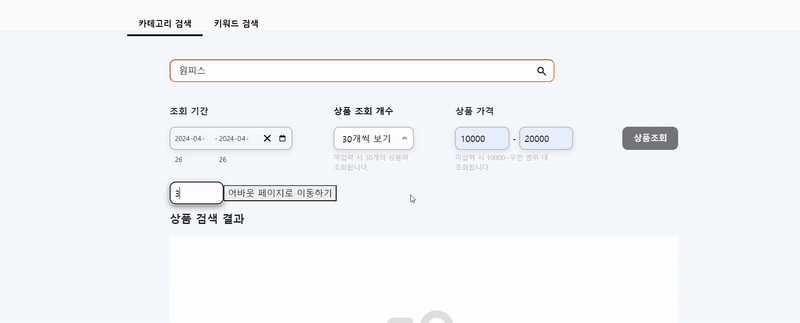

초기 React-Query loading 상태 시 모습은 spinner 였습니다.


<br>
<br>

하지만 spinner 보다 스켈레톤 ui가 더 보기좋다는 의견이 나와서 수정하기로 했습니다.

```tsx
import styled, { keyframes } from "styled-components";

const loadingAnimation = keyframes`
  0% {
    transform: translateX(0);
  }
  50%,
  100% {
    transform: translateX(800px);
  }
`;

const SkeletonItem = styled.li`
  display: flex;
  align-items: center;
  margin-top: 15px;
  margin-bottom: 40px;
  padding: 20px;
  border: 1px solid #ccc;
  border-radius: 4px;
  position: relative;
`;

const SkeletonInfo = styled.div`
  width: 100%;
  display: flex;
  flex-direction: column;
  align-items: flex-start;
  margin: 0px 70px;
`;

const SkeletonEmail = styled.p`
  width: 100%;
  height: 50px;
  background: #f2f2f2;
  margin-top: 10px;
  position: relative;
  overflow: hidden;

  &::before {
    content: "";
    position: absolute;
    top: 0;
    left: 0;
    width: 30px;
    height: 100%;
    background: linear-gradient(to right, #f2f2f2, #ddd, #f2f2f2);
    animation: ${loadingAnimation} 2.5s infinite linear;
  }
`;
export default function SkeletonContainer() {
  return (
    <SkeletonItem>
      <SkeletonInfo>
        <SkeletonEmail />
        <SkeletonEmail />
        <SkeletonEmail />
        <SkeletonEmail />
      </SkeletonInfo>
    </SkeletonItem>
  );
}
```

다음과 같이 수정한 결과입니다.

<br>
<br>



나름 아까보단 생동감 있는 ui가 된 것 같습니다..ㅎㅎ

<br>
<br>
<br>

<details>

<summary>참고 및 출처</summary>

<div markdown="1">

https://developer.mozilla.org/ko/docs/Web/CSS/gradient/linear-gradient

https://ui.toast.com/weekly-pick/ko_20201110

</div>

</details>
