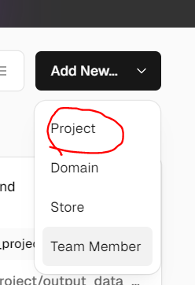
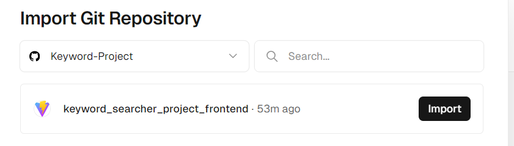
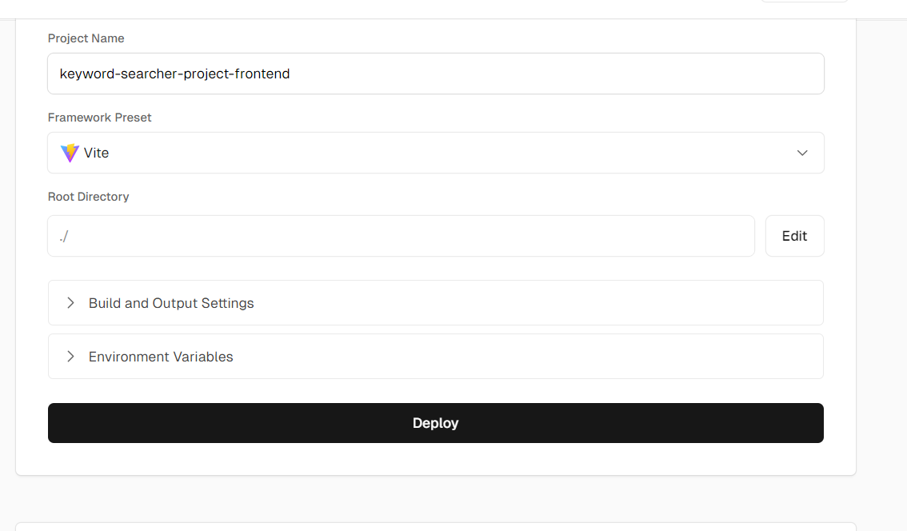
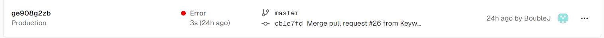
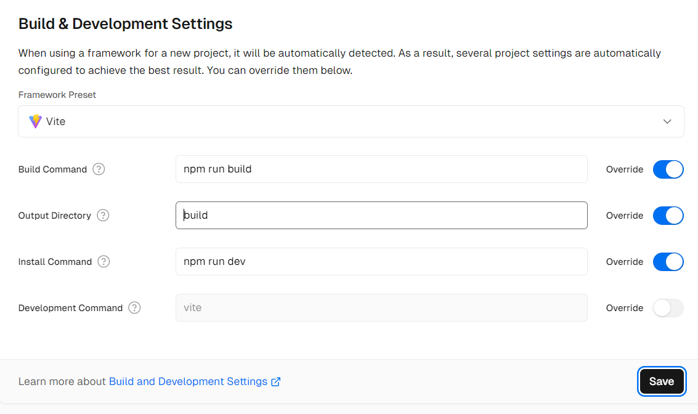
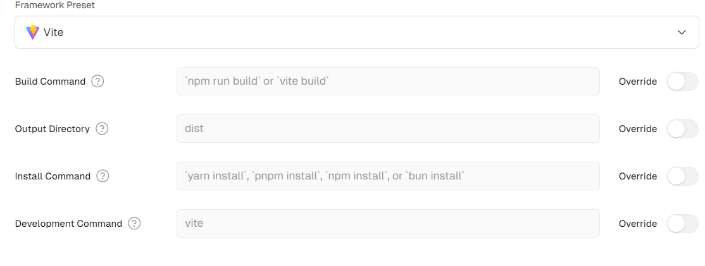
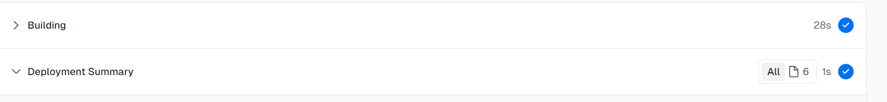
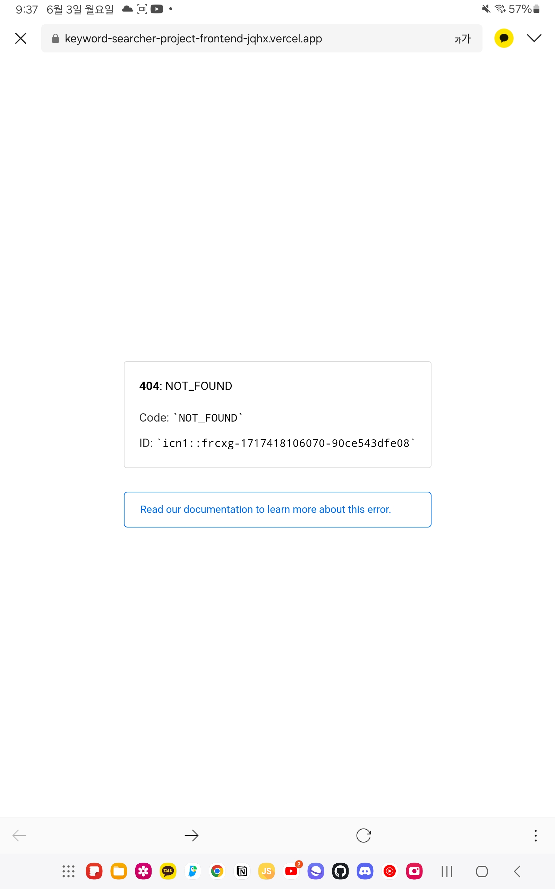
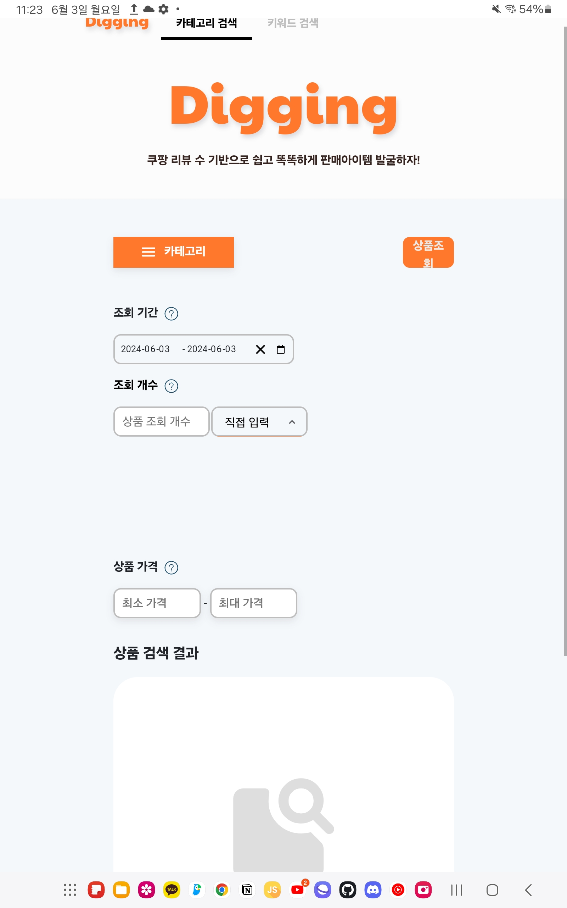

프로젝트를 만들었으니 배포해야겠죠??

배포 과정이 간단하기로 유명한 vercel을 통해 배포해보도록 하겠습니다.

# Vercel 배포

Vercel로 배포하는 과정은 간단합니다. 

1. 로그인 후 (계정이 없다면 만들어주세요. github 연동하면 편합니다.) 

<br>

2. Add new.. 버튼을 눌러 Project를 클릭해줍니다.



<br>

3. 배포하고자하는 git repository를 선택하고 import 해줍니다.



<br>

4. 배포 설정 후 deploy를 클릭해줍니다.



간략하게 설명드리자면

 먼저 프레임워크를 설정해줍니다. 저는 vite로 react를 빌드했기에 vite로 설정해주었습니다.

### Build and Output Settings

Vercel 빌드, 실행 명령어 및 루트 디렉토리를 세팅하는 곳입니다.

### Environment Variables

환경변수를 설정하는 곳입니다. 보통 API_KEY와 같이 보안 이슈가 발생할 수 있는 코드를 숨기기 위해 사용합니다.

일단 제 프로젝트에서는 사용하지 않았기 때문에 넘어가겠습니다. 차후 생긴다면 추가하겠습니다. 


<br>
<br>

자 이제 배포가 잘 되었는지 확인해볼까요??



역시 한번에 될리가 없지요. 문제점을 해결해 봅시다.


<br>
<br>

# 배포 에러 해결

## 1. 명령어 이슈

```shell

sh: line 1: vite: command not found
Error: Command "npm run dev" exited with 127

```

다음과 같은 에러가 났습니다. `npm run dev` 라는 명령어를 찾을 수 없다는 뜻입니다.



제가 명령어를 이상하게 설정했더군요...

vite에서 쓰는 명령어와 vercel에서 쓰는 명령어는 차이가 있습니다.

`npm run dev` 라는 명령어는 로컬 환경에서는 사용 가능하지만 Vercel의 서버 환경에서는 사용할 수 없는 명령어입니다. vite 환경이 아니니까요.

<br>



vercel 명령어로 수정한 뒤 다시 deploy 해줬습니다.



정상적으로 빌드가 되었습니다!!

<br>

이제 프로젝트가 정상적으로 배포되었는지 확인해볼까요??




음 제 갤탭으로 접속해봤는데 접속되지 않는군요... 역시 이 개발이란 놈은 한 번에 되는 꼴을 본 적이 없습니다. 

<br>
<br>

## 2. Vercel은 정적 웹 사이트

Vite는 기본적으로 SPA (Single Page Application)를 위해 설계되어 있으며, 클라이언트 측 라우팅을 사용하여 페이지를 로드합니다. 이것은 클라이언트 측에서 URL이 변경될 때 페이지가 다시 로드되지 않고 JavaScript 코드가 사용되는 것을 의미합니다.

반면, Vercel은 정적 웹 사이트를 위한 서비스로서, 각 URL에 대한 정적 파일을 미리 생성하여 제공합니다. 이것은 서버 사이드 렌더링 (SSR) 또는 정적 사이트 생성기 (SSG)와 같은 방식으로 작동합니다.

이러한 이유로 Vite를 사용하여 만든 SPA를 Vercel에 배포할 때는 서버가 모든 URL에 대한 적절한 정적 파일을 제공하지 않으므로 404 오류가 발생한 것 입니다. 이를 해결하기 위해 Vercel에게 모든 요청을 단일 HTML 파일로 리다이렉션하도록 구성하는 것이 필요합니다.


```json
//vercel.json

{
  "rewrites": [{ "source": "/(.*)", "destination": "/" }]
}

```

프로젝트 루트 디렉토리에 다음과 같이 vercel.json 파일을 생성해줍니다.

위 코드는 `URL 재작성(rewrites)` 규칙을 설정하는 코드입니다. 이 설정은 모든 요청 URL을 서버의 `루트 경로(/)`로 재지정하도록 설정합니다. 여기서 `source": "/(.*)`는 모든 경로를 포착하는 정규 표현식입니다. 즉, 사이트의 어떤 URL로 접근하더라도, 실제로는 `루트 URL(/)`로 처리됩니다.

<br>

이번엔 과연 정상적으로 배포가 됐을지 확인해봅시다




테블릿이라 ui가 조금 이상하긴하지만..ㅎㅎ 일단 배포하는 것이 목적이니 성공입니다!


<br>
<br>
<br>

<details>

<summary>참고문헌</summary>

<div markdown="1">

https://velog.io/@richard/vite%EC%97%90%EC%84%9C-vercel%EB%A1%9C-%EB%B0%B0%ED%8F%AC%ED%95%98%EA%B8%B0

https://velog.io/@j2yn34/ReactTypescriptVite-%ED%94%84%EB%A1%9C%EC%A0%9D%ED%8A%B8-Vercel-%EB%B0%B0%ED%8F%AC

</div>

</details>
