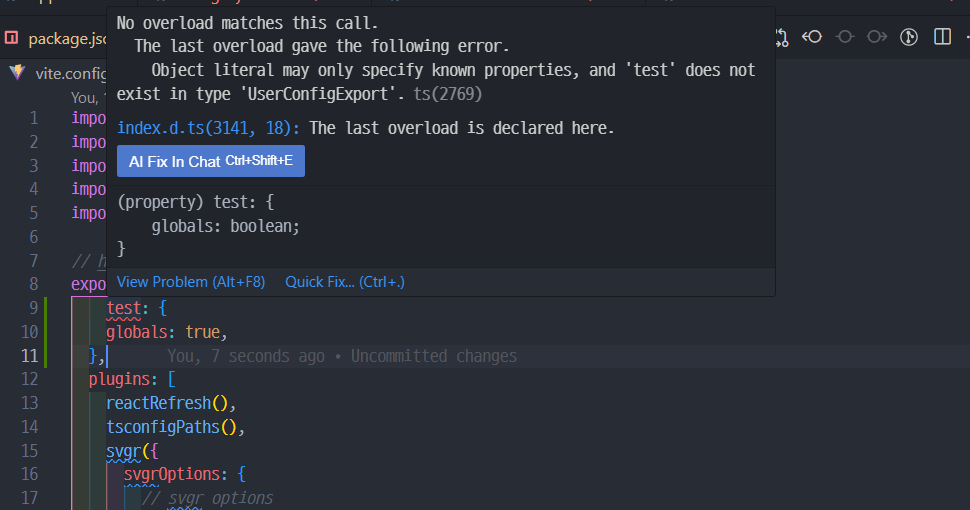

테스트 코드를 작성해봅시다. 유튜버 제로초님 말로는 본인께서는 tdd의 필요성을 못느끼는 경우가 많아 코드를 작성하면서 테스트 코드도 작성하는 경우가 많다고 합니다. 전 아직 뭣 모르는 초심자니까 일단 프로들이 하는걸 따라해보도록 하겠습니다.

# vitest

Vite를 기반으로 작동하는 테스팅 프레임워크입니다.

Vitest는 테스트 코드만을 위한 별도의 설정 없이, Vite를 통해 프로젝트의 기본 빌드 설정을 그대로 이용할 수 있다고 합니다. 그래서 Vite 프로젝트에서 사용했을 때 그 진가를 느낄 수 있다고해요.

그럼 한 번 사용해봅시다.

# vitest 설치

```shell
 npm add -D vitest

```

테스트라는 과정 자체가 애플리케이션 실행 때 필요한 의존성이 아니므로 개발 의존성으로 설치해주도록 합시다.

<br>

## npm 스크립트 추가

package.json 파일에 Vitest를 실행해주는 두 개의 스크립트를 추가해줍니다. 첫 번째 test 스크립트는 Vitest를 감시(watch) 모드로 실행해주고, 두 번째 test:run 스크립트는 Vitest를 일회성으로 실행해주는 설정입니다.

```json
//package.json

{
  "scripts": {
    "test": "vitest",
    "test:run": "vitest run"
  }
}
```



## 설정파일

Vitest의 설정을 통해 보다 편리하게 프레임워크를 사용해봅시다.

vite.config.ts 파일에 test 항목을 추가하고 설정해주면 됩니다. 여러가지 설정이 있지만 테스트 함수들을 별도로 import 해야하는 불편함을 해소하기 위해 ` globals: true,` 설정을 해주도록 합시다.

```ts
//vite.config.ts

import { defineConfig } from "vite";

export default defineConfig({
  test: {
    globals: true,

    //그외 여러가지 설정
  },
});
```

이제 테스트 코드에서 import 문을 제거해도 테스트가 정상적으로 동작합니다.

```js
//first.test.js

// import { expect, test } from "vitest";

test("1 is 1", () => {
  expect(1).toBe(1);
});
```

오우 근데 기가막히게 에러가 뜨네요. 역시 오늘도 세상은 저를 억까하고있습니다.


<br>
<br>

구글링을 통해 해법을 찾아냈습니다.

> Object literal may only specify known properties, and 'test' does not exist in type 'UserConfigExport'.

Vite 자체는 Vitest에 대해 아무것도 알지 못하니 에러가 나는겁니다. "이거 도대체 뭐냐!" 라고 따지는거죠.

```ts
//vite.config.ts

import { defineConfig } from 'vitest/config';

```

다음과 같이 수정해주면 에러가 사라집니다. 

<br>
<br>
<br>

<details>

<summary>참고</summary>

<div markdown="1">

https://www.daleseo.com/vitest/

https://stackoverflow.com/questions/72146352/vitest-defineconfig-test-does-not-exist-in-type-userconfigexport

</div>

</details>
