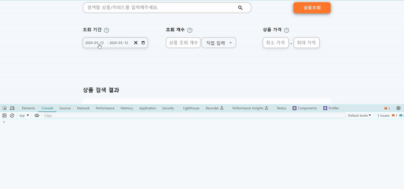
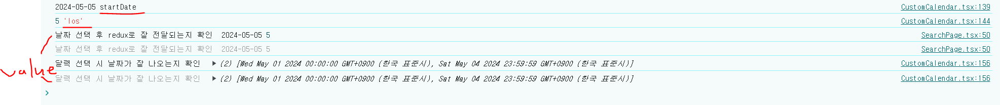

# 이슈 및 원인

```tsx

//CustomCalendar.tsx


//스타일 컴포넌트 생략


export default function CustomCalendar() {
  const dispatch = useDispatch();
  const [value, onChange] = useState<Value>([new Date(), new Date()]);
  const today = new Date();

  const CalculateDateGap = (startDate: Date, endDate: Date) => {
    return Math.abs(startDate.valueOf() - endDate.valueOf());
  };


  const onCalendarClose = () => {

    if (isValuePieceArray(value) && value[0] && value[1]) {

      const startDate = value[0]?.toISOString().split("T")[0];
      console.log(startDate, "startDate");
      const differenceMs = CalculateDateGap(value[0], value[1]);


      const los = Math.ceil(differenceMs / (1000 * 60 * 60 * 24));
      console.log(los, "los");

      dispatch(
        dateFetch({
          startDate: startDate,
          los: los,
        })
      );
    }
  };


  console.log("달력 선택 시 날짜가 잘 나오는지 확인 ", value);

  return (

//생략

      <StlyedDateRangePicker
        onChange={onChange}
        value={value}

       //생략

        onCalendarClose={onCalendarClose}
      />
    </CalendarBox>
  );
}

```

날짜 선택 시 onChange 함수가 실행되고 value값이 업데이트됩니다. 그리고 달력은 자동으로 닫히는데 달력이 닫히면 실행되는 onCalendarClose 함수기 실행됩니다. onCalendarClose 함수는 업데이트된 value값을 기반으로 비즈니스 로직을 통해 stateDate, los 계산한 후 전역으로 보내줍다.

작성한대로 동작하는지 확인해볼까요??



네.. 선택한 값으로 할당되지 않고 이전 상태값을 가져오는군요. 한박자씩 자꾸 미뤄집니다. 이는 setState를 비동기적으로 처리하기 때문에 발생하는 이슈입니다.

console을 자세히 보시면 value값보다 stateDate 와 los 값이 먼저 업데이트되는 것을 보실 수 있습니다.



<br>
<br>
<br>

# 해결 방법

setState 함수의 비동기 이슈를 해결하기 위해선 대표적으로 useEffect 훅을 활용하는 방법이 있습니다.


```tsx


//CustomCalendar.tsx

//스타일 컴포넌트 생략


export default function CustomCalendar() {
  const dispatch = useDispatch();
  const [value, onChange] = useState<Value>([new Date(), new Date()]);
  const today = new Date();

  useEffect(() => {
    const CalculateDateGap = (startDate: Date, endDate: Date) => {
      return Math.abs(startDate.valueOf() - endDate.valueOf());
    };

    if (isValuePieceArray(value) && value[0] && value[1]) {
      // value가 [ValuePiece, ValuePiece] 인 경우

      const startDate = value[0]?.toISOString().split("T")[0];
      console.log(startDate, "startDate");
      const differenceMs = CalculateDateGap(value[0], value[1]);

      const los = Math.ceil(differenceMs / (1000 * 60 * 60 * 24));
      console.log(los, "los");

      dispatch(
        dateFetch({
          startDate: startDate,
          los: los,
        })
      );
    }
  }, [value]);

  return (
   
     //생략

      <StlyedDateRangePicker
        onChange={onChange}
        value={value}
      
  //생략

      />
    </CalendarBox>
  );
}

```

위 코드처럼 setState 함수가 실행된 후 동작할 로직을 useEffect 훅 내부에 넣어주면 비동기 문제가 해결됩니다. 물론 의존성배열은 잘 설정해줘야겠죠?


정상적으로 동작합니다!!

<br>
<br>
<br>

<details>

<summary>참고</summary>

<div markdown="1">


https://velog.io/@nimoh/React-setState-%EB%B9%84%EB%8F%99%EA%B8%B0-%ED%95%B4%EA%B2%B0%ED%95%98%EA%B8%B0

</div>

</details>
