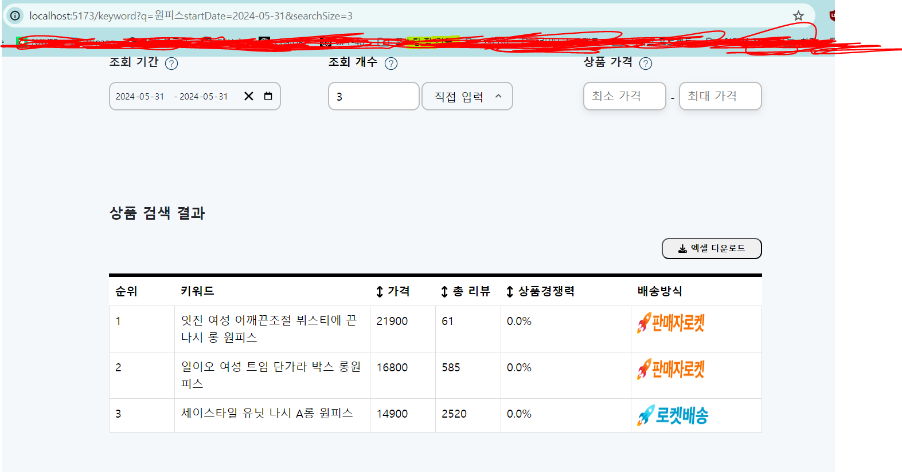
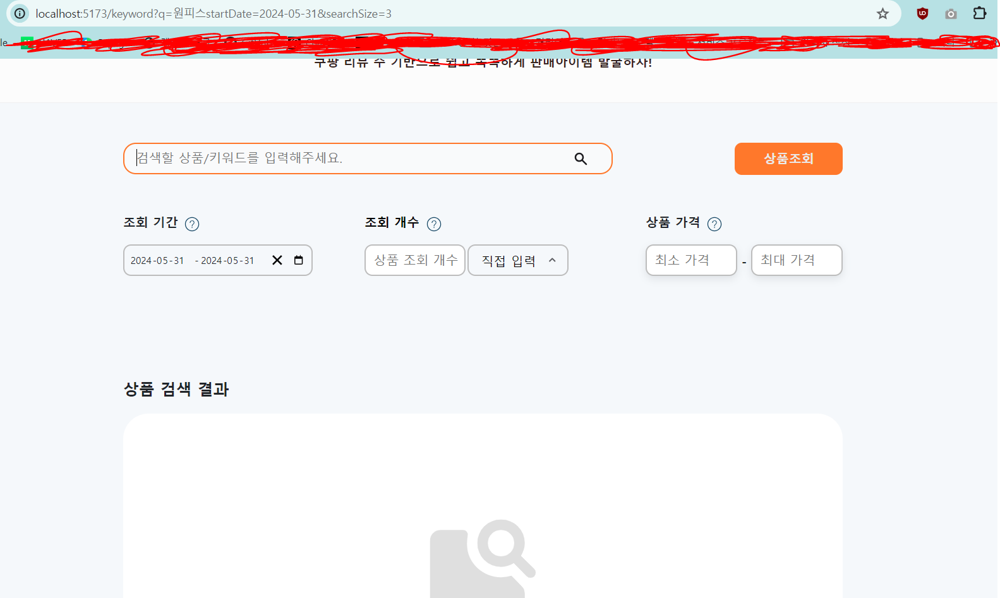
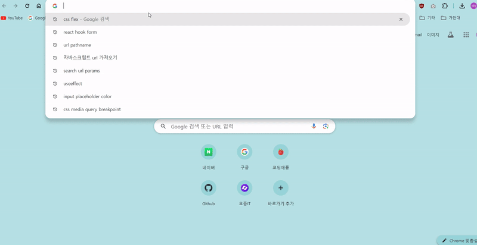

# 코드 및 개요


```tsx

//SearchPage.tsx


import { useState } from "react";
import CustomCalendar from "components/feature/filter/CustomCalendar";
import { useSelector } from "react-redux";
import Result from "components/feature/result/Result";
import { useLocation, Outlet } from "react-router-dom";
import { RootState } from "main";
import ItemSearchCount from "components/feature/filter/ItemSearchCount";
import PriceRange from "components/feature/filter/PriceRange";
import EmptyResult from "components/feature/result/EmptyResult";
import FetchData from "api/route";
import { QueryErrorResetBoundary } from "@tanstack/react-query";
import { ErrorBoundary } from "react-error-boundary";
import ErrorField from "components/feature/result/ErrorField";
import SearchButton from "components/feature/filter/SearchButton";
import { useNavigate } from "react-router-dom";
import media from "styles/media";


export default function SearchPage() {
  const [resultVisible, setResultVisible] = useState(false);
  const [maxPrice, setMaxPrice] = useState(0);
  const [minPrice, setMinPrice] = useState(0);
  const [searchSize, setSearchSize] = useState("");
  const [showModal, setShowModal] = useState(false);
  const [errorMessage, setErrorMessage] = useState("");

  const { startDate, los } = useSelector(
    (state: RootState) => state.queryString.date
  );

  const keywordInputValue = useSelector(
    (state: RootState) => state.queryString.pathName
  );

  const { pathname } = useLocation();
  const navigate = useNavigate();

  const commonURL = `${startDate ? `startDate=${startDate}` : ""}${
    los ? `&los=${los}` : ""
  }${minPrice ? `&minPrice=${minPrice}` : ""}${
    maxPrice ? `&maxPrice=${maxPrice}` : ""
  }${searchSize ? `&searchSize=${searchSize}` : ""}`;

  let apiURL = "";

  if (
    /^\/categories\/\d+$/.test(pathname) &&
    Number(maxPrice) >= Number(minPrice)
  ) {
    apiURL = `http://localhost:3000/api/v1${pathname}?` + `${commonURL}`;
  } else if (pathname == "/keyword" && Number(maxPrice) >= Number(minPrice)) {
    apiURL =
      `http://localhost:3000/api/v1/keyword?q=${keywordInputValue}&` +
      `${commonURL}`;
  }

  const { error, isError, data, refetch, isFetching } = FetchData(apiURL);

  const fetchHandler = () => {
    let queryURL = "";
    if (pathname == "/categories") {
      setShowModal(true);
      setErrorMessage("카테고리 목록을 선택해주세요.");
    } else if (/^\/categories\/\d+$/.test(pathname)) {
      if (Number(maxPrice) < Number(minPrice)) {
        setShowModal(true);
        setErrorMessage("최대가격이 최소가격보다 커야합니다.");
      } 
      else if (!Number(minPrice) && Number(maxPrice)) {
        if (Number(maxPrice) < 10000) {
          setShowModal(true);
          setErrorMessage("최소가격 미 입력 시\n최대가격이 10000보다 커야합니다.");
        }
                }       
      
      else {
        queryURL = `${pathname}?${commonURL}`;
        navigate(queryURL);
        setResultVisible(true);
        refetch();
      }
    }

    if (pathname == "/keyword") {
      if (keywordInputValue === "") {
        setShowModal(true);
        setErrorMessage("키워드를 입력해주세요.");
      } else {
        if (Number(maxPrice) < Number(minPrice)) {
          setShowModal(true);
          setErrorMessage("최대가격이 최소가격보다 커야합니다.");
        } else if (!Number(minPrice) && Number(maxPrice)) {
if (Number(maxPrice) < 10000) {
  setShowModal(true);
  setErrorMessage("최소가격 미 입력 시\n최대가격이 10000보다 커야합니다.");
}
        } 
        
        
        else {
          queryURL = `keyword?q=${keywordInputValue}` + `${commonURL}`;
          navigate(queryURL);
          setResultVisible(true);
          refetch();
        }
      }
    }
  };

  const searchData = data;

  return (
    <>
      <ButtonNSearchField>
        <Outlet context={{ isFetching }} />
        <SearchButton isFetching={isFetching} fetchHandler={fetchHandler} />
      </ButtonNSearchField>
      <FilterBox>
        <CustomCalendar />
        <ItemSearchCount
          setSearchSize={setSearchSize}
          isFetching={isFetching}
        />
        <PriceRange
          setMinPrice={setMinPrice}
          setMaxPrice={setMaxPrice}
          isFetching={isFetching}
        />
      </FilterBox>

  
      <SearchResultWord>상품 검색 결과</SearchResultWord>
      {resultVisible ? (
        <QueryErrorResetBoundary>
          {({ reset }) => (
            <ErrorBoundary
              onReset={() => {
                reset();
              }}
              FallbackComponent={({ resetErrorBoundary }) => (
                <div>
                  <ErrorField
                    resetErrorBoundary={resetErrorBoundary}
                    setResultVisible={setResultVisible}
                  />
                </div>
              )}
            >
              <Result
                isError={isError}
                searchData={searchData}
                isFetching={isFetching}
                error={error}
              />
            </ErrorBoundary>
          )}
        </QueryErrorResetBoundary>
      ) : (
        <EmptyResult />
      )}
    </>
  );
}

```

코드가 너무 길어서 복잡한데... 요약하자면

먼저 input 입력값, 달력값 등 여러 상태값을 SearchPage 컴포넌트로 불러와 쿼리스트링으로 전달해줍니다. 

react-query로 api 호출 후 받아온 데이터를 Result 컴포넌트에 전달해주는 방식입니다. 

<br>
<br>


# 문제점

보기엔 별 문제 없어보이고 실제로 데이터도 잘 받아옵니다. 

문제는 url에 있었습니다.




상품을 조회하면 필터 조건들이 query string 값으로 넘어갑니다. url이 `http://localhost:5173/keyword?q=%EC%9B%90%ED%94%BC%EC%8A%A4startDate=2024-05-31&searchSize=3` 가 된 것을 확인하실 수 있습니다.

하지만 주소를 새 창에서 그대로 열었을 시 데이터가 조회되지 않습니다.

<br>



위 사진과 같이 데이터가 조회되지 않고 초기화면이 렌더링되는 것을 확인할 수 있습니다. 

<br>
<br>

# 원인 분석

제가 짠 코드를 살펴봅시다. 

```tsx

  const fetchHandler = () => {
//생략
          queryURL = `keyword?q=${keywordInputValue}` + `${commonURL}`;
          navigate(queryURL);
          setResultVisible(true);
          refetch();
        }
      }
```

상품 조회 버튼을 클릭하면 fetchHandler 함수가 실행됩니다. 함수 내부 조건 성립 시 

1. refetch 함수가 실행되면서 api를 호출합니다.
2. `navigate(queryURL)` 를 통해 변경된 url 주소로 이동합니다. 
3. `setResultVisible(true);` 를 통해 Result 컴포넌트(데이터 렌더링)가 렌더링 되는 로직입니다.

문제는 여기 있었습니다. 

제가 원하는 기능은 url 주소 쿼리스트링이 바뀔때마다 Result 컴포넌트도 다시 렌더링되어 해당되는 데이터를 가져오는 것인데 Result 컴포넌트는 url 쿼리스트링에 의존하지않고 SearchPage 컴포넌트 내에서 처리한 data 값에 의존하는 형태입니다. 

즉 `navigate(queryURL)` 에 의해 만들어진 url은 아무역할을 하지 않습니다. 단순 표시용입니다. 

위에 언급한 문제점을 해결하기 위해선 Result 컴포넌트에 url 쿼리스트링 의존성을 부여해야합니다. 이를 위해선 useEffect를 사용해야합니다.

<br>
<br>
<br>

# 해결 과정 

## 1. Result 컴포넌트 내 useEffect에 query-string 의존성 부여

일단 SearchPage에서 호출하던 비동기함수를 Result 컴포넌트에서 호출하도록 해줍니다. 

```tsx

//Result.tsx

export default function Result() {
 
  const { pathname } = useLocation();
  const url = new URL(window.location.href);
  const queryString = url.search
  const apiURL = `http://localhost:3000/api/v1${pathname}${queryString}`;


  const { error, isError, data, refetch, isFetching } = FetchData(apiURL);


const searchData = data

  if (isFetching) return <SkeletonContainer />;

  if (isError) {
    throw error;
  }
  return (
    <>
    <ExcelDownloader searchData={searchData} />
      <ResultTable searchData={searchData} />
    </>
  );
}

```

url로부터 받아온 쿼리스트링값을 이용해 api 호출을 해야하므로 `useLocation`와 `window.location.href`를 이용해 pathname, 쿼리스트링 값을 받아옵니다.

받아온 값으로 api를 호출하고 받아온 데이터를 렌더링해주면 됩니다. 

그리고 쿼리 스트링 값이 바뀔 때마다 다시 데이터를 불러와야하므로 useEffect 의존성 배열에 쿼리스트링 값을 넣어줍니다.

```tsx

  const { error, isError, data, refetch, isFetching } = FetchData(apiURL);
  useEffect(() => {

    refetch();
    setResultVisible(true);
  }, [queryString]);
  


const searchData = data

```

<br>
<br>

## 2. 버튼 클릭 시 쿼리스트링 전달


SearchPage 컴포넌트 내에서 `navigate`를 활용해 버튼 클릭 시 쿼리스트링을 전달하도록 구현해줍니다.


```tsx
//SearchPage.tsx


    //버튼 클릭시 동작하는 함수
  const fetchHandler = () => {

//생략

    queryURL = `${pathname}?${commonURL}`;
        navigate(queryURL);
        setResultVisible(true);
      } 
```

<br>

어디한번 잘 동작하는지 볼까요?



전혀 되지 않는군요! 이유가 뭘까요??

<br>

원인은 바로  `setResultVisible(true)` setState함수에 있습니다.

Result 컴포넌트가 화면에 렌더링 되기 위해선 반드시 `setResultVisible(true)` 함수가 실행되어야합니다. 즉 ResultVisible 값이 true가 되어야한다는 뜻이죠. 

단순 url 변경시 `setResultVisible(true)` 함수가 동작하지 않으니 데이터가 조회되지 않았던 것입니다.


<br>
<br>

## 3. url 변경 및 버튼 클릭 시 setResultVisible(true) 실행

```tsx

//SearchPage.tsx


export default function SearchPage() {

  //생략

  const url = new URL(window.location.href);
  const queryString = url.search

  useEffect(()=>{
    if(queryString){
      setResultVisible(true)
    }
  },[queryString])

  //생략

```

SearchPage 컴포넌트 내 useEffect 훅을 활용해 쿼리스트링이 변경될 때마다 `setResultVisible(true)` 함수를 실행시켜서 Result 컴포넌트가 렌더링되고 데이터를 불러오도록 구현해줍니다.

<br>

위 로직을 통해 버튼을 클릭하지않고 url을 복사해 새창에서 열거나, 쿼리스트링값을 url에서 별도로 변경했을 경우에도 데이터가 정상적으로 렌더링되는 것을 확인할 수 있습니다.

> gif파일로 시현영상을 올리려했는데 화면녹화하면 실패하고 화면녹화를 안하면 성공하네요... 원인을 모르겠어서 첨부하지 못했습니다ㅠ.ㅠ

<br>
<br>


