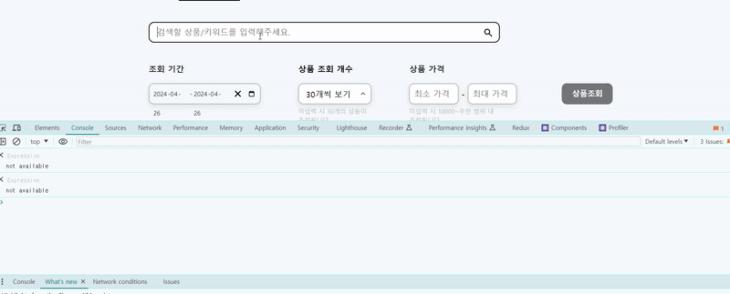
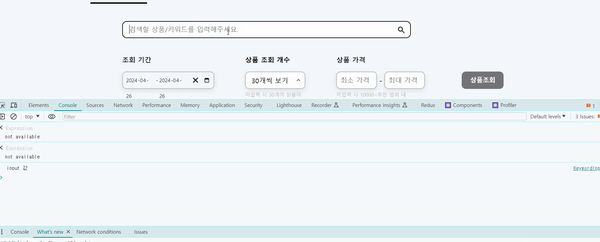

프로젝트 진행 중 컴포넌트 리렌더링 최적화를 구축하고자 리팩토링을 했습니다.

리렌더링 최소화는 프론트엔드에서 할 수 있는 대표적인 컴포넌트 최적화 과정 중 하나입니다.

# 리팩토링 전

다음은 기존 keyword 컴포넌트 코드입니다.

```tsx
//KeywordInput.tsx

//styled-component 컴포넌트들은 생략했습니다.

export default function KeywordInput() {
  const dispatch = useDispatch();

  const keywordNameChange = (e) => {
    dispatch(pathNameFetch(e.target.value));
    console.log(e.target.value);
  };

  return (
    <>
      <InputDiv>
        <Input
          placeholder="검색할 상품/키워드를 입력해주세요."
          onChange={keywordNameChange}
        />
        <StyledMagnifier width="22" height="22" />
      </InputDiv>
    </>
  );
}
```

<br>
<br>

input 태그에 값을 입력할 때마다 생기는 리렌더링입니다.


불필요한 리렌더링은 애플리케이션 성능을 악화시킬 수 있습니다.

`useRef` 훅을 이용해 불필요한 리렌더링을 없애봅시다.

<br>
<br>

# 리팩토링

`useRef` 훅을 활용해 input에 ref 속성을 넣어주고 `useRef`에서 추출한 ref 객체를 할당해주면 됩니다. 근데...

## 그래서 ref를 어떻게 뽑아낼거야??

```jsx


export default function KeywordInput() {
  const dispatch = useDispatch();
  const keywordRef = useRef("");\

  //생략


  return

//생략

<Input ref={keywordRef} placeholder="검색할 상품/키워드를 입력해주세요." />
```

본 애플리케이션은 redux를 활용해 전역 상태 관리를 하고 있습니다. 즉 이 컴포넌트에서 뽑아낸 input의 값은 dispatch함수로 전달하는 구조입니다, 근데.. dispatch 함수는 혼자 맘대로 동작하는게 아닙니다. 어떠한 행위를 걸어줘야 dispatch 함수가 동작하고 input에 입력한 값을 전역으로 사용할 수 있습니다.

근데 위 코드를 보면 dispatch함수를 불러올 함수가 없습니다. 여기서 참 고민을 많이 했었습니다. onChange를 쓰자니 useRef를 사용하는 의미가 퇴색됩니다. 리렌더링 최적화가 안되니까요.

고민하다 `onBlur` 라는 input 속성을 발견했습니다. `onBlur`는 input focus가 해지되면 동작하는 함수입니다.

`MainPage.tsx` 컴포넌트에 있는 버튼을 클릭해야 input 값이 전달되는 구조이므로 버튼을 클릭하면 자동으로 `onBlur`가 실행되고 이때 dispatch로 input값을 넘겨주면 되겠다 생각했습니다.

## `onBlur`을 이용한 해결

```tsx
//KeywordInput.tsx

export default function KeywordInput() {
  const dispatch = useDispatch();
  const keywordRef = useRef("");
  useEffect(() => {
    keywordRef.current.focus();
  }, []);
  //   /keyword url 접속 시 자동 포커스 구현

  const keywordNameChange = () => {
    dispatch(pathNameFetch(keywordRef.current.value));
    console.log("outfocus!");
  };

  return (
    <>
      <InputDiv>
        <Input
          ref={keywordRef}
          placeholder="검색할 상품/키워드를 입력해주세요."
          onBlur={keywordNameChange}
        />
        <StyledMagnifier width="22" height="22" />
      </InputDiv>
    </>
  );
}
```

다음과 코드를 짜고 결과를 확인해봅시다.



성공적으로 적용됐습니다!!

<br>
<br>
<br>

<details>

<summary>참고</summary>

<div markdown="1">

[별코딩 useRef를 통한 변수관리](https://www.youtube.com/watch?v=VxqZrL4FLz8)

[별코딩 useRef를 통한 DOM 요소 접근](https://www.youtube.com/watch?v=EMK8oUUwP5Q)

</div>

</details>
