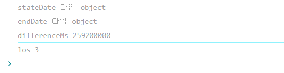

다음과 같이 코드를 짰는데… 

```jsx

 //searchPage.tsx

  
  
  const date = useSelector((state) => state.queryString.date);
  //달력에서 날짜 선택 후 가져온 value값
  console.log("date", date);
  //date {startDate: '2024-03-04T15:00:00.000Z', endDate: '2024-03-07T14:59:59.999Z'}
  
  
  const startDate = date.startDate.split("T")[0];
  const endDate = date.endDate.split("T")[0];
  
  
  console.log('stateDate', startDate)
  //stateDate 2024-03-04
  console.log('endDate', endDate)
  //endDate 2024-03-07

  const differenceMs = Math.abs(endDate - startDate);
  console.log('differenceMs' ,differenceMs)
  //differenceMs NaN

  const los = Math.ceil(differenceMs / (1000 * 60 * 60 * 24));
  console.log('los',los)
  //los NaN
  
  
  
```

달력에서 날짜 선택 후 searchPage로 가져와 query string으로 전달하려했는데…

두 날짜 사이 간격을 계산 못하는 이슈가 생겼다….

흠 원인이 뭘까 생각해보니

```jsx
  
  
  console.log('stateDate', startDate)
  //stateDate 2024-03-04
  console.log('endDate', endDate)
  //endDate 2024-03-07
  
  ///여기서 가져온 stateDAate와 endDate는 string 값이다... Date 객체가 아니였다.
```

실제로 타입을 찍어보니

```jsx
  console.log('stateDate 타입', typeof startDate)
  console.log('endDate 타입', typeof endDate)
  
  
  //stateDate 타입 string
/// endDate 타입 string
```

string으로 뜬다.

바로 수정해줬다.

```jsx
 const startDate = new Date(date.startDate.split("T")[0])
  const endDate = new Date(date.endDate.split("T")[0])
  
 // 다음과같이 수정하니
```



los값이 출력됐다!!