현재 도메인주소는 https://keyword-searcher-project-frontend-keyword-project.vercel.app/categories 입니다. vercel로 배포한거라 이쁘지않죠.

프로젝트도 거의 완성되었으니 이쁜 도메인을 구매해 적용시켜봅시다.

# 가비아 도메인 구매과정

## 1. 가비아 회원가입
 [가비아](https://www.gabia.com/)에 접속해 회원가입을 해줍니다. 이미 계정이 존재한다면 생략하셔도 됩니다.

  

## 2. 도메인 입력

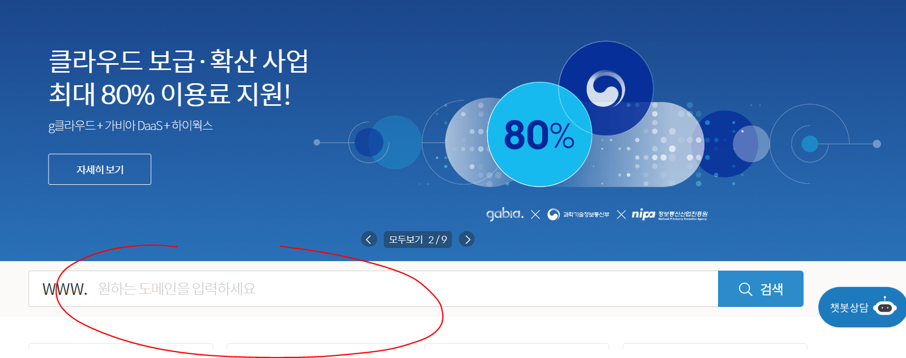 

본인이 원하는 도메인을 자유롭게 입력해줍니다. 저는 digggle을 하려했는데 이미 존재한다해서 diggggle로 했습니다.

  

## 3. 도메인 구매

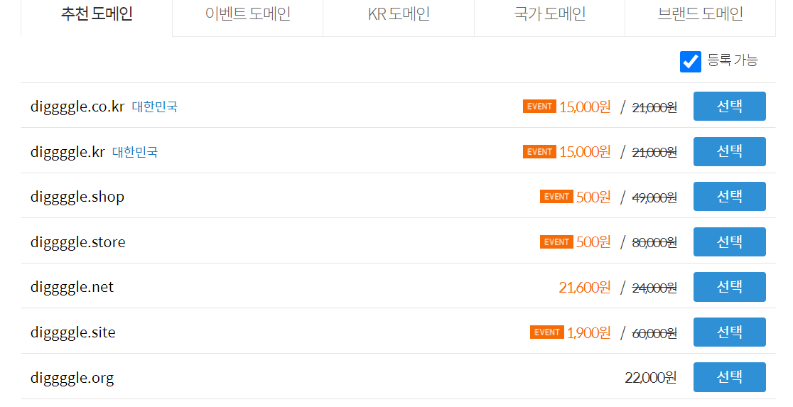

TLD 별로 도메인 종류가 나오는데 원하는 도메인을 선택해줍니다. 캡쳐에는 diggggle이 이미 존재한다 나오는데 제가 이미 구매했기 때문입니다. 저는 diggggle.com으로 선택했습니다.

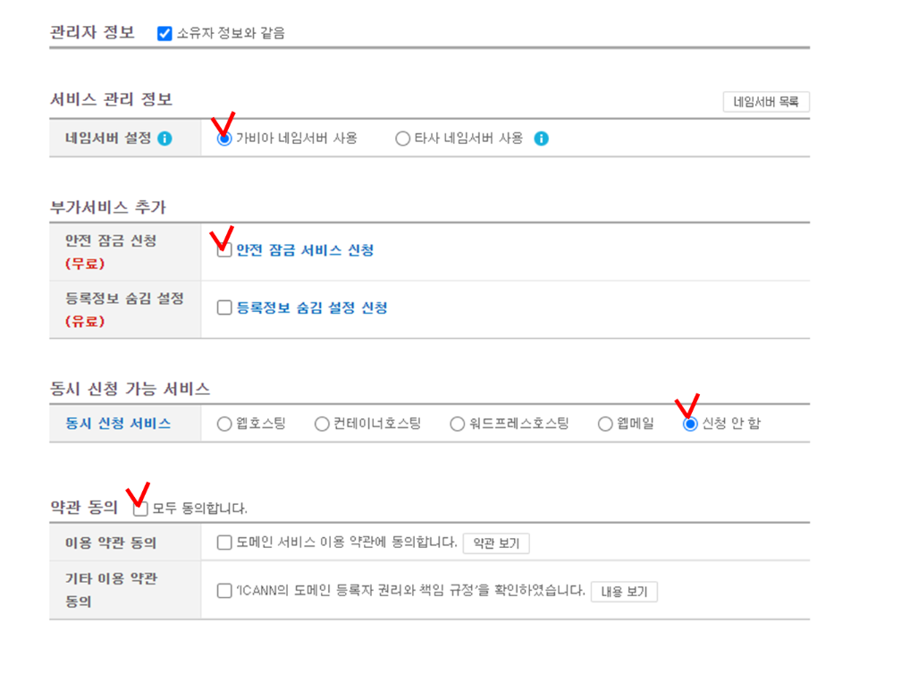

다음과 같이 체크해주고 결제해줍니다.

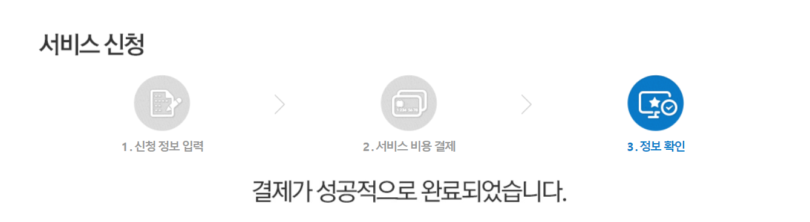

정상적으로 결제됐습니다.

 
 

# vercel 도메인 추가 및 설정

## 1. vercel에서 방금 구매한 도메인 추가

이제 배포한 vercel 도메인 설정으로 들어가 방금 구매한 도메인을 추가해줍니다.

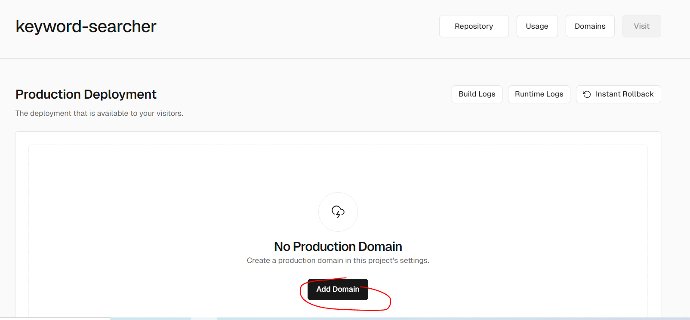

add 클릭 후

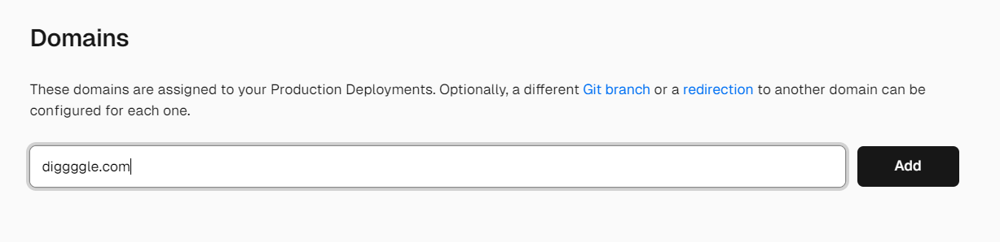

도메인을 입력해줍니다.

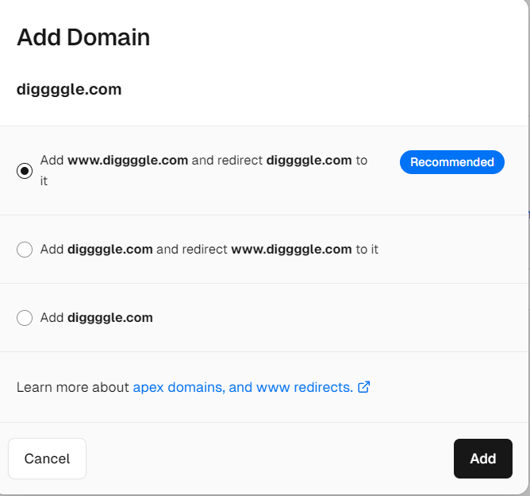

위 옵션은 맨위를 선택하시는걸 추천드립니다. 

도메인이 diggggle이라면 diggggle.com만 해도 www.diggggle.com 으로 리다이렉트 해주겠다는 의미입니다. 해서 나쁠거 없죠.

 

이렇게 세팅해주면??!!

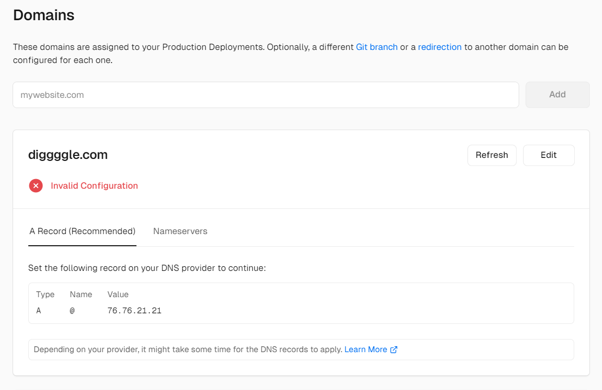

완성!! 되지 않습니다!!! 

오류뜨는거보고 역시 한번에 되는 꼴을 못보내 싶었느데 안되는게 정상입니다. 가비아에서 구매한 도메인 설정을 변경하지 않았거든요.

 
 

# 가비아 도메인 설정 변경

## 1. 가비아dns관리

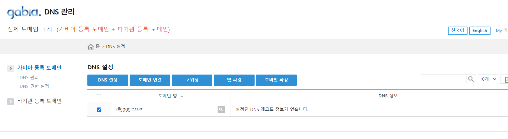

가비아로 돌아와 dns 관리창에 접속해줍니다. 그리고 구매한 도메인 dns 설정을 들어갑니다.

 

## 2. dns 레코드 설정

오류난 위 정보를 바탕으로 가비아 도메인 설정을 변경해줍니다.

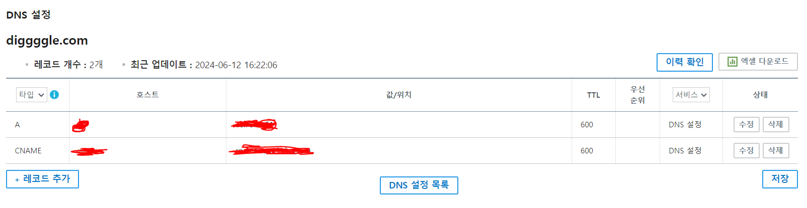

세팅해주면 vercel도 자동으로 업데이트 됩니다. 

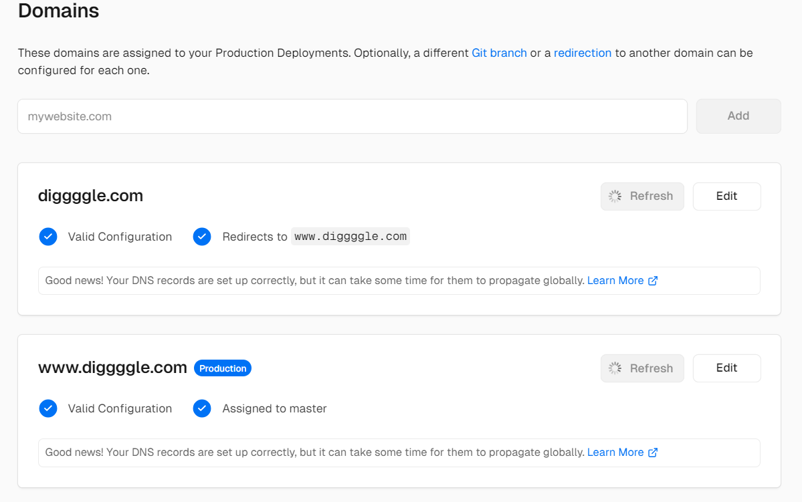

 
 

업데이트가 완료되면 정상적으로 도메인이 적용된 것을 확인할 수 있습니다.

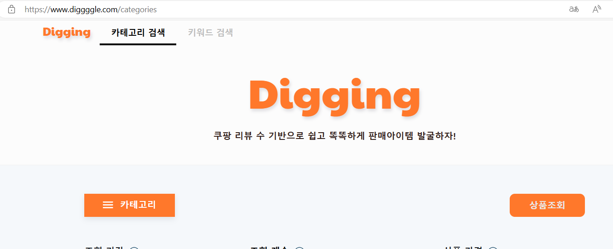

 
 
 

참고문헌

https://velog.io/@yaejin9503/%EA%B0%80%EB%B9%84%EC%95%84%EC%97%90%EC%84%9C-domain%EC%9D%84-Vercel%EC%9D%98-%EB%82%B4-%ED%94%84%EB%A1%9C%EC%A0%9D%ED%8A%B8%EC%99%80-%EC%97%B0%EA%B2%B0%ED%95%98%EA%B8%B0

https://king-father.com/entry/%EA%B0%80%EB%B9%84%EC%95%84-%EB%8F%84%EB%A9%94%EC%9D%B8-%EA%B5%AC%EC%9E%85-%EB%B0%A9%EB%B2%95Feat-%ED%8B%B0%EC%8A%A4%ED%86%A0%EB%A6%AC-%EC%84%A4%EC%A0%95

