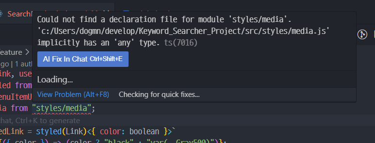
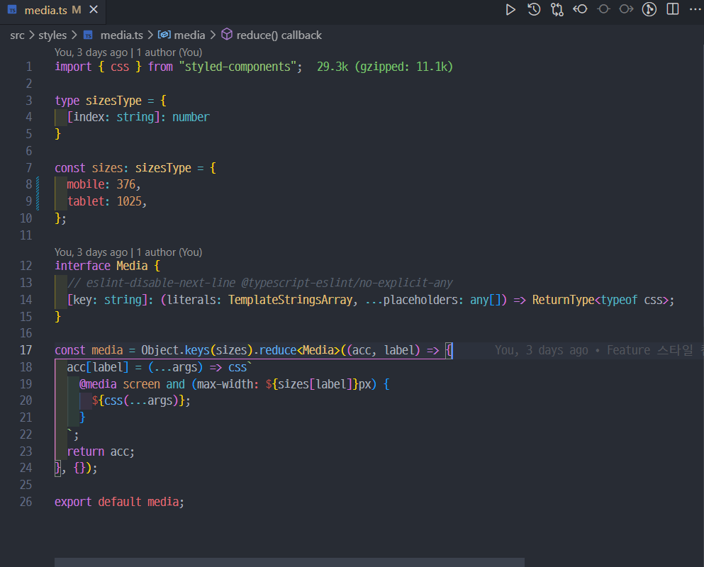
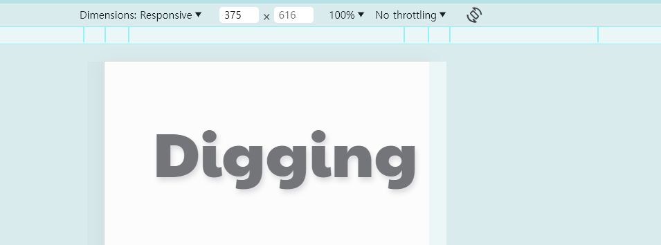

반응형 웹 구현을 위해 `media query` 기능을 접목시켜보겠습니다.

# 스타일 컴포넌트 media query 구현

```js
// media.js

import { css } from "styled-components";

const sizes = {
  mobile: 376,
  tablet: 1025,
};

const media = Object.keys(sizes).reduce((acc, label) => {
  acc[label] = (...args) => css`
    @media (min-width: ${sizes[label] / 16}em) {
      ${css(...args)};
    }
  `;

  return acc;
}, {});

export default media;
```

미디어 쿼리를 구현하는 것은 크게 어렵지 않습니다.`media.js` 라는 파일을 만들고 위 코드를 작성하면 됩니다.

```js
const sizes = {
  mobile: 376,
  tablet: 1025,
};
```

sizes 객체에는 각 레이블(mobile, tablet)과 해당 레이블의 최대 너비(픽셀 단위 376, 1025)가 키-값 쌍으로 저장되어 있습니다.

```js
const media = Object.keys(sizes).reduce((acc, label) => {
  acc[label] = (...args) => css`
    @media screen and (max-width: ${sizes[label]}px) {
      ${css(...args)};
    }
  `;

  return acc;
}, {});

export default media;
```

media객체는 Object.keys(sizes).reduce() 함수를 사용하여 sizes 객체의 각 키값에 대해 반복 작업을 수행합니다.

Object.keys(sizes)는 sizes 객체의 모든 키를 포함하는 문자열 배열을 반환합니다. 즉 `["mobile", "tablet"]` 의 형태를 가집니다.

이 반복 작업에서는 각 레이블에 대해 새로운 스타일 함수(각 레이블에 대해 CSS 템플릿 리터럴을 반환하는 함수)를 생성하고, 이 함수는 css 함수를 사용하여 전달된 스타일 인자들을 처리하고, @media 룰 내에서 특정 최대 너비에 도달할 때 적용될 CSS 스타일을 정의합니다.

이렇게 하면, 브라우저 창의 너비가 sizes[label]에 정의된 픽셀 값 이하로 내려갈 때 해당 스타일이 적용됩니다.

예를 들어 sizes[label] => sizes[376] 이면 픽셀값은 376px 이 됩니다.

결과적으로, 이 코드는 각 레이블에 대해 미디어 쿼리를 포함하는 스타일 함수를 생성하고, 이 함수들을 acc 객체에 저장하여 반환합니다. 이 객체를 사용하여 개발자는 다양한 화면 크기에 따라 적절한 스타일을 적용할 수 있습니다.

<br>
<br>

## 적용

```tsx
//SearchMethodTab.tsx

import media from "styles/media";

//생략

const Title = styled.p`
  color: var(--Orange500);
  text-decoration-line: none;
  text-shadow: 2px 4px 6px rgba(37, 36, 62, 0.15);
  font-size: var(--font-size-medium);
  font-style: normal;
  font-weight: 400;
  line-height: normal;
  text-align: center;
  font-family: PaytoneOne;
  margin-right: 1rem;
  margin-bottom: 0.7rem;
  ${media.mobile`
  font-size: var(--font-size-title);
   color : var(--Gray700);
  `}
`;

//생략
```

위 코드처럼 정의한 media 객체를 import 한 후 사용하면 됩니다.

<br>
<br>

### 자바스크립트를 타입스크립트 파일에 import 하면?

하지만 호락호락하게 넘어갈 우리의 타입스크립트가 아닙니다.

잘 아시겠지만 js파일을 ts에서 import 하면 에러가 납니다. js는 타입처리가 하나도 안되어있기 때문이죠.



`Could not find a declaration file for module 'styles/media'. 'c:/Users/dogmn/develop/Keyword_Searcher_Project/src/styles/media.js' implicitly has an 'any' type.`

대충 타입스크립트는 타입지정안된 자바스크립트 파일은 취급안하겠다는 뜻입니다.

`media`파일에 타입을 지정해 해결해주도록 합시다.

<br>
<br>

### media 파일 타입지정

```ts
//media.ts

import { css } from "styled-components";

type sizesType = {
  [index: string]: number;
};

const sizes: sizesType = {
  mobile: 376,
  tablet: 1025,
};

interface Media {
  // eslint-disable-next-line @typescript-eslint/no-explicit-any
  [key: string]: (
    literals: TemplateStringsArray,
    ...placeholders: any[]
  ) => ReturnType<typeof css>;
}

const media = Object.keys(sizes).reduce<Media>((acc, label) => {
  acc[label] = (...args) => css`
    @media screen and (max-width: ${sizes[label]}px) {
      ${css(...args)};
    }
  `;
  return acc;
}, {});

export default media;
```

코드를 분석해보자면

1. `interface Media`

TypeScript에서 사용하는 인터페이스 정의 방식입니다. 이 인터페이스는 Media 객체가 문자열 키를 사용하여 접근할 수 있고, 각 키에 대응하는 값은 특정 함수 형태를 가져야 함을 명시합니다.

2. `[key: string]`
   Media 객체가 어떤 문자열 키로도 접근될 수 있음을 의미합니다. 예를 들어, media['mobile'] 또는 media['tablet'] 처럼 접근할 수 있습니다.

3. `(literals: TemplateStringsArray, ...placeholders: any[]) => ReturnType<typeof css>`

이 함수 시그니처는 각 키에 대응하는 값이 함수 형태임을 나타냅니다. 이 함수는 다음과 같은 매개변수를 받습니다

- `literals` : TemplateStringsArray 타입으로, 템플릿 리터럴의 고정된 문자열 부분들을 포함합니다.

- `...placeholders` : 나머지 매개변수(rest parameters)로, 어떤 타입의 값들도 받을 수 있습니다(any[]).

이 함수는 css 함수의 반환 타입을 반환합니다.

간단히 말해, Media 인터페이스는 media 객체가 다양한 디바이스 크기에 따라 CSS 미디어 쿼리를 쉽게 적용할 수 있는 함수들을 매핑하는 역할을 합니다. 각 함수는 스타일 규칙을 받아 해당 미디어 쿼리에 맞게 적용합니다.

<br>
<br>
<br>

# 적용



에러가 사라졌습니다!

<br>

```tsx

//SearchMethodTab.tsx

import media from "styles/media";

//생략

const Title = styled.p`
  color: var(--Orange500);
  text-decoration-line : none;
  text-shadow: 2px 4px 6px rgba(37, 36, 62, 0.15);
  font-size: var(--font-size-medium);
  font-style: normal;
  font-weight: 400;
  line-height: normal;
  text-align: center;
  font-family: PaytoneOne;
  margin-right: 1rem;
  margin-bottom: 0.7rem;
${media.mobile`
  font-size: var(--font-size-title);
   color : var(--Gray700);
  `}
`;

//생략

export default function SearchMethodTab() {
  const { pathname } = useLocation();

  const link = [
    { to: "categories", name: "카테고리 검색", key: 0 },
    { to: "keyword", name: "키워드 검색", key: 1 },
  ];


  return (
    <AppContainer>
      <Title>Digging</Title>

//생략

```



일단 실험용으로 코드를 작성해봤는데 잘 동작하는군요.!!

<br>
<br>
<br>

<details>

<summary>참고문헌</summary>

<div markdown="1">

https://tyhopp.com/notes/styled-components-media-queries

</div>

</details>
