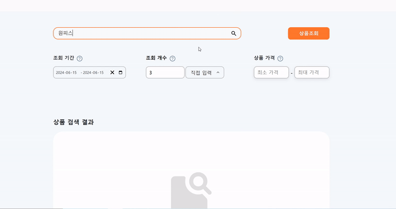
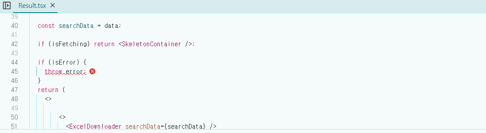

# 프로젝트 설계 요약

```tsx
//Result.tsx

export default function Result({
  setResultVisible,
}: {
  setResultVisible: (value: boolean) => void;
}) {
  const apiURL = `http://localhost:3000/api/v1${pathname}${queryString}`;

  const { error, isError, data, refetch, isFetching } = FetchData(apiURL);
  useEffect(() => {
    if (queryString) {
      refetch();
      setResultVisible(true);
    }
  }, [queryString]);

  const searchData = data;

  if (isFetching) return <SkeletonContainer />;

  if (isError) {
    throw error;
  }
  return (
    <>
      <>
        <ExcelDownloader searchData={searchData} />
        <ResultTable searchData={searchData} />
      </>
    </>
  );
}
```

<br>
<br>

```tsx
//SearchPage.tsx

//생략

return;

// 생략

{
  resultVisible ? (
    <ErrorBoundary
      onReset={() => {
        reset();
      }}
      FallbackComponent={({ resetErrorBoundary }) => (
        <div>
          <ErrorField
            resetErrorBoundary={resetErrorBoundary}
            setResultVisible={setResultVisible}
          />
        </div>
      )}
    >
      <Result setResultVisible={setResultVisible} />
    </ErrorBoundary>
  ) : (
    <EmptyResult />
  );
}
```

<br>
<br>

```tsx
//ErrorField.tsx

//스타일컴포넌트 생략

const ErrorField = ({
  resetErrorBoundary,
  setResultVisible,
}: {
  resetErrorBoundary: () => void;
  setResultVisible: (visible: boolean) => void;
}) => {
  const handleClose = () => {
    resetErrorBoundary();
    setResultVisible(false);
  };

  return (
    <ErrorContainer>
      <Error_triangle width="5rem" height="5rem" />
      <ErrorTitle>서비스 에러가 발생했습니다.</ErrorTitle>
      <ErrorMessage>잠시 후 다시 시도하세요.</ErrorMessage>
      <Button onClick={handleClose}>돌아가기</Button>
    </ErrorContainer>
  );
};

export default ErrorField;
```

제작중인 프로젝트 에러처리 관련 코드입니다. 간략하게 설명드리자면 `Result` 컴포넌트에서 비동기함수 호출 에러 발생 시 부모 컴포넌트인 `ErrorBoundary`에서 에러를 포착하고 처리합니다. 그리고 사용자경험 증대를 위해 `fallback UI`인 `ErrorField` 컴포넌트를 보여줍니다.

`ErrorField` 내 버튼을 클릭하면 에러가 발생했던 Result컴포넌트를 에러발생 전 상태로 초기화 시키고 setResultVisible(false) 에 의해 Result 컴포넌트가 언마운트 되고 초기화면(`EmptyResult`)으로 돌아갑니다.

<br>
<br>
<br>

# 문제점

문제는 버튼을 클릭했을 때 입니다.



`ErrorField` 내 버튼을 클릭하면 에러를 초기화한 상태로 돌아가야합니다. 즉 초기화면 상태에서 다시 상품을 조회하면 `로딩창(SkeletonUI)`가 화면에 띄워져야합니다.

하지만 위 영상처럼 로딩창이 뜨지않고 다시 에러가 발생합니다.


<br>



실제 콘솔창을 보면 Result컴포넌트가 다시 렌더링되지만 error가 사라지지 않은채로 렌더링 되기 때문에 fallbackUI인 ErrorField가 다시 렌더링되는 것을 확인할 수 있습니다.

에러가 컴포넌트 내에서 계속 살아있다는 의미 같은데... 뭐가 문제일까요..

<br>
<br>

## 의문점 포착

이것저것 알아보다 이상한 현상을 발견했습니다.

위 영상처럼 에러 발생 후 다시 상품을 조회하면 error가 그대로 남아있었지만

대략 5~10분정도 지난 후 다시 상품을 조회하면 정상적으로 동작하는 것이었습니다.

즉 시간이 지나면 에러가 사라진다는 것을 알아냈고 캐시 문제일 수도 있겠다는 생각이 들었습니다.

<br>
<br>

# 해결

본 프로젝트는 React-Query를 사용하는데 쿼리 상태에 관련된 시간을 설정할 수 있습니다.

stale Time, gcTime 두가지 상태가 존재하는데 gcTime 의 경우 별도로 설정해두지 않으면 기본 5분으로 설정됩니다. 위에서 언급했던 5~10분정도 뒤에 다시 호출하니 정상적으로 됬다 말한 시간과 비슷하죠?

```tsx
//main.tsx

const queryClient = new QueryClient({
  defaultOptions: {
    queries: {
      gcTime: 0,
      retry: 0,
    },
  },
});
```

`gcTime` 를 모두 0초로 설정해두고 다시 시도해보았습니다.


정상적으로 동작합니다!! 무야호!

<br>
<br>
<br>

# 왜 gcTime이 문제였을까?

해결해서 기분이 좋지만 여기서 끝내버리면 전 개발자 하면 안됩니다. 발전이 없거든요. 

자고로 어떠한 현상이나 기능의 원인, 원리를 정확하게 알고 넘어가는 것이 개발자의 미덕이라 할 수 있습니다.

<br>

## inactive 상태와 gcTime

서버 데이터는 화면에서 unmount 되면 inactive 상태가 됩니다. 말 그대로 사용하지 않는 데이터란 뜻이죠.

그리고  gcTime은 데이터가 inactive 상태가 되었을 때 캐싱되는 시간을 의미합니다. 

<br>

제가 만든 프로젝트 데이터 호출 과정을 살펴보면 

데이터 호출 (fetching 상태) -> 
에러발생 (에러발생 즉시 stale 상태로 변환) -> 
돌아가기 버튼 클릭 (화면에서 사라졌으므로 inactive 상태) -> 
다시 상품조회 버튼 클릭 (기본gcTime인 5분 내 다시 refetch) -> 
inactive 된 캐싱 데이터를 불러옴(에러상태) -> 
에러화면을 다시 띄움

이러한 원리로 인해 에러 초기화가 안된다고 착각한 것 입니다. 묵묵히 본인 할 일 하고있던 애꿎은 ErrorBoundary만 탓 했던 것이죠.

하지만 덕분에 staleTime과 gcTime에 대해서 자세히 알게되어 오히려 좋았던 경험이었습니다. 


<br>


참고로 제가 정리해놓은 [staleTime, gcTime 관련 글](https://www.epik-blog.com/[React%20Query]%20staleTime%EA%B3%BC%20gcTime/)을 보시면 이해하는데 도움이 되실 겁니다.

<br>
<br>
<br>

<details>

<summary>출처</summary>

<div markdown="1">

오로지 내 머리

</div>

</details>
